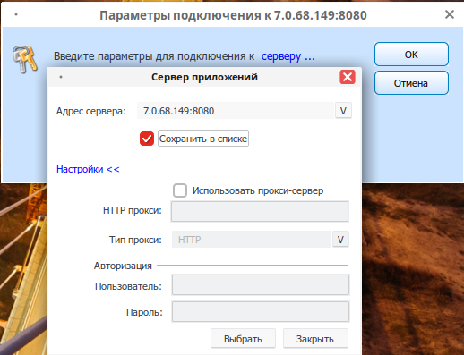
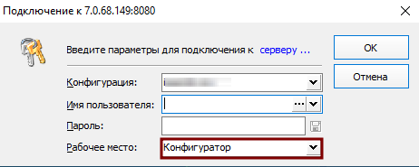

# Установка и настройка клиентского программного обеспечения ГИС «Смета ЯНАО» на автоматизированных рабочих местах с использованием VipNet Client

> **⚠️ Внимание!**  
> Необходимо проверить работоспособность установленного VipNet клиента и доступность сетевого узла **LARM-Sal-CB-ServSmetaSP**.  
> Также при отсутствии скачать и установить **КриптоПро CSP**: https://cryptopro.ru/products/csp/downloads

---

## Загрузка программного обеспечения ГИС «Смета ЯНАО»

> **📌 Для операционной системы РЕД ОС**:  
> https://files.yanao.ru/s/dfn7iAL85Jf5e7e

> **📌 Для операционной системы Windows**:  
> https://files.yanao.ru/s/PqieKP4SSB8RGqK

---

## Настройка программного обеспечения ГИС «Смета ЯНАО»

> **📌 Для операционной системы РЕД ОС добавить права на выполнение исполняемого файла stimrun.**

Убедиться, что у текущего пользователя есть права доступа на запись в текущий каталог (при первом запуске клиент создаст файл инициализации в текущем каталоге).

Запустить `stimrun`, в модальном окне перейти по гиперссылке **«адрес сервера»**.

В дополнительном модальном окне в поле **«Адрес сервера»** добавить адрес сервера авторизации в формате **IP:PORT**.  
Узнать адрес сервера авторизации возможно следующими способами:

> **📌 Для операционных систем семейства Microsoft Windows**:  
> Необходимо запустить приложение **ViPNet Client**, выбрать **«Защищённая сеть»**, найти узел **LARM-Sal-CB-ServSmetaSP**, открыть свойства узла, посмотреть реальный IP-адрес узла, использовать его вместе с портом **8080**.  
> В данном случае адрес сервера авторизации будет выглядеть **7.0.68.149:8080**

> **📌 Для отечественных операционных систем**:  
> Необходимо запустить приложение **ViPNet Client**, выбрать **«Сетевые узлы»**, в поиске ввести наименование узла **LARM-Sal-CB-ServSmetaSP**, либо кратко как на изображении. В выборке посмотреть IP-адрес узла, использовать его вместе с портом **8080**.  
> В данном случае адрес сервера авторизации будет выглядеть **7.0.68.149:8080**.

> **⚠️ Важно!**  
> Запуск приложения **ViPNet Client** необходимо осуществлять от имени пользователя, под которым была произведена установка лицензии (dst).

---

## В случае использования прокси-сервера в Вашей локально-вычислительной сети необходимо указать параметры прокси-сервера, доступные при переходе по гиперссылке «Настройки»

Если Вы всё сделали правильно, то при выборе в выпадающем списке должен появится список баз данных различных учреждений. Выберите нужное учреждение из списка.

В случае если в выпадающем списке отсутствует перечень баз данных, значит доступ к серверу ГИС «Смета ЯНАО» ограничен. Причин может быть несколько:

-   Отсутствие доступа к узлу защищённой сети VipNet — **LARM-Sal-CB-ServSmetaSP**;
-   Проблемы на уровне сетевых технологий Вашей локально-вычислительной сети;
-   Сервер ГИС «Смета ЯНАО» в плановом обслуживании (недоступность не более 40 минут в позднее вечернее время);
-   Локальные проблемы с операционной системой автоматизированного рабочего места;
-   Прочие.

В большинстве случаев большая доля вероятных ошибок происходит на стороне конечного пользователя. В этом случае Вам необходимо предпринимать соответствующие меры по устранению проблем.

---

## Тестовая апробация функционала ГИС «Смета ЯНАО» на примере базы данных департамент по общим вопросам

Для апробирования функционала для пользователей создана специальная база данных **Департамент по общим вопросам ЯНАО_hidden.drx**

> **📌 Дополнительные детали**  
> Суффикс **\_hidden** означает скрытый контекст в списке подключений. Это сделано для того чтобы не смешивать тестовые базы данных с реальными.  
> Поэтому на данном этапе Вам необходимо скопировать наименование **Департамент по общим вопросам ЯНАО_hidden.drx** и вставить в поле **«Конфигурация»**.  
> В реальности пользователи работают в реальных базах данных, поэтому копирование наименований конфигурации не требуется: достаточно выбора значений из списка.  
> Если конфигурация установлена правильно, в списке пользователей должен отобразиться перечень пользователей выбранной базы данных. Для теста используйте имя пользователя **student**. В рабочих базах имя пользователя = «Фамилия Имя Отчество»

Далее, введите пароль — **1**

Результат авторизации пользователя приведен на рисунке ниже (выбор конфигурации, имя пользователя, пароль, рабочее место) с максимальным уровнем доступа в рамках базы данных департамента по общим вопросам:

---

## Запуск ГИС «Смета ЯНАО» для операционных систем Microsoft Windows (адрес сервера подключения может отличаться)

Требуется установить сервер обновлений из стабильной ветки дистрибутива (указывается адрес подключения к серверу):

---

## Установка и настройка клиентского программного обеспечения ГИС «Смета ЯНАО» на автоматизированных рабочих местах с использованием технологии TLS (альтернативный способ только в РМТКС ЯНАО)

### Для операционной системы РЕД ОС:

1.  Открыть терминал (`Ctrl+Alt+T`).
2.  Команда для суперпользователя: `su`.
3.  Ввести пароль суперпользователя.
4.  Выполнить команду: `openssl-switch-config gost`.
5.  Выполнить команду: `openssl engine`.
6.  В итоге должно получиться так:

    

7.  Выполнить команду: `exit`.
8.  Удалить все файлы из директории `stimate` (находится в домашней папке пользователя).
9.  Скачать клиент [по ссылке](https://files.yanao.ru/s/WfnAMN7MFNayJRR).

> **📌 Обязательные системные требования для РЕД ОС**  
> Требуется установленное программное обеспечение **КриптоПро CSP 4.0 и выше**: https://cryptopro.ru/products/csp/downloads

10. В свойствах файла `stimrun` выставить права как на картинке:

    

11. Запустить файл `stimrun` и дождаться установки.
12. При подключении ввести адрес сервера: [https://smeta-app.yanao.ru:443](https://smeta-app.yanao.ru:443/)
13. После первого входа из меню **Настройки** → **открыть настройки клиента** и во вкладке **Программа** выбрать сервер обновлений **win-stim.krista.ru:8080**. Также поставить галочку на **Регистрация** для запуска приложения из браузера.

    

### Для операционной системы MS Windows:

1.  Скачать клиент [по ссылке](https://files.yanao.ru/s/ZyG8ZHPzMSxt3BN).
2.  Удалить все файлы из директории `stimate` (находится в папке C:\Windows).
3.  Переместить скачанные файлы `stimrun` и `stimrun.ini` в директорию `stimate/`.
4.  Запустить файл `stimrun` и дождаться установки.
5.  При подключении ввести адрес сервера: [https://smeta-app.yanao.ru:443](https://smeta-app.yanao.ru:443/)
6.  После первого входа из меню **Настройки** открыть настройки клиента и во вкладке **Программа** выбрать сервер обновлений `win-stim.krista.ru:8080`. Также поставить галочку на **Регистрация** для запуска приложения из браузера.

    