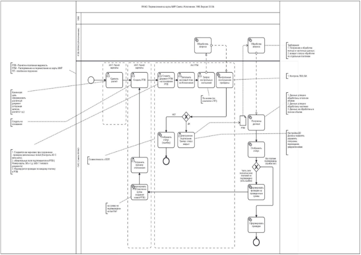

```mermaid
flowchart TD
    A[Нажата кнопка "Запросить справку об обучении"] --> B[Ввод СНИЛС и даты]
    ...
```

Оказание услуг по предоставлению права использования програм..."
reestr_number: "0190200000325014723"
year: 2025
status: "Определение поставщика завершено"
tags: [закупка, 44-ФЗ]
---
# Оказание услуг по предоставлению права использования программного обеспечения для ГИС "Смета ЯНАО"
## Основная информация
- **Реестровый номер**: 0190200000325014723
- **Статус**: Определение поставщика завершено
- **Дата размещения**: 17.11.2025
- **Цена контракта**: 3100000.00 руб.
- **ИКЗ**: '<span class="highlightColor">252890103836489010100100300025829244</span>'
[Полная карточка на zakupki.gov.ru](https://zakupki.gov.ru/epz/order/notice/ea44/view/common-info.html?regNumber=0190200000325014723)

**ТЕХНИЧЕСКОЕ ЗАДАНИЕ**
**на оказание услуг по предоставлению права использования программного обеспечения для ГИС «Смета ЯНАО»**

## Общие сведения
### 1.1. Цель оказания услуг
Оказание услуг по предоставлению права использования программного обеспечения для государственной информационной системы «Смета Ямало-Ненецкого автономного округа» (далее - ГИС «Смета ЯНАО»), дополняющего функциональные возможности ГИС «Смета ЯНАО».

### 1.2. Сведения о ГИС «Смета ЯНАО»
ГИС «Смета ЯНАО» создана в соответствии с постановлением Правительства Ямало-Ненецкого автономного округа от 15 апреля 2021 г. № 290-П «О создании государственной информационной системы «Смета Ямало-Ненецкого автономного округа» и используется для начисления физическим лицам выплат по оплате труда и иных выплат, а также связанных с ними обязательных платежей в бюджеты бюджетной системы Российской Федерации и их перечисления, ведения бухгалтерского (бюджетного) учета, включая составление и представление бухгалтерской (бюджетной) отчетности.

ГИС «Смета ЯНАО» функционирует на платформе программного продукта «Автоматизированная система бюджетного учета «Смета» (АС «Смета», № 1636 в Едином реестре российских программ для электронных вычислительных машин и баз данных).
Заказчик использует программное обеспечение АС «Смета» на условиях простой (неисключительной) лицензии, переданной от департамента финансов Ямало-Ненецкого автономного округа, без ограничения по количеству пользователей/подключений в рамках сублицензионного договора от 18.12.2019 №05/1-1987.
## Состав услуг
### 2.1. Предоставление права использования программного обеспечения для ГИС «Смета ЯНАО», дополняющего функциональные возможности ГИС «Смета ЯНАО»:**

2.1.1. Исполнитель должен предоставить право использования программного обеспечения для ГИС «Смета ЯНАО», на условиях простой (неисключительной) лицензии, без ограничения количества пользователей Заказчика, с правом последующего предоставления Заказчиком права использования дополнительных функциональных возможностей исполнительным органам автономного округа, подведомственным учреждениям исполнительных органов автономного округа, иным органам государственной власти автономного округа, органам местного самоуправления в автономном округе, подведомственным учреждениям органов местного самоуправления в автономном округе на неограниченное количество пользователей и бессрочный период.

2.1.2. Дополнительные функциональные возможности должны быть полностью совместимы с  реализованым ранее функционалом в ГИС «Смета ЯНАО».
2.1.3. Дополнительные функциональные возможности  должны отвечать нижеперечисленным требованиям:

- дополнительные функциональные возможности  в части информационного взаимодействия с программным обеспечением по автоматизации работы организаций в сфере имущественных и земельных отношений (далее - ГИС «Имущество ЯНАО») согласно требованиям п.2.2 настоящего Технического задания (далее - ТЗ);

- дополнительные функциональные возможности  в части автоматизации формирования платежных документов для прямых выплат на карты «Мир» и информационного взаимодействия с программным обеспечением по автоматизации процесса исполнения бюджета (далее - ГИС «РЭБ ЯНАО») согласно требованиям п.2.3 текущего ТЗ.

### 2.2. Требования к  дополнительной функциональной возможности  в части информационного взаимодействия с ГИС «Имущество ЯНАО».

Функционал должен обеспечить однократность ввода данных о начислении дохода при формировании первичных учетных документов в ГИС «Смета ЯНАО» путем автоматической передачи соответствующих данных из ГИС «Имущество ЯНАО».

2.2.1. Требования к сервису загрузки в ГИС «Смета ЯНАО» данных из внешней информационной системы ГИС «Имущество ЯНАО».
 В ГИС «Смета ЯНАО» должен быть обеспечен сервис по загрузке данных из ГИС «Имущество ЯНАО», по протоколу REST:
тип запроса: GET.

URL запроса: <code>http://<Адрес>:<Порт></code>, где Адрес – IP-адрес сервера, Порт – порт сервера;
(*адрес сервера, на котором должен быть расположен сервис, предоставляется Заказчиком в течение 30 (тридцати) календарных дней с момента заключения Контракта*).

При отправке POST-запроса сервис должен формировать ответ в формате JSON.

Авторизация ГИС «Имущество ЯНАО» должна осуществляться через персональный токен-идентификатор участника, который в дальнейшем будет использоваться как входной параметр для взаимодействия c ГИС «Смета ЯНАО».

Загрузка данных в ГИС «Смета ЯНАО» должна осуществляться по установленному расписанию. Расписание должно настраиваться на стороне ГИС «Имущество ЯНАО».

Загрузка данных в ГИС «Смета ЯНАО» должна осуществляться на имеющиеся в ГИС «Смета ЯНАО» электронные документы (далее - ЭД):
- данные из извещения о начислении дохода (уточнении начисления) по форме ОКУД 0510432 из ГИС «Имущество ЯНАО» должны загружаться в ЭД «Извещение 0510432» ГИС «Смета ЯНАО» (DokumentIzveshchenieONachisleniiDokhodov.xml).
- данные из ведомости начисления дохода по форме ОКУД 0510837 из ГИС «Имущество ЯНАО» должны загружаться в ЭД «Начисление доходов» ГИС «Смета ЯНАО» с типом первичного документа «Ведомость начисления доходов бюджета (ф. 0510837)» (DokumentVedomostNachisleniyaDokhodov.xml).

ЭД «Извещение 0510432» и «Начисление доходов» с типом первичного документа «Ведомость начисления доходов бюджета (ф. 0510837)» предназначены для хранения и обработки загруженных данных из ГИС «Имущество ЯНАО» в ГИС «Смета ЯНАО».

Заказчик в течение 10 (десяти) календарных дней с момента заключения Контракта должен передать Исполнителю описание формата взаимодействия с ГИС «Имущество ЯНАО».

2.2.2. Требования к ответам на загрузку данных.

При загрузке данных сервис ГИС «Смета ЯНАО» должен формировать ответ в формате JSON:
В ответе может быть:

1) 200 OK («хорошо») – означает, что обращение обработано, есть результат, в ответе JSON-файл «StatementResponse.json» или «NoticeResponse.json» с результатом. Описание структуры файлов «StatementResponse.json» и «NoticeResponse.json» приведено ниже.
2) 403 Forbidden («запрещено (не уполномочен)») – нет прав на взаимодействие по указанному токену;
3) 520 Unknown Error («неизвестная ошибка»). В этом случае в качестве ответа приходит ResponseError.json, содержащий ErrorInfo – текстовое описание ошибки.


Таблица 1 – Описание атрибутов файла «StatementResponse.json»
Таблица 2 – Описание типа данных «NotificationsResponeType» - результат обработки начислений
Таблица 3 – Описание атрибутов файла «NoticeResponse.json»
Таблица 4 – Описание заполнения полей ЭД «Начисление доходов» с типом первичного документа «Ведомость начисления доходов бюджета (ф. 0510837)» ГИС «Смета ЯНАО» из файла DokumentVedomostNachisleniyaDokhodov.xml
Таблица 5 – Описание заполнения полей ЭД «Извещение 0510432» ГИС «Смета ЯНАО» из файла DokumentIzveshchenieONachisleniiDokhodov.xml

### 2.3.  Требования к дополнительной функциональной возможности в части автоматизации формирования платежных документов для прямых выплат на карты «Мир» и информационного взаимодействия с  ГИС «РЭБ ЯНАО»

Технология прямых выплат на карты «Мир» — сервис, разработанный Федеральным казначейством совместно с Центральным банком РФ и АО «Национальная система платёжных карт». Цель — моментальное зачисление денежных средств на карты «Мир» с использованием только номера карты (от 16 до 19 цифр) и даты рождения получателя.

Сервис используется для выплат социальных пособий, субсидий на оплату жилого помещения и коммунальных услуг, ежемесячных компенсаций расходов на оплату жилого помещения и коммунальных услуг, а также выплату командировочных расходов, зарплатных и иных связанных платежей.

Прямые выплаты на карты «Мир» регулируются: Федеральным законом от 27.06.2011 №161-ФЗ «О национальной платёжной системе»; Постановлением Правительства РФ от 21.04.2011 №2943; приказом Федерального казначейства от 13.05.2020 № 20н "Об утверждении Правил организации и функционирования системы казначейских платежей"; приказом Федерального казначейства от 14.05.2020 № 21н "О Порядке казначейского обслуживания".

Новый функционал должен обеспечивать:

* сокращение времени на ввод в ГИС «РЭБ ЯНАО» информации о перечислении денежных средств по реквизитам банковских карт «Мир» при осуществлении зарплатных, стипендиальных и иных схожих по своему содержанию выплат государственным гражданским служащим, сотрудникам органов власти и учреждений, в том числе как подотчетным лицам, а также студентам и гражданам по договорам гражданско-правового характера;
* исключение возможности изменения данных в заявке о перечислении денежных средств на карты «Мир» в части номеров карт и перечисляемых сумм;
* сокращение времени на получение результата обработки документа и его анализ в ГИС «Смета ЯНАО»;
* обеспечение визуального контроля отправляемых данных из ГИС «Смета ЯНАО»;
* контроль процесса обработки данных работниками департамента финансов ЯНАО.

2.3.1. Общие требования и схема бизнес-процесса прямых выплат на карты «МИР».

Функционал должен удовлетворять общей схеме бизнес-процесса прямых выплат в нотации BPMN (Приложение 1 к  ТЗ).

В ГИС «Смета ЯНАО» в секции «Платежное поручение» должно обеспечиваться формирование нового документа со следующими требованиями к нему:

вид документа «Заявка на перечисление «МИР» (заявка на перечисление денежных средств на банковские карты «Мир» физических лиц);

детализация для отражения информации о номерах банковских карт «Мир» или номерах банковских карт с товарным знаком «Мир», эмитированных Банком России, датах рождения граждан-получателей выплат на карты «МИР», суммах, удержанных по исполнительному листу, суммах расхода, списываемых с лицевого счета плательщика, кода и описания ошибки в случае отклонения;

поля для отражения сумм принятых строк и отклоненных строк детализации документа в рублях и копейках через запятую;

дополнительные поля, которые могут потребоваться для корректной передачи информации по перечислению на карты «МИР» в ГИС «РЭБ ЯНАО»;

печатная форма для вида «Заявка на перечисление «МИР» согласно Приложению 2 настоящего ТЗ с наложением штампа электронной подписи;

для вида документа «Заявка на перечисление «МИР» должна быть возможность настройки отдельной от других видов последовательности статусов и подписания;

возможность настройки доступности детализации, содержащей персональные данные сотрудников.

В ГИС «Смета ЯНАО» в секции «Платежное поручение» должно обеспечиваться формирование документа «Платежный реестр ПОЛ» для формирования, редактирования и хранения сумм перечислений по расчетам с подотчетными лицами в разрезе подотчетных лиц. Документ «Платежный реестр ПОЛ» должен располагаться на секции «Расчеты с подотчетными лицами». Документ «Платежный реестр ПОЛ» должен формироваться по данным документов «Решение о командировании» и «Авансовый отчет». 
На документе «Платежный реестр ПОЛ» должна быть настроена печатная форма согласно Приложению 3 настоящего ТЗ. На основании документа «Платежный реестр ПОЛ» должна быть возможность создания документа «Платежное поручение» с видом документа «Заявка на перечисление «МИР» для осуществления прямых выплат на карты МИР

Функционал должен обеспечивать настройку сервисов выгрузки данных из ГИС «Смета ЯНАО» в ГИС «РЭБ ЯНАО»: направление запроса на создание и обработку документа «Платежное поручение» вид «Заявка на перечисление «МИР» с отправкой информации об электронных подписях в ГИС «РЭБ ЯНАО».

В ГИС «Смета ЯНАО» в секции «Платежное поручение» должен быть обеспечен сервис загрузки данных из ГИС «РЭБ ЯНАО» в ГИС «Смета ЯНАО» со следующими требованиями к нему:

заполнение кода бюджетной классификации и других аналитических признаков из Кассового плана по выделенным строкам детализации «Суммы по счетам» документа «Платежное поручение» вид «Заявка на перечисление «МИР» и по текущей строке;
получение информации о текущем состоянии документа «Платежное поручение» вид «Заявка на перечисление «МИР» в ГИС «РЭБ ЯНАО»;
получение и обработка ответа о результатах исполнения документа «Платежное поручение» вид «Заявка на перечисление «МИР» в формате ГИС «РЭБ ЯНАО»;
настройка печатной формы документа «Платежное поручение» вид «Заявка на перечисление «МИР» в части отражения результатов обработки документа в ГИС «РЭБ ЯНАО».

Ответ от ГИС «РЭБ ЯНАО» должен быть обработан системой ГИС «Смета ЯНАО». Результатом обработки должен стать автоматический перевод документа «Платежное поручение» вид «Заявка на перечисление «МИР» в конечный статус с автоматическим формированием проводок по отражению списания средств с лицевого счета учреждения в сумме фактического исполнения документа в бухгалтерском учете.
 В случае отклонения отдельных сумм по виду документа «Заявка на перечисление «МИР» должна быть возможность ручного формирования по строкам детализации с данными о картах граждан-получателей этого документа с признаком «Код ошибки» нового документа «Платежная ведомость» с соответствующими записями в детализации на суммы отклонения, отраженными методом «Красное сторно».

Функционал должен обеспечивать:
формирование документа «Заявка на перечисление «МИР» (заявка на перечисление денежных средств на банковские карты «Мир» физических лиц) в секции «Расчеты со студентами» на реквизиты студента и родителя с последующим подписанием документа в секции «Финансовые активы»/«Платежное поручение»;
возможность формирования ЭД «Платежная ведомость» по студентам и родителям, если получателем стипендии является родитель. Дата рождения родителя должна указываться у студента в новом поле «Дата рождения» на секции «Анкетные данные», закладка «Расчетные данные»/ «Банковские карточки» в полях «ФИО получателя (иное лицо)», ФИО родителя должна указываться на секции «Анкетные данные», закладка «Расчетные данные»/ «Банковские карточки» в полях «ФИО получателя (иное лицо)». Номер карты родителя должен заполняться у студента на секции «Анкетные данные», закладка «Расчетные данные»/«Банковские карточки»;
формирование документа «Заявка на перечисление «МИР» (заявка на перечисление денежных средств на банковские карты «Мир» физических лиц) на основании ЭД «Платежная ведомость» секции «Расчет зарплаты» с последующим подписанием документа в секции «Финансовые активы» / «Платежное поручение».

Для реализации возможности формирования отдельного документа «Заявка на перечисление «МИР» (заявка на перечисление денежных средств на банковские карты «Мир» физических лиц) на каждое денежное обязательство - Договор гражданско-правового характера (Договор ГПХ) - ЭД «Платежная ведомость» должен формироваться с группировкой по аналитическому признаку «Договор».
Функционал должен обеспечивать:

- возможность ручной корректировки данных в ЭД «Платежный реестр ПОЛ»;
- поле «Код вида выплаты» в соответствии с КОСГУ и КВР, согласно Приложению №4 к настоящему ТЗ, в ЭД «Командирование (фин. обеспечение)» и ЭД «Авансовый отчет» с последующим автоматическим заполнением в ЭД «Платежный реестр ПОЛ»;
- присвоение статусной картинки к ЭД «Платежный реестр ПОЛ» после исполнения «Заявки на перечисление «МИР», сформированной на основании данного реестра;
- всплывающее окно с предупреждающим контролем при повторном формировании ЭД «Платежный реестр ПОЛ»;
- присвоение статусной картинки для первичного ЭД «Решение о командировании» или ЭД «Авансовый отчет» на основании которого был создан ЭД «Платежный реестр ПОЛ»;
- возможность формирования нескольких ЭД «Платежный реестр ПОЛ» с разными типами финансирования из одного ЭД «Решение о командировании» или ЭД «авансовый отчет»;
- создание сторнирующего ЭД «Платежный реестр ПОЛ» на суммы отклонения в случае отклонения отдельных сумм по виду документа «Заявка на перечисление «МИР»;
- возможность формирования в ЭД «Входящий счет» документа «Заявка на перечисление «МИР» по получателям социальных выплат, которые рассчитываются по заявкам, договорам и т.п. и данные по которым находятся в справочнике «Организации».

2.3.2. Требования к сервису обмена данными ГИС «Смета ЯНАО» и ГИС «РЭБ ЯНАО».

 Должно быть обеспечено  взаимодействие с ГИС «РЭБ ЯНАО» в соответствии с форматами:
2.3.2.1. выгрузки данных из ГИС «Смета ЯНАО» (Приложение №5 к настоящему ТЗ);
2.3.2.2. загрузки данных в ГИС «Смета ЯНАО» из ГИС «РЭБ ЯНАО» (Приложение №6 к настоящему ТЗ).
Исполнитель может изменять форматы обмена без согласования с Заказчиком с сохранением функциональности обмена информационными пакетами между ГИС "Смета ЯНАО" и ГИС "РЭБ ЯНАО".

2.3.3. Требования к подсистеме формирования и обработки электронных документов.
В веб-приложении на страницах «Командировки и льготные отпуска», «Отчет о расходах», «Заявка ЗМО» должно быть поле «Банковская карта». Поле «Банковская карта» должно быть обязательно для заполнения, выбор значений в поле должен быть организован из выпадающего списка значений банковских карт сотрудника на основании интерфейса «Анкетные данные» ГИС «Смета ЯНАО».
Виды документов-оснований на страницах «Командировки и льготные отпуска», «Отчет о расходах», «Заявка ЗМО» веб-приложении «Сервис подотчетного лица» приведены в Приложении №7 настоящего ТЗ.

## 3.3. Требование к развертыванию программного обеспечения.
3.3.1. Дистрибутив передаваемых дополнительных функциональных возможностей разворачивается Заказчиком на вычислительных ресурсах Заказчика, где на текущий момент развернута ГИС «Смета ЯНАО», и функционирует в составе ГИС «Смета ЯНАО».

3.3.2. Новый функционал не должен выводить из строя действующий функционал и/или изменять его за исключением случаев, предусмотренных настоящими требованиями.

## 4. Требования к праву на результаты интеллектуальной деятельности
4.1. Услуги должны быть оказаны с соблюдением раздела VII Гражданского кодекса Российской Федерации в отношении охраны права на результаты интеллектуальной деятельности правообладателей программного обеспечения, право на которое передается Заказчику.

4.2. Исполнитель по требованию Заказчика обязан представить документы, подтверждающие наличие у него права на объекты интеллектуальной собственности в объеме, достаточном для оказания услуг, предусмотренных настоящими требованиями.

## 5. Порядок оказания услуг
5.1. Оказание услуг Исполнителем производится удаленно без выезда к Заказчику через средства связи и Интернет.
5.2. Исполнителем должны быть приняты меры по обеспечению безопасности передачи информации, предусматривающие:
5.2.1. Неразглашение сведений конфиденциального характера должностными лицами и сотрудниками Исполнителя, участвующими в оказании услуг.
5.2.2. Контроль выполнения соответствующих инструкций для должностных лиц и сотрудников Исполнителя.
5.2.3. Предотвращение несанкционированного копирования информации с носителей и технических средств, доступ к которым предоставлен Заказчиком в рамках государственного контракта.
5.2.4. Исполнитель обязуется не сохранять у себя файлы и перечни документов и иные материалы в электронной форме, полученные от Заказчика, обрабатываемые в процессе исполнения технического задания, а также после завершения оказания услуг.

## 6. Требования к результатам оказанных услуг
По факту оказания услуг дополнительные функциональные возможности должны быть доступны на всех действующих базах данных ГИС "Смета ЯНАО", а также должны быть предустановленно включенными для новых участников бюджетного процесса (конфигурационная настройка).

## 7. Требования к срокам оказания услуг

| Наименование услуг | Результат оказания услуг | Срок оказания услуг |
| ----- | ----- | ----- |
| Оказание услуг по предоставлению права использования программного обеспечения для ГИС «Смета ЯНАО» Передача неисключительного права использования программного обеспечения для ГИС «Смета ЯНАО», дополняющего функциональные возможности ГИС «Смета ЯНАО» в части: 1) информационного взаимодействия с программным обеспечением по автоматизации работы организаций в сфере имущественных и земельных отношений; 2) автоматизации формирования платежных документов для прямых выплат на карты «Мир» и информационного взаимодействия с программным обеспечением по автоматизации процесса исполнения бюджета; для неограниченного количества  пользователей и без ограничения по сроку использования. | Лицензионный/сублицензионный договор (форма договора приведена в Приложении 8). Актуализированные руководства пользователя и администратора.  | С даты заключения контракта по 15.12.2025 |

## 8. Правовое регулирование объектов интеллектуальной собственности в ходе оказания услуг.
При оказании услуг должны соблюдаться все интеллектуальные права правообладателей проприетарного программного обеспечения используемой Заказчиком ГИС «Смета ЯНАО» и смежных систем.

Исполнитель должен оказывать услуги без нарушения авторских и исключительных прав на объекты интеллектуальной собственности согласно ст. ст. 1233, 1252, 1270 ГК РФ.

Исполнитель в течение 3-х рабочих дней с даты заключения Контракта должен направить на электронную почту Заказчика cb@yanao.ru документы на использование программы «АС «Смета» (№ 1636 в Едином реестре российских программ для электронных вычислительных машин и баз данных):

а) для Исполнителя, являющегося правообладателем – копия свидетельства об официальной регистрации программ либо копия договора об отчуждении исключительного права на программу с копией документа, подтверждающего государственную регистрацию отчуждения исключительного права;

б) для Исполнителя, которому права на программы переданы автором или иным правообладателем – копия действующего договора о передаче Исполнителю прав на модификацию и иное использование программ, заключенный в письменной форме и устанавливающий объем и способы использования программ.

## 9. Конфиденциальность.
9.1. Раскрывающая Сторона – Сторона, которая раскрывает конфиденциальную информацию другой Стороне.

9.2. Получающая Сторона – Сторона, которая получает конфиденциальную информацию от другой Стороны.

9.3. Настоящим Стороны договорились, что конфиденциальной информацией являются условия Контракта и любая информация, которой Стороны обменивались в процессе его заключения, исполнения и прекращения. В течение срока действия Контракта Получающая Сторона обязуется не раскрывать без предварительного письменного согласия Раскрывающей Стороны любую конфиденциальную информацию, полученную от Раскрывающей Стороны.

Когда любая конфиденциальная информация раскрывается третьему лицу с таким согласием, Получающая Сторона, раскрывающая такую конфиденциальную информацию третьему лицу, должна гарантировать, что третье лицо взяло на себя обязательства по сохранению конфиденциальности такой информации на условиях, аналогичных изложенным в настоящем разделе Контракта.

9.4. Получающая Сторона, которая получила любую конфиденциальную информацию, в том числе в устной форме, при условии, что письменное сообщение относительно конфиденциальности такой информации было получено от Раскрывающей Стороны, не должна раскрывать ее и обязуется обрабатывать такую информацию с той степенью заботливости и осмотрительности, которая применяется относительно ее информации того же уровня важности.

9.5. Информация, полученная Получающей Стороной, не рассматривается как конфиденциальная и соответственно у Получающей Стороны не возникает обязательств по сохранению конфиденциальности в отношении такой информации, если она удовлетворяет одной из следующих характеристик:

9.5.1. информация во время ее раскрытия является публично известной;

9.5.2. информация представлена Получающей Стороне с письменным указанием на то, что она не является конфиденциальной;

9.5.3. информация получена от любого третьего лица на законных основаниях;

9.5.4. информация не может являться конфиденциальной в соответствии с законодательством Российской Федерации.

9.6. Получающая Сторона имеет право раскрывать конфиденциальную информацию без согласия Раскрывающей Стороны:

9.6.1. профессиональным советникам (юристам, аудиторам) при условии, что такие лица взяли на себя обязательства по сохранению конфиденциальности указанной информации на условиях, аналогичных изложенным в настоящем разделе Контракта, либо обязаны сохранять такую информацию в тайне в соответствии с законодательством Российской Федерации;

9.6.2. если информация должна быть раскрыта в соответствии с законом, иным нормативно-правовым актом, судебным актом при условии, что Сторона, которая получила информацию от другой Стороны, предварительно письменно и с подтверждением необходимости в таком раскрытии уведомит об этом другую Сторону;

9.7. В случае нарушения условий конфиденциальности одной из Сторон такая Сторона должна возместить второй Стороне реальный ущерб на основании вступившего в силу решения суда.

Приложение 1. Бизнес-процесс «Перечисления на карты МИР»

Приложение 2. Печатная форма документа «Заявка на перечисление «МИР»
![][image1]

Приложение 3. Печатная форма документа «Платежный реестр ПОЛ»



Приложение 4. Коды видов выплат по ПОЛ

| КВР | СубКОСГУ | Код вида выплат | Наименование выплаты |
| :---: | :---: | :---: | ----- |
| 122 | 2120301 | 5008 | Возмещение расходов, связанных со служебными командировками |
| 122 | 2260300 | 5008 | Возмещение расходов, связанных со служебными командировками |
| 122 | 2260400 | 5008 | Возмещение расходов, связанных со служебными командировками |
| 122 | 2260100 | 5008 | Возмещение расходов, связанных со служебными командировками |
| 122 | 2220200 | 5008 | Возмещение расходов, связанных со служебными командировками |
| 122 | 2140000 | 5003 | Выплаты в пользу работников (сотрудников) и (или) их иждивенцев не относящиеся к заработной плате пособий, компенсации и иные дополнительные выплаты, обусловленные условиями трудовых отношений, статусом получателей (иные выплаты персоналу учреждений, за исключением фонда оплаты труда) |
| 122 | 2140100 | 5003 | Выплаты в пользу работников (сотрудников) и (или) их иждивенцев не относящиеся к заработной плате пособий, компенсации и иные дополнительные выплаты, обусловленные условиями трудовых отношений, статусом получателей (иные выплаты персоналу учреждений, за исключением фонда оплаты труда) |
| 122 | 2260100 | 5003 | Выплаты в пользу работников (сотрудников) и (или) их иждивенцев не относящиеся к заработной плате пособий, компенсации и иные дополнительные выплаты, обусловленные условиями трудовых отношений, статусом получателей (иные выплаты персоналу учреждений, за исключением фонда оплаты труда) |
| 122 | 2120500 | 5003 | Выплаты в пользу работников (сотрудников) и (или) их иждивенцев не относящиеся к заработной плате пособий, компенсации и иные дополнительные выплаты, обусловленные условиями трудовых отношений, статусом получателей (иные выплаты персоналу учреждений, за исключением фонда оплаты труда) |
Приложение 5. Описание формата выгрузки данных
из ГИС «Смета ЯНАО» в ГИС «РЭБ ЯНАО»

*Предметный класс = 03.13*

| Датасет | Имя в формате | Заголовок | Тип в формате (условно) | Поле в ГИС "РЭБ ЯНАО" (порядок обработки при необходимости) | Обязательность по формату | Описание |
| ----- | ----- | ----- | ----- | ----- | ----- | ----- |
| **master** | id | id | long | externalId | да | ID документа в ГИС «Смета ЯНАО» |
|  | documentNumber | Номер документа | String | documentNumber | нет |   |
|  | documentDate | Дата документа | String | documentDate | нет |   |
|  | dpdBudgetAccount | Счет бюджета | String | dpdBudgetAccount | да |   |
|  | facialAccountCode | Номер лицевого счета в ФО | String | offAccFacialAccount | да |   |
|  | type | Тип БК | integer | type | да |   |
|  | sum | Сумма распоряжения | BigDecimal | sum | да |   |
|  | clsAnalityc6 | Аналитический классификатор 6 | String | clsAnalityc6 | нет |   |
|  | clsAnalityc7 | Аналитический классификатор 7 | String | clsAnalityc7 | нет |   |
|  | clsAnalityc8 | Аналитический классификатор 8 | String | clsAnalityc8 | нет |   |
| **details**  | id | id | long | externalId | да | ID строки детализации в ГИС «Смета ЯНАО» |
|  | ownerId | Ключ заголовка | long | - | да | ID заголовка в ГИС «Смета ЯНАО» |
|  | bankcardNumber | Номер банковской карты | String | bankcardNumber | да |   |
|  | paymentKindCode | Код вида выплаты | String | paymentKindCode | да |   |
|  | dateBirth | Дата рождения получателя | String | dateBirth | да |   |
|  | promiseNumber | Учетный номер денежного обязательства | String | promiseNumber | нет |   |
|  | promiseDetailNumber | Номер строки обязательства | String | promiseDetailNumber | да |   |
|  | grbs | Код главы | String | grbs | да |   |
|  | fkr | РзПр | String | fkr | да |   |
|  | csr | ЦСР | String | csr | да |   |
|  | vr | ВР | String | vr | да |   |
|  | incomeTypeCodeEnum | Код вида дохода | String | incomeTypeCodeEnum | да |   |
|  | ifdb | Код источника | String | ifdb | нет |   |
|  | action | Мероприятие | String | action | нет |   |
|  | direction | Направление | String | direction | нет |   |
|  | fundsType | Тип средств | String | fundsType | нет |   |
|  | subsidy | Код субсидии | String | subsidy | нет |   |
|  | target | Код цели | String | target | нет |   |
|  | ibtRecipientBudget | Бюджет трансферта | String | ibtRecipientBudget | нет |   |
|  | subEKR | СубКОСГУ | String | subEKR | нет |   |
|  | кrks | КРКС | String | кrks | нет |   |
|  | expensesPromise | Код расходного обязательства | String | expensesPromise | нет |   |
|  | budgetAllocations | Код бюджетного ассигнования | String | budgetAllocations | нет |   |
|  | clsObject | Объект | String | clsObject | нет |   |
|  | regionalProjectResult | Результат рег. проекта | String | regionalProjectResult | нет |   |
|  | workKind | Вид работ | String | Вид работ | нет |   |
|  | receivingSourceTargetedFunds | Источник поступления целевых средств | String | receivingSourceTargetedFunds | нет |   |
|  | spendingDirectionTargetedFunds | Направление расходования целевых средств | String | spendingDirectionTargetedFunds | нет |   |
|  | contractIdentifier | Идентификатор контракта/соглашения | String | contractIdentifier | нет |   |
|  | clsAnalityc1 | Аналитический классификатор 1 | String | clsAnalityc1 | нет |   |
|  | clsAnalityc2 | Аналитический классификатор 2 | String | clsAnalityc2 | нет |   |
|  | clsAnalityc3 | Аналитический классификатор 3 | String | clsAnalityc3 | нет |   |
|  | clsAnalityc4 | Аналитический классификатор 4 | String | clsAnalityc4 | нет |   |
|  | clsAnalityc5 | Аналитический классификатор 5 | String | clsAnalityc5 | нет |   |
|  | clsAnalityc6 | Аналитический классификатор 6 | String | clsAnalityc6 | нет |   |
|  | clsAnalityc7 | Аналитический классификатор 7 | String | clsAnalityc7 | нет |   |
|  | clsAnalityc8 | Аналитический классификатор 8 | String | clsAnalityc8 | нет |   |
|  | executionWritUuid | Исполнительный листы  | String | executionWrit | нет |   |
Приложение 6. Описание формата загрузки данных
в ГИС «Смета ЯНАО» из ГИС «РЭБ ЯНАО»

*Предметный класс = 03.13*

| Датасет | Имя в формате | Заголовок | Тип в формате (условно) | Порядок выгрузки из ГИС "РЭБ ЯНАО" | Обязательность по формату | Описание |
| ----- | ----- | ----- | ----- | ----- | ----- | ----- |
| **master** | id | id | long | externalId | да | ID документа в ГИС «Смета ЯНАО» |
|  | uuid | uuid | uuid | uuid | да |   |
|  | externalId | externalId | uuid | externalId | да |   |
|  | documentNumber | Номер документа | String | documentNumber | нет |   |
|  | documentDate | Дата документа | String | documentDate | нет |   |
|  | dpdBudgetAccount | Счет бюджета | String | dpdBudgetAccount | да |   |
|  | facialAccountCode | Номер лицевого счета в ФО | String | offAccFacialAccount | да |   |
|  | type | Тип БК | integer | type | да | 0-расходная 1- доходная 2-источники |
|  | sum | Сумма распоряжения | BigDecimal | sum | да |   |
|  | clsAnalityc6 | Аналитический классификатор 6 | String | clsAnalityc6.clsId | нет |   |
|  | clsAnalityc7 | Аналитический классификатор 7 | String | clsAnalityc7.clsId | нет |   |
|  | clsAnalityc8 | Аналитический классификатор 8 | String | clsAnalityc8.clsId | нет |   |
|  | acceptDate | Дата принятия | Date | acceptDate | нет |   |
|  | rejectCode | Причина отклонения (код) | String | reject.clsId | нет |   |
|  | rejectCause | Причина отклонения (текст) | String | rejectCause | нет |   |
|  | rejectDate | Дата отклонения | String | rejectDate | нет |   |
| **details**  | id | id | long | externalId | да | ID документа в ГИС «Смета ЯНАО» |
|  | ownerId | Ключ заголовка | long | - | да | ID документа в ГИС «Смета ЯНАО» |
|  | bankcardNumber | Номер банковской карты | String | bankcardNumber | да |   |
|  | paymentKindCode | Код вида выплаты | String | paymentKindCode | да |   |
|  | dateBirth | Дата рождения получателя | String | dateBirth | да |   |
|  | promiseNumber | Учетный номер денежного обязательства | String | promiseNumber | нет |   |
|  | promiseDetailNumber | Номер строки обязательства | String | promiseDetailNumber | да |   |
|  | grbs | Код главы | String | grbs.clsId | да |   |
|  | fkr | РзПр | String | fkr.clsId | да |   |
|  | csr | ЦСР | String | csr.clsId | да |   |
|  | vr | ВР | String | vr.clsId | да |   |
|  | incomeTypeCodeEnum | Код вида дохода | String | incomeTypeCodeEnum.clsId | да |   |
|  | ifdb | Код источника | String | ifdb.clsId | нет |   |
|  | action | Мероприятие | String | action.clsId | нет |   |
|  | direction | Направление | String | direction.clsId | нет |   |
|  | fundsType | Тип средств | String | fundsType.clsId | нет |   |
|  | subsidy | Код субсидии | String | subsidy.clsId | нет |   |
|  | target | Код цели | String | target.clsId | нет |   |
|  | ibtRecipientBudget | Бюджет трансферта | String | ibtRecipientBudget.clsId | нет |   |
|  | subEKR | СубКОСГУ | String | subEKR.clsId | нет |   |
|  | кrks | КРКС | String | кrks.clsId | нет |   |
|  | expensesPromise | Код расходного обязательства | String | expensesPromise.clsId | нет |   |
|  | budgetAllocations | Код бюджетного ассигнования | String | budgetAllocations.clsId | нет |   |
|  | workKind | Вид работ | String | workKind..clsId | нет |   |
|  | clsObject | Объект | String | clsObject.clsId | нет |   |
|  | regionalProjectResult | Результат рег. проекта | String | regionalProjectResult.clsId | нет |   |
|  | receivingSourceTargetedFunds | Источник поступления целевых средств | String | receivingSourceTargetedFunds.clsId | нет |   |
|  | spendingDirectionTargetedFunds | Направление расходования целевых средств | String | spendingDirectionTargetedFunds.clsId | нет |   |
|  | contractIdentifier | Идентификатор контракта/соглашения | String | contractIdentifier | нет | Из строкового поля |
|  | clsAnalityc1 | Аналитический классификатор 1 | String | clsAnalityc1.clsId | нет |   |
|  | clsAnalityc2 | Аналитический классификатор 2 | String | clsAnalityc2.clsId | нет |   |
|  | clsAnalityc3 | Аналитический классификатор 3 | String | clsAnalityc3.clsId | нет |   |
|  | clsAnalityc4 | Аналитический классификатор 4 | String | clsAnalityc4.clsId | нет |   |
|  | clsAnalityc5 | Аналитический классификатор 5 | String | clsAnalityc5.clsId | нет |   |
|  | clsAnalityc6 | Аналитический классификатор 6 | String | clsAnalityc6.clsId | нет |   |
|  | clsAnalityc7 | Аналитический классификатор 7 | String | clsAnalityc7.clsId | нет |   |
|  | clsAnalityc8 | Аналитический классификатор 8 | String | clsAnalityc8.clsId | нет |   |
|  | rejectCode | Причина отклонения (код) | String | reject.clsId | нет |   |
|  | rejectCause | Причина отклонения (текст) | String | rejectCause | нет |   |
|  | rejectDate | Дата отклонения | String | rejectDate | нет |   |
Приложение 7. Виды документов в веб-приложении подсистемы формирования и обработки электронных документов для добавления поля «Банковская карта»

## 1. ОКУД 0504520 Отчет о расходах подотчетного лица
## 2. ОКУД 0504512 Решение о командировании на территории Российской Федерации
## 3. ОКУД 0504513 Изменение Решения о командировании на территории Российской Федерации
## 4. ОКУД 0505515 Решение о командировании на территорию иностранного государства
## 5. ОКУД 0504517 Решение о компенсации расходов на оплату стоимости проезда и провоза багажа для лиц, работающих в районах Крайнего Севера и приравненных к ним местностях, и членов их семей
## 6. ОКУД 0510521 Заявка-обоснование закупки товаров, работ, услуг малого объема через подотчетное лицо
## 7. ОКУД 0504516 Изменение Решения о командировании на территорию иностранного государства

Приложение 8

**Форма**

**Лицензионный (сублицензионный) договор**
**на предоставление права использования программного обеспечения**

| г. Салехард | «___» ____________ 20___ г. |
| :---- | ----: |
Государственное казенное учреждение органов государственной власти Ямало-Ненецкого автономного округа, именуемый в дальнейшем **«____________»**, в лице ____________________________________________________, действующего на основании __________________________________________, с одной стороны, и ___________________________________________, именуемое в дальнейшем **«___________»**, в лице ____________________________________________________, действующего на основании _________________________________________, вместе именуемые **«Стороны»**, действуя на основании ____________________________________________ (далее – Контракт), заключённого между Сторонами, заключили настоящий лицензионный/сублицензионный договор на передачу права использования программного обеспечения (далее – Договор), о нижеследующем:

**1. ПРЕДМЕТ ДОГОВОРА**
## 1.1. По Договору _____________ в соответствии с Контрактом предоставляет _________ право использования  программного обеспечения для ГИС «Смета ЯНАО» в части:

1) информационного взаимодействия с программным обеспечением по автоматизации работы организаций в сфере имущественных и земельных отношений;
2) автоматизации формирования платежных документов для прямых выплат на карты «Мир» и информационного взаимодействия с программным обеспечением по автоматизации процесса исполнения бюджета;

(далее — право использования программного обеспечения), на условиях простой (неисключительной) лицензии, а также предоставления этого права неограниченному количеству пользователей и без ограничения по сроку использования.
Автоматизированная система бюджетного учета «Смета» (АС «Смета») зарегистрирована № 1636 в Едином реестре российских программ для электронных вычислительных машин и баз данных. Заказчик использует программное обеспечение АС «Смета» на условиях простой (неисключительной) лицензии, переданной от департамента финансов Ямало-Ненецкого автономного округа, без ограничения по количеству пользователей/подключений в рамках сублицензионного договора от 18.12.2019 №05/1-1987.
Исключительные права принадлежат правообладателю ________________.
## 1.2. ________ предоставляет __________ право использования программного обеспечения на неограниченный срок использования.
## 1.3. _________ гарантирует, что он действует в пределах прав и полномочий, предоставленных ему правообладателями программного обеспечения, и на момент предоставления ________ права использования программного обеспечения оно не заложено, не арестовано, не является предметом исков третьих лиц и является лицензионным продуктом.
## 1.4. __________ не вправе полностью или частично предоставлять не поименованным в Договоре третьим лицам полученные им по Договору права, продавать, тиражировать, копировать программное обеспечение, предоставлять доступ, отчуждать иным образом, в т.ч. безвозмездно, без получения на все вышеперечисленные действия предварительного письменного согласия ___________.
## 1.5. Право использования программного обеспечения, предоставляемое -__________ в соответствии с Договором, предоставляется с единственной целью, передачи этого права неограниченному количеству пользователей и без ограничения по сроку использования.
## 1.6. Право использования программного обеспечения предоставляется по акту приёма-передачи права использования программного обеспечения, составленному по форме в соответствии с приложением № 1 к Договору.

**2. ИСКЛЮЧИТЕЛЬНЫЕ ПРАВА**
## 2.1. Программное обеспечение является результатом интеллектуальной деятельности правообладателей и защищается законодательством Российской Федерации об авторском праве.
## 2.2. Право использования программного обеспечения передается только _________ и Конечным пользователям (и никаким иным третьим лицам) исключительно в объёме, оговорённом Договором, если нет письменного согласия правообладателей на иное.

**3. УСЛОВИЯ ИСПОЛЬЗОВАНИЯ ПРОГРАММНОГО ОБЕСПЕЧЕНИЯ**
## 3.1. ________ и/или Конечный пользователь имеет право использовать программное обеспечение на рабочем месте (рабочих местах) и одном централизованном сервере в соответствии с объёмом и типом приобретённых прав, назначением и правилами пользования, изложенными в эксплуатационной документации на программное обеспечение, передаваемой вместе с правами на программное обеспечение на электронном носителе, следующими способами: хранить и устанавливать программное обеспечение в память ЭВМ, воспроизводить программное обеспечение путём его записи в память ЭВМ.
## 3.2. _________ и/или Конечный пользователь не имеет права осуществлять следующую деятельность:

* допускать использование программного обеспечения лицами, не имеющими прав на такое использование;
* дизассемблировать (анализировать и исследовать объектный код), декомпилировать (преобразовывать объектный код в исходный текст), модифицировать программное обеспечение;
* вносить какие-либо изменения в объектный код программ за исключением тех, которые вносятся средствами, включёнными в комплект программного обеспечения, и описанными в эксплуатационной документации;
* совершать относительно программного обеспечения другие действия, нарушающие российские и международные нормы по авторскому праву и использованию программных средств.

**4. ТЕРРИТОРИЯ ИСПОЛЬЗОВАНИЯ ПРОГРАММНОГО ОБЕСПЕЧЕНИЯ**
## 4.1. Территория использования программного обеспечения, неисключительное право на которое передаётся в соответствии с Договором – Российская Федерация.

**5. СРОК ДЕЙСТВИЯ ДОГОВОРА**
## 5.1. Договор действует в течение срока действия переданных прав  использования программного обеспечения, но не более срока действия исключительных прав правообладателей на программное обеспечение.
## 5.2. В случае нарушения условий Договора или неспособности далее выполнять его условия, все компоненты программного обеспечения (включая печатные материалы, магнитные носители, файлы с информацией, архивные копии) должны быть уничтожены.

**6. ВОЗНАГРАЖДЕНИЕ**
## 6.1. Размер вознаграждения _______ за передачу ________ прав на использование программного обеспечения определён в соответствии с Государственным контрактом № ________ от «___» _______________ _____ г.

**7. ОТВЕТСТВЕННОСТЬ**
## 7.1. ________ и/или Конечный пользователь получает право использования программного обеспечения в объёме, оговорённом в Контракте и в Договоре, и несёт ответственность за его использование в соответствии с рекомендациями, изложенными в эксплуатационной документации, и действующим законодательством Российской Федерации.

**8. ПРОЧИЕ УСЛОВИЯ**
## 8.1. Все споры, возникающие из Договора, разрешаются Сторонами путём переговоров. Не урегулированные Сторонами споры разрешаются в Арбитражном суде Ямало-Ненецкого автономного округа.
## 8.2. Договор составлен в двух одинаковых экземплярах, имеющих равную юридическую силу.

| _______________ _________________ / __________ / м.п. «____» __________________ 202_ г. | _____________ _________________ / __________ / м.п. «____» _________________ 202_ г. |
| :---- | :---- |
Приложение № 1 к
 лицензионному (сублицензионному) договору
«____» _____________ 20___ г.

**Форма акта приема-передачи права использования программного обеспечения**

------------------------------------- начало формы -------------------------------------

Акт
приема-передачи права использования программного обеспечения

 «___» ___________ 202_ года
«________» ____________________________________________________________
«________» ____________________________________________________________
составили и подписали настоящий акт о том, что ___________ передал, а _________ принял право использования программного обеспечения для государственной информационной системы «Смета Ямало-Ненецкого автономного округа» (далее - ГИС «Смета ЯНАО»), дополняющего функциональные возможности ГИС «Смета ЯНАО», на условиях простой (неисключительной) лицензии в следующем объеме:

| № | Наименование программного обеспечения | Договор | Срок пользования |
| ----- | ----- | ----- | ----- |
|  |  |  |  |
|  |  |  |  |
Объем переданного права использования программного обеспечения  ограничен условиями соответствующего договора по каждому пункту перечня (колонка – Договор).
Общая стоимость переданного права использования программного обеспечения составляет ________________ (______________________) рублей, НДС не облагается (пп. 26 п. 2 ст. 149 налогового кодекса Российской Федерации).

| ________ _________________ / __________ / м.п. «____» __________________ 202_ г. | ____________ _________________ / __________ / м.п. «____» _________________ 202_ г. |
| :---- | :---- |
------------------------------------- конец формы -------------------------------------

          Приложение № 2
                                                                                       к государственному контракту
                                                                                              № 14723 от «08» декабря 2025 г.

**CПЕЦИФИКАЦИЯ**

| Наименование товара, работы, услуги по КТРУ | Срок оказания  | Код позиции | Ед. изм. | Кол-во | Цена за ед. изм. | Стоимость |
| :---: | :---: | :---: | :---: | :---: | :---: | :---: |
| Оказание услуг по предоставлению права использования программного обеспечения для ГИС «Смета ЯНАО» | с даты заключения   Контракта по 15 декабря 2025 года. | 58.29.50.000 | Усл. ед. | 1 | 3 100 000,00 | **3 100 000,00** |