**Подсистема \"Документооборот\"**

## Настройка прав доступа к подсистеме \"Документооборот\" 

Для начала работы с подсистемой \"Документооборот\" в Установках системы на закладке \"Настройки учреждения\" в детализации \"Дополнительно\" необходимо установить флаг-галку в поле \"Использовать документооборот\". Если данная галка не будет установлена, то не будет выполняться контроль очередности наложения электронных подписей.

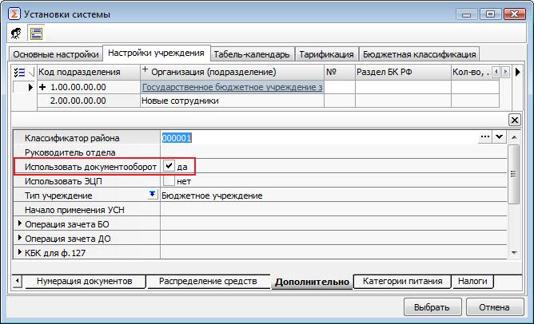

*Рисунок -- Установки системы*

В Установках системы на закладке \"Настройки учреждения\" в окне, открываемом при нажатии кнопки \"Пользователи\", установить флаг-галку напротив каждого пользователя, которому будут доступны права по обработке документов данного учреждения.

*Рисунок -- Установка флаг-галки на доступность к Учреждению в Установках системы*

Настройка схем электронного документооборота между централизованной бухгалтерией и обслуживаемыми учреждениями, настройка прав доступа пользователей, групп пользователей Системы, настройка ЭП пользователей осуществляется в интерфейсах \"Настройка документооборота\", \"Группы пользователей\", \"Пользователи\", \"Настройка ЭП\".

Интерфейсы \"Настройка документооборота\", \"Группы пользователей\", \"Пользователи\", \"Настройка ЭП\" доступны пользователю Системы с правами конфигуратора на секции \"Документооборот\" (вход в Системы осуществляется на рабочее место Конфигуратор).

##  Интерфейс \"Настройка документооборота\" 

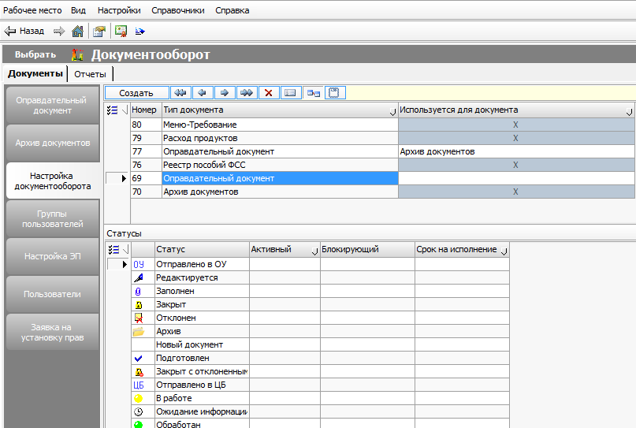

*Рисунок -- Интерфейс \"Настройка документооборота\"*

На панели инструментов интерфейса \"Настройка документооборота\" расположены кнопки:

 (Показать документ-основание), кнопка  (Цифровая подпись).

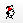 (Сменить тип группы) - на детализации "Права на переход" заполняется поле "Группа" при условии, что оно было пустым, а поле "Название" заполнено.

Таблица -- Поля интерфейса ввода \"Настройка документооборота\"

+------------------------------------------------------------------------------------------------------------------------------------------------+-----------------------------------------------------------------------------------------------------------------------------------------------------------------------------------------------------------------------------------------------------------------------------------------------------------------------------------------------------------------------------------------------------------------------------------------+----------------------------------------------------------------------------------------------------------------------------------------------------------------------------+
| Наименование поля                                                                                                                              | Описание                                                                                                                                                                                                                                                                                                                                                                                                                                | Способ ввода                                                                                                                                                               |
+:===============================================================================================================================================+:========================================================================================================================================================================================================================================================================================================================================================================================================================================+:===========================================================================================================================================================================+
| Заголовок                                                                                                                                                                                                                                                                                                                                                                                                                                                                                                                                                                                                                                                                                                                                                             |
+------------------------------------------------------------------------------------------------------------------------------------------------+-----------------------------------------------------------------------------------------------------------------------------------------------------------------------------------------------------------------------------------------------------------------------------------------------------------------------------------------------------------------------------------------------------------------------------------------+----------------------------------------------------------------------------------------------------------------------------------------------------------------------------+
| Номер                                                                                                                                          | Номер по порядку.                                                                                                                                                                                                                                                                                                                                                                                                                       | Автоматическая генерация. Корректировка вручную.                                                                                                                           |
+------------------------------------------------------------------------------------------------------------------------------------------------+-----------------------------------------------------------------------------------------------------------------------------------------------------------------------------------------------------------------------------------------------------------------------------------------------------------------------------------------------------------------------------------------------------------------------------------------+----------------------------------------------------------------------------------------------------------------------------------------------------------------------------+
| Тип документа                                                                                                                                  | Название документа Системы, для которого будет настраиваться схема документооборота.                                                                                                                                                                                                                                                                                                                                                    | Выбор из списка.                                                                                                                                                           |
|                                                                                                                                                |                                                                                                                                                                                                                                                                                                                                                                                                                                         |                                                                                                                                                                            |
|                                                                                                                                                |                                                                                                                                                                                                                                                                                                                                                                                                                                         | При выборе документа Системы на закладку \"Статусы\" должны подгружаться статусы документа, доступные в Системе.                                                           |
+------------------------------------------------------------------------------------------------------------------------------------------------+-----------------------------------------------------------------------------------------------------------------------------------------------------------------------------------------------------------------------------------------------------------------------------------------------------------------------------------------------------------------------------------------------------------------------------------------+----------------------------------------------------------------------------------------------------------------------------------------------------------------------------+
| Используется для документа                                                                                                                     | Название документа Системы, который может быть создан на основании документа типа \"Оправдательный документ\".                                                                                                                                                                                                                                                                                                                          | Выбор из списка. Поле доступно, если в поле \"Тип документа\" выбран \"Оправдательный документ\".                                                                          |
+------------------------------------------------------------------------------------------------------------------------------------------------+-----------------------------------------------------------------------------------------------------------------------------------------------------------------------------------------------------------------------------------------------------------------------------------------------------------------------------------------------------------------------------------------------------------------------------------------+----------------------------------------------------------------------------------------------------------------------------------------------------------------------------+
| **Таблица-детализация «Статусы»**                                                                                                                                                                                                                                                                                                                                                                                                                                                                                                                                                                                                                                                                                                                                     |
+------------------------------------------------------------------------------------------------------------------------------------------------+-----------------------------------------------------------------------------------------------------------------------------------------------------------------------------------------------------------------------------------------------------------------------------------------------------------------------------------------------------------------------------------------------------------------------------------------+----------------------------------------------------------------------------------------------------------------------------------------------------------------------------+
| Иконка статуса                                                                                                                                 | Картинка статуса документа.                                                                                                                                                                                                                                                                                                                                                                                                             | Автоматическое заполнение при выборе типа документа в заголовочной части.                                                                                                  |
|                                                                                                                                                |                                                                                                                                                                                                                                                                                                                                                                                                                                         |                                                                                                                                                                            |
|                                                                                                                                                |                                                                                                                                                                                                                                                                                                                                                                                                                                         | Выбор из справочника \"Картинки проекта\".                                                                                                                                 |
+------------------------------------------------------------------------------------------------------------------------------------------------+-----------------------------------------------------------------------------------------------------------------------------------------------------------------------------------------------------------------------------------------------------------------------------------------------------------------------------------------------------------------------------------------------------------------------------------------+----------------------------------------------------------------------------------------------------------------------------------------------------------------------------+
| Статус                                                                                                                                         | Наименование статуса документа.                                                                                                                                                                                                                                                                                                                                                                                                         | Автоматическое заполнение при выборе типа документа в заголовочной части.                                                                                                  |
|                                                                                                                                                |                                                                                                                                                                                                                                                                                                                                                                                                                                         |                                                                                                                                                                            |
|                                                                                                                                                |                                                                                                                                                                                                                                                                                                                                                                                                                                         | Ввод вручную.                                                                                                                                                              |
+------------------------------------------------------------------------------------------------------------------------------------------------+-----------------------------------------------------------------------------------------------------------------------------------------------------------------------------------------------------------------------------------------------------------------------------------------------------------------------------------------------------------------------------------------------------------------------------------------+----------------------------------------------------------------------------------------------------------------------------------------------------------------------------+
| Активный для                                                                                                                                   | Отображение оправдательных документов на закладке \"Общий список\" ГИП \"Оправдательный документ\" для стороны (ЦБ, ОУ) при установке параметра выборки \"Состояние\" = Активные.                                                                                                                                                                                                                                                       | Выбор из списка значений путем установки флаг-галки:                                                                                                                       |
|                                                                                                                                                |                                                                                                                                                                                                                                                                                                                                                                                                                                         |                                                                                                                                                                            |
|                                                                                                                                                |                                                                                                                                                                                                                                                                                                                                                                                                                                         | \- ЦБ (централизованная бухгалтерия);                                                                                                                                      |
|                                                                                                                                                |                                                                                                                                                                                                                                                                                                                                                                                                                                         |                                                                                                                                                                            |
|                                                                                                                                                |                                                                                                                                                                                                                                                                                                                                                                                                                                         | \- ОУ (обслуживаемое учреждение).                                                                                                                                          |
+------------------------------------------------------------------------------------------------------------------------------------------------+-----------------------------------------------------------------------------------------------------------------------------------------------------------------------------------------------------------------------------------------------------------------------------------------------------------------------------------------------------------------------------------------------------------------------------------------+----------------------------------------------------------------------------------------------------------------------------------------------------------------------------+
| Блокирующий                                                                                                                                    | При установке галок ЦБ/ОУ документ блокируется для указанных пользователей, если документ находится в указанном статусе. При установке галки \"По статусу ОД\" проверка необходимости блокировки будет производиться не по статусу ПУД, а по статусу ОД, связанного с текущим ПУД. Если связанный ОД, согласно имеющейся настройке, должен быть заблокирован по своему текущему статусу, то и ПУД будет тоже заблокирован от изменения. | Выбор из списка значений путем установки флаг-галки:                                                                                                                       |
|                                                                                                                                                |                                                                                                                                                                                                                                                                                                                                                                                                                                         |                                                                                                                                                                            |
|                                                                                                                                                |                                                                                                                                                                                                                                                                                                                                                                                                                                         | \- ЦБ (централизованная бухгалтерия);                                                                                                                                      |
|                                                                                                                                                |                                                                                                                                                                                                                                                                                                                                                                                                                                         |                                                                                                                                                                            |
|                                                                                                                                                |                                                                                                                                                                                                                                                                                                                                                                                                                                         | \- ОУ (обслуживаемое учреждение);                                                                                                                                          |
|                                                                                                                                                |                                                                                                                                                                                                                                                                                                                                                                                                                                         |                                                                                                                                                                            |
|                                                                                                                                                |                                                                                                                                                                                                                                                                                                                                                                                                                                         | \- По статусу ОД (доступен только для ПУД, если установлена галка \"По статусу ОД\", то галки ЦБ /ОУ не обрабатываются).                                                   |
+------------------------------------------------------------------------------------------------------------------------------------------------+-----------------------------------------------------------------------------------------------------------------------------------------------------------------------------------------------------------------------------------------------------------------------------------------------------------------------------------------------------------------------------------------------------------------------------------------+----------------------------------------------------------------------------------------------------------------------------------------------------------------------------+
| Срок на исполнение                                                                                                                             | Задание срока для обработки документа                                                                                                                                                                                                                                                                                                                                                                                                   | Выбор из выпадающего списка или справочника \"Сроки оплаты\".                                                                                                              |
+------------------------------------------------------------------------------------------------------------------------------------------------+-----------------------------------------------------------------------------------------------------------------------------------------------------------------------------------------------------------------------------------------------------------------------------------------------------------------------------------------------------------------------------------------------------------------------------------------+----------------------------------------------------------------------------------------------------------------------------------------------------------------------------+
| **Таблица-детализация «Переходы»**                                                                                                                                                                                                                                                                                                                                                                                                                                                                                                                                                                                                                                                                                                                                    |
+------------------------------------------------------------------------------------------------------------------------------------------------+-----------------------------------------------------------------------------------------------------------------------------------------------------------------------------------------------------------------------------------------------------------------------------------------------------------------------------------------------------------------------------------------------------------------------------------------+----------------------------------------------------------------------------------------------------------------------------------------------------------------------------+
| № п/п                                                                                                                                          | Номер по порядку.                                                                                                                                                                                                                                                                                                                                                                                                                       | Автоматическая генерация. Корректировка вручную.                                                                                                                           |
+------------------------------------------------------------------------------------------------------------------------------------------------+-----------------------------------------------------------------------------------------------------------------------------------------------------------------------------------------------------------------------------------------------------------------------------------------------------------------------------------------------------------------------------------------------------------------------------------------+----------------------------------------------------------------------------------------------------------------------------------------------------------------------------+
| Начальный статус                                                                                                                               | Иконка начального статуса.                                                                                                                                                                                                                                                                                                                                                                                                              | Должно быть закрыто для редактирования.                                                                                                                                    |
|                                                                                                                                                |                                                                                                                                                                                                                                                                                                                                                                                                                                         |                                                                                                                                                                            |
|                                                                                                                                                |                                                                                                                                                                                                                                                                                                                                                                                                                                         | Иконка должна автоматически подставляться с закладки \"Статусы\" по наименованию начального статуса.                                                                       |
+------------------------------------------------------------------------------------------------------------------------------------------------+-----------------------------------------------------------------------------------------------------------------------------------------------------------------------------------------------------------------------------------------------------------------------------------------------------------------------------------------------------------------------------------------------------------------------------------------+----------------------------------------------------------------------------------------------------------------------------------------------------------------------------+
| Конечный статус                                                                                                                                | Иконка конечного статуса.                                                                                                                                                                                                                                                                                                                                                                                                               | Должно быть закрыто для редактирования.                                                                                                                                    |
|                                                                                                                                                |                                                                                                                                                                                                                                                                                                                                                                                                                                         |                                                                                                                                                                            |
|                                                                                                                                                |                                                                                                                                                                                                                                                                                                                                                                                                                                         | Иконка должна автоматически подставляться с закладки \"Статусы\" по наименованию конечного статуса.                                                                        |
+------------------------------------------------------------------------------------------------------------------------------------------------+-----------------------------------------------------------------------------------------------------------------------------------------------------------------------------------------------------------------------------------------------------------------------------------------------------------------------------------------------------------------------------------------------------------------------------------------+----------------------------------------------------------------------------------------------------------------------------------------------------------------------------+
| Начальный                                                                                                                                      | Наименование начального статуса.                                                                                                                                                                                                                                                                                                                                                                                                        | Выбор из списка доступных статусов детализации \"Статусы\".                                                                                                                |
+------------------------------------------------------------------------------------------------------------------------------------------------+-----------------------------------------------------------------------------------------------------------------------------------------------------------------------------------------------------------------------------------------------------------------------------------------------------------------------------------------------------------------------------------------------------------------------------------------+----------------------------------------------------------------------------------------------------------------------------------------------------------------------------+
| Конечный                                                                                                                                       | Наименование конечного статуса.                                                                                                                                                                                                                                                                                                                                                                                                         | Выбор из списка доступных статусов детализации \"Статусы\".                                                                                                                |
+------------------------------------------------------------------------------------------------------------------------------------------------+-----------------------------------------------------------------------------------------------------------------------------------------------------------------------------------------------------------------------------------------------------------------------------------------------------------------------------------------------------------------------------------------------------------------------------------------+----------------------------------------------------------------------------------------------------------------------------------------------------------------------------+
| Номер перехода                                                                                                                                 | Установка очередности переходов по статусам при условии обязательности заполнения поля \"Назначены права\".                                                                                                                                                                                                                                                                                                                             | Ввод вручную.                                                                                                                                                              |
|                                                                                                                                                |                                                                                                                                                                                                                                                                                                                                                                                                                                         |                                                                                                                                                                            |
|                                                                                                                                                |                                                                                                                                                                                                                                                                                                                                                                                                                                         | Если номер перехода не заполнен, то действуют все переходы по статусам, введенные на закладке \"Переходы\" при условии обязательности заполнения поля \"Назначены права\". |
+------------------------------------------------------------------------------------------------------------------------------------------------+-----------------------------------------------------------------------------------------------------------------------------------------------------------------------------------------------------------------------------------------------------------------------------------------------------------------------------------------------------------------------------------------------------------------------------------------+----------------------------------------------------------------------------------------------------------------------------------------------------------------------------+
| Название перехода                                                                                                                              | Название перехода.                                                                                                                                                                                                                                                                                                                                                                                                                      | Ввод вручную.                                                                                                                                                              |
+------------------------------------------------------------------------------------------------------------------------------------------------+-----------------------------------------------------------------------------------------------------------------------------------------------------------------------------------------------------------------------------------------------------------------------------------------------------------------------------------------------------------------------------------------------------------------------------------------+----------------------------------------------------------------------------------------------------------------------------------------------------------------------------+
| 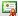 Подписывать       | Наличие ЭП                                                                                                                                                                                                                                                                                                                                                                                                                              | Поле с флаг-галкой.                                                                                                                                                        |
|                                                                                                                                                |                                                                                                                                                                                                                                                                                                                                                                                                                                         |                                                                                                                                                                            |
|                                                                                                                                                |                                                                                                                                                                                                                                                                                                                                                                                                                                         | При установленной галке Система должна проверять наличие ЭП пользователя на данный переход по статусам.                                                                    |
+------------------------------------------------------------------------------------------------------------------------------------------------+-----------------------------------------------------------------------------------------------------------------------------------------------------------------------------------------------------------------------------------------------------------------------------------------------------------------------------------------------------------------------------------------------------------------------------------------+----------------------------------------------------------------------------------------------------------------------------------------------------------------------------+
| 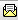 Прикреплять файл | Наличие скан-копии ПУД                                                                                                                                                                                                                                                                                                                                                                                                                  | Поле с флаг-галкой.                                                                                                                                                        |
|                                                                                                                                                |                                                                                                                                                                                                                                                                                                                                                                                                                                         |                                                                                                                                                                            |
|                                                                                                                                                |                                                                                                                                                                                                                                                                                                                                                                                                                                         | При установленной галке Система должна проверять наличие приложенной скан-копии ПУД на данном переходе по статусам.                                                        |
+------------------------------------------------------------------------------------------------------------------------------------------------+-----------------------------------------------------------------------------------------------------------------------------------------------------------------------------------------------------------------------------------------------------------------------------------------------------------------------------------------------------------------------------------------------------------------------------------------+----------------------------------------------------------------------------------------------------------------------------------------------------------------------------+
|  Уведомление пользователям                                                  | Выбор последующего перехода для группы пользователей, которым должно прийти уведомление о получении электронного документа.                                                                                                                                                                                                                                                                                                             | Выбор из списка значений путем установки флаг-галки.                                                                                                                       |
+------------------------------------------------------------------------------------------------------------------------------------------------+-----------------------------------------------------------------------------------------------------------------------------------------------------------------------------------------------------------------------------------------------------------------------------------------------------------------------------------------------------------------------------------------------------------------------------------------+----------------------------------------------------------------------------------------------------------------------------------------------------------------------------+
| Доп.проверка прав (ABL)                                                                                                                        | Поле для скрипта по проверке прав пользователей.                                                                                                                                                                                                                                                                                                                                                                                        | Выбор из окна \"Редактирование программ\".                                                                                                                                 |
+------------------------------------------------------------------------------------------------------------------------------------------------+-----------------------------------------------------------------------------------------------------------------------------------------------------------------------------------------------------------------------------------------------------------------------------------------------------------------------------------------------------------------------------------------------------------------------------------------+----------------------------------------------------------------------------------------------------------------------------------------------------------------------------+
| Логический контроль                                                                                                                            | Поле для скрипта по логическому контролю за правильностью переходов статусов.                                                                                                                                                                                                                                                                                                                                                           | Выбор из окна \"Редактирование программ\".                                                                                                                                 |
+------------------------------------------------------------------------------------------------------------------------------------------------+-----------------------------------------------------------------------------------------------------------------------------------------------------------------------------------------------------------------------------------------------------------------------------------------------------------------------------------------------------------------------------------------------------------------------------------------+----------------------------------------------------------------------------------------------------------------------------------------------------------------------------+
| Доп.обработка                                                                                                                                  | Поле для скрипта по дополнительной обработке статусов.                                                                                                                                                                                                                                                                                                                                                                                  | Выбор из окна \"Редактирование программ\".                                                                                                                                 |
+------------------------------------------------------------------------------------------------------------------------------------------------+-----------------------------------------------------------------------------------------------------------------------------------------------------------------------------------------------------------------------------------------------------------------------------------------------------------------------------------------------------------------------------------------------------------------------------------------+----------------------------------------------------------------------------------------------------------------------------------------------------------------------------+
| Назначены права                                                                                                                                | Группы пользователей с правами на переход.                                                                                                                                                                                                                                                                                                                                                                                              | Должно быть закрыто для редактирования. Должно отображать перечень групп пользователей, которым разрешены права на данный переход на закладке \"Права на переход\".        |
+------------------------------------------------------------------------------------------------------------------------------------------------+-----------------------------------------------------------------------------------------------------------------------------------------------------------------------------------------------------------------------------------------------------------------------------------------------------------------------------------------------------------------------------------------------------------------------------------------+----------------------------------------------------------------------------------------------------------------------------------------------------------------------------+
| **Таблица-детализация «Права на переход»**                                                                                                                                                                                                                                                                                                                                                                                                                                                                                                                                                                                                                                                                                                                            |
+------------------------------------------------------------------------------------------------------------------------------------------------+-----------------------------------------------------------------------------------------------------------------------------------------------------------------------------------------------------------------------------------------------------------------------------------------------------------------------------------------------------------------------------------------------------------------------------------------+----------------------------------------------------------------------------------------------------------------------------------------------------------------------------+
| Группа                                                                                                                                         | Группа пользователей, которой доступен данный переход по статусам.                                                                                                                                                                                                                                                                                                                                                                      | Выбор значения из документа \"Группы пользователей\".                                                                                                                      |
+------------------------------------------------------------------------------------------------------------------------------------------------+-----------------------------------------------------------------------------------------------------------------------------------------------------------------------------------------------------------------------------------------------------------------------------------------------------------------------------------------------------------------------------------------------------------------------------------------+----------------------------------------------------------------------------------------------------------------------------------------------------------------------------+
| Название                                                                                                                                       | Название группы пользователей.                                                                                                                                                                                                                                                                                                                                                                                                          | Должны быть закрыты для редактирования.                                                                                                                                    |
|                                                                                                                                                |                                                                                                                                                                                                                                                                                                                                                                                                                                         |                                                                                                                                                                            |
|                                                                                                                                                |                                                                                                                                                                                                                                                                                                                                                                                                                                         | Должны автоматически заполняться из справочника "Группы пользователей".                                                                                                    |
+------------------------------------------------------------------------------------------------------------------------------------------------+-----------------------------------------------------------------------------------------------------------------------------------------------------------------------------------------------------------------------------------------------------------------------------------------------------------------------------------------------------------------------------------------------------------------------------------------+                                                                                                                                                                            |
| В составе                                                                                                                                      | Группа пользователей, обладающая правом видимости выбранного перехода по статусам.                                                                                                                                                                                                                                                                                                                                                      |                                                                                                                                                                            |
+------------------------------------------------------------------------------------------------------------------------------------------------+-----------------------------------------------------------------------------------------------------------------------------------------------------------------------------------------------------------------------------------------------------------------------------------------------------------------------------------------------------------------------------------------------------------------------------------------+----------------------------------------------------------------------------------------------------------------------------------------------------------------------------+

**Таблица-детализация \"Статусы\"**

*Рисунок -- Таблица-детализация \"Статусы\"*

На данной детализации показаны все возможные статусы, в которых может находиться выбранный документ.

Документ "Оправдательный документ" может находиться в одном из следующих состояний (статусов):

*Новый документ* - устанавливается системой автоматически при создании нового документа;

 *Редактируется* -- документ сохранен в базе данных. Устанавливается удаленным пользователем;

 *Заполнен* -- устанавливается удаленным пользователем после заполнения документа и прикрепления скан-копии первичного учетного документа. Пользователю ЦБ с соответствующими правами автоматически формируется уведомление по обработке документа

*Отклонен* -- отклонение обработки документа пользователем ЦБ по какой-либо причине (причина может быть указана в таблице-детализации "Комментарий"). Удаленному пользователю в соответствии с его правами автоматически формируется задача по доработке документа "Оправдательный документ";

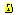 *Закрыт* -- документ обработан пользователем ЦБ. Документ закрывается для редактирования.

 *Архив* -- документ сохранен в Архив;

 *Подготовлен* -- документ обработан пользователем ЦБ и возвращен для обработки пользователю ОУ.

**\**

**Таблица-детализация \"Переходы\"**

*Рисунок -- Таблица-детализация* "*Переходы*"

На данной детализации необходимо указать все возможные переходы по статусам на выбранном документе.

Переход по статусам документа "Оправдательный документ":

1.  Редактируется ↔ Заполнен ↔ Отклонен

Документ заполнен удаленным пользователем. Пользователю ЦБ поступило уведомление о необходимости обработки документа. Документ отклонен пользователем ЦБ для доработки удаленным пользователем.

2.  Редактируется ↔ Заполнен ↔ Закрыт

Документ заполнен удаленным пользователем. Пользователю ЦБ поступило уведомление о необходимости обработки документа. Документ обработан и закрыт пользователем ЦБ.

3.  Редактируется ↔ Заполнен ↔ Редактируется

Документ заполнен удаленным пользователем. Пользователю ЦБ поступило уведомление о необходимости обработки документа. Задача не обработана Пользователем ЦБ. Документ отозван удаленным пользователем.

Для того, чтобы пользователю определенной группы настроить поступление уведомления об изменении статуса оправдательного документа нужно:

- перейти на детализацию \"Переходы\" в поле \"Уведомления пользователям\" напротив данного перехода;

- открыть выпадающий список;

- поставить флаг-галку на следующий за данным переходом переход по статусам;

- перейти на переход по статусам в полях \"начальный\" - \"конечный\", на который поставили флаг-галку;

- в поле \"Назначены права\" напротив данного перехода установить группу пользователей, которым должно приходить уведомление об изменении статуса оправдательного документа.

*\
Пример настройки*

Пользователям групп ОУ_НФА, ОУ_РО должно приходить уведомление об изменении статуса Оправдательного документа на \"Отклонен\".

1\. На документе \"Настройка документооборота\" на детализации \"Переходы\" встаем в поле \"Уведомление пользователям\" напротив перехода \"Заполнен - Отклонен\".

2\. Из выпадающего списка выбираем переход \"Отклонен - Редактируется\".

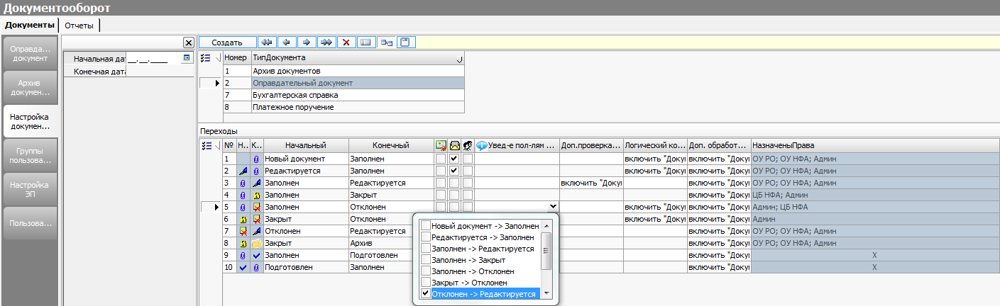

*Рисунок -- Пример таблицы-детализации "Переходы"*

3\. В полях \"Начальный\", \"Конечный\" ставим флаг-галку у перехода \"Отклонен - Редактируется\".

4\. В поле \"Назначены права\" проставляем группу ОУ_НФА, ОУ_РО.

*Рисунок -- Детализация "Переходы"*

**Таблица-детализация \"Права на переход\"**

На данной детализации в поле "Переходы" прописываются все возможные переходы по статусам документа и группы пользователей, обладающей правами видимости данных переходов по статусам.

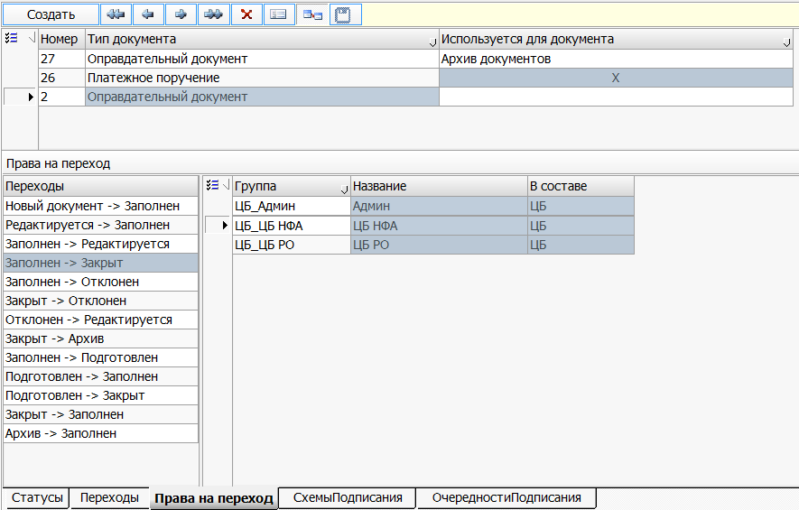

*Рисунок -- Таблица-детализация "Права на переход"*

## Интерфейс \"Группы пользователей\" 

Интерфейс \"Группы пользователей\" предназначен для привязки пользователей к группам (например, группа 1 \"обслуживаемое учреждение\", группа 2 \"централизованная бухгалтерия\") и наделения групп пользователей правами.

*Рисунок -- Интерфейс \"Группы пользователей\"*

В заголовке интерфейса находится сервис  (Заполнить из файла подключения). При вызове сервиса из файла подключения Системы в интерфейс копируются группы пользователей, а на детализацию \"Пользователи\" подтягиваются все пользователи, входящие в данную группу.

Таблица -- Поля интерфейса ввода \"Группы пользователей\"

+---------------------------------------------------------------------------------------------------+---------------------------------------------------------------------------------------------------------------------------------------------------------------------------------------------+-------------------------------------------------------------------------------------------------------------------------------------------------------------------------------------------------------------------------------------------------------------------------------------------------------------------------------------------------------------------------------------+
| Наименование поля                                                                                 | Описание                                                                                                                                                                                    | Способ ввода                                                                                                                                                                                                                                                                                                                                                                        |
+===================================================================================================+=============================================================================================================================================================================================+=====================================================================================================================================================================================================================================================================================================================================================================================+
| **Заголовок**                                                                                                                                                                                                                                                                                                                                                                                                                                                                                                                                                                                                                                                                         |
+---------------------------------------------------------------------------------------------------+---------------------------------------------------------------------------------------------------------------------------------------------------------------------------------------------+-------------------------------------------------------------------------------------------------------------------------------------------------------------------------------------------------------------------------------------------------------------------------------------------------------------------------------------------------------------------------------------+
| Номер                                                                                             | Номер по порядку.                                                                                                                                                                           | Автоматическая генерация. Корректировка вручную.                                                                                                                                                                                                                                                                                                                                    |
+---------------------------------------------------------------------------------------------------+---------------------------------------------------------------------------------------------------------------------------------------------------------------------------------------------+-------------------------------------------------------------------------------------------------------------------------------------------------------------------------------------------------------------------------------------------------------------------------------------------------------------------------------------------------------------------------------------+
| Группа                                                                                            | Наименование группы пользователей.                                                                                                                                                          | Выбор из справочника \"Группа пользователей\", либо из выпадающего списка.                                                                                                                                                                                                                                                                                                          |
+---------------------------------------------------------------------------------------------------+---------------------------------------------------------------------------------------------------------------------------------------------------------------------------------------------+-------------------------------------------------------------------------------------------------------------------------------------------------------------------------------------------------------------------------------------------------------------------------------------------------------------------------------------------------------------------------------------+
| В составе                                                                                         | Принадлежность группы пользователей.                                                                                                                                                        | Выбор значения из выпадающего списка:                                                                                                                                                                                                                                                                                                                                               |
|                                                                                                   |                                                                                                                                                                                             |                                                                                                                                                                                                                                                                                                                                                                                     |
|                                                                                                   |                                                                                                                                                                                             | \- не указано;                                                                                                                                                                                                                                                                                                                                                                      |
|                                                                                                   |                                                                                                                                                                                             |                                                                                                                                                                                                                                                                                                                                                                                     |
|                                                                                                   |                                                                                                                                                                                             | \- ОУ;                                                                                                                                                                                                                                                                                                                                                                              |
|                                                                                                   |                                                                                                                                                                                             |                                                                                                                                                                                                                                                                                                                                                                                     |
|                                                                                                   |                                                                                                                                                                                             | \- ЦБ.                                                                                                                                                                                                                                                                                                                                                                              |
+---------------------------------------------------------------------------------------------------+---------------------------------------------------------------------------------------------------------------------------------------------------------------------------------------------+-------------------------------------------------------------------------------------------------------------------------------------------------------------------------------------------------------------------------------------------------------------------------------------------------------------------------------------------------------------------------------------+
| **Таблица-детализация \"Пользователи\"**                                                                                                                                                                                                                                                                                                                                                                                                                                                                                                                                                                                                                                              |
+---------------------------------------------------------------------------------------------------+---------------------------------------------------------------------------------------------------------------------------------------------------------------------------------------------+-------------------------------------------------------------------------------------------------------------------------------------------------------------------------------------------------------------------------------------------------------------------------------------------------------------------------------------------------------------------------------------+
| Пользователь                                                                                      | ФИО пользователя.                                                                                                                                                                           | Выбор из выпадающего списка.                                                                                                                                                                                                                                                                                                                                                        |
|                                                                                                   |                                                                                                                                                                                             |                                                                                                                                                                                                                                                                                                                                                                                     |
|                                                                                                   |                                                                                                                                                                                             | ФИО пользователей должны подгружаться из файла подключения.                                                                                                                                                                                                                                                                                                                         |
+---------------------------------------------------------------------------------------------------+---------------------------------------------------------------------------------------------------------------------------------------------------------------------------------------------+-------------------------------------------------------------------------------------------------------------------------------------------------------------------------------------------------------------------------------------------------------------------------------------------------------------------------------------------------------------------------------------+
| Руководитель группы                                                                               | Руководитель группы.                                                                                                                                                                        | Поле с флаг-галкой.                                                                                                                                                                                                                                                                                                                                                                 |
|                                                                                                   |                                                                                                                                                                                             |                                                                                                                                                                                                                                                                                                                                                                                     |
|                                                                                                   | Руководитель группы должен иметь возможность назначения (внутри своей группы для ЦБ) Исполнителя в ГИП \"Оправдательный документ\".                                                         |                                                                                                                                                                                                                                                                                                                                                                                     |
+---------------------------------------------------------------------------------------------------+---------------------------------------------------------------------------------------------------------------------------------------------------------------------------------------------+-------------------------------------------------------------------------------------------------------------------------------------------------------------------------------------------------------------------------------------------------------------------------------------------------------------------------------------------------------------------------------------+
| **Таблица-детализация \"Права группы\"**                                                                                                                                                                                                                                                                                                                                                                                                                                                                                                                                                                                                                                              |
+---------------------------------------------------------------------------------------------------+---------------------------------------------------------------------------------------------------------------------------------------------------------------------------------------------+-------------------------------------------------------------------------------------------------------------------------------------------------------------------------------------------------------------------------------------------------------------------------------------------------------------------------------------------------------------------------------------+
| Класс объекта                                                                                     | Системное наименование документа (объекта) Системы.                                                                                                                                         | Выбор из выпадающего списка. Если класса объекта не хватает в выпадающем списке, его необходимо добавить в поле \"Тип документа\" в заголовочной части ГИП \"Настройка документооборота\" без какой-либо настройки для данного типа документа.                                                                                                                                      |
+---------------------------------------------------------------------------------------------------+---------------------------------------------------------------------------------------------------------------------------------------------------------------------------------------------+-------------------------------------------------------------------------------------------------------------------------------------------------------------------------------------------------------------------------------------------------------------------------------------------------------------------------------------------------------------------------------------+
|  Добавление                   | Установка прав на добавление документов указанного типа.                                                                                                                                    | Поле с флаг-галкой.                                                                                                                                                                                                                                                                                                                                                                 |
+---------------------------------------------------------------------------------------------------+---------------------------------------------------------------------------------------------------------------------------------------------------------------------------------------------+-------------------------------------------------------------------------------------------------------------------------------------------------------------------------------------------------------------------------------------------------------------------------------------------------------------------------------------------------------------------------------------+
|  Изменение                    | Установка прав на изменение документов указанного типа.                                                                                                                                     | Поле с флаг-галкой.                                                                                                                                                                                                                                                                                                                                                                 |
+---------------------------------------------------------------------------------------------------+---------------------------------------------------------------------------------------------------------------------------------------------------------------------------------------------+-------------------------------------------------------------------------------------------------------------------------------------------------------------------------------------------------------------------------------------------------------------------------------------------------------------------------------------------------------------------------------------+
| 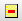 Удаление                     | Установка прав на удаление документов указанного типа.                                                                                                                                      | Поле с флаг-галкой.                                                                                                                                                                                                                                                                                                                                                                 |
+---------------------------------------------------------------------------------------------------+---------------------------------------------------------------------------------------------------------------------------------------------------------------------------------------------+-------------------------------------------------------------------------------------------------------------------------------------------------------------------------------------------------------------------------------------------------------------------------------------------------------------------------------------------------------------------------------------+
| 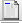 Доступность                  | Установка прав на доступность документов указанного типа.                                                                                                                                   | Поле с флаг-галкой.                                                                                                                                                                                                                                                                                                                                                                 |
+---------------------------------------------------------------------------------------------------+---------------------------------------------------------------------------------------------------------------------------------------------------------------------------------------------+-------------------------------------------------------------------------------------------------------------------------------------------------------------------------------------------------------------------------------------------------------------------------------------------------------------------------------------------------------------------------------------+
|  Оправдательный документ      | Установка прав на добавление, изменение, удаление, доступность документов указанного типа. Данная флаг-галка отвечает за видимость оправдательных документов по типам первичных документов. | Поле с флаг-галкой.                                                                                                                                                                                                                                                                                                                                                                 |
+---------------------------------------------------------------------------------------------------+---------------------------------------------------------------------------------------------------------------------------------------------------------------------------------------------+-------------------------------------------------------------------------------------------------------------------------------------------------------------------------------------------------------------------------------------------------------------------------------------------------------------------------------------------------------------------------------------+
|  Запрет получения уведомлений | Установка запрета получения уведомлений о поступлении новых оправдательных документов по указанному классу объекта.                                                                         | Поле с флаг-галкой.                                                                                                                                                                                                                                                                                                                                                                 |
+---------------------------------------------------------------------------------------------------+---------------------------------------------------------------------------------------------------------------------------------------------------------------------------------------------+-------------------------------------------------------------------------------------------------------------------------------------------------------------------------------------------------------------------------------------------------------------------------------------------------------------------------------------------------------------------------------------+
|  Отбор по исполнителю         | Отображение оправдательных документов на закладке \"Общий список\" ГИП \"Оправдательный документ\".                                                                                         | Выбор из списка: пусто, только мои и не назначенные, только мои.                                                                                                                                                                                                                                                                                                                    |
|                                                                                                   |                                                                                                                                                                                             |                                                                                                                                                                                                                                                                                                                                                                                     |
|                                                                                                   |                                                                                                                                                                                             | \"Пусто\" - на закладке \"Общий список\" должны отображаться Оправдательные документы, у которых в детализации «Созданы документы» присутствуют доступные пользователю типы документов.                                                                                                                                                                                             |
|                                                                                                   |                                                                                                                                                                                             |                                                                                                                                                                                                                                                                                                                                                                                     |
|                                                                                                   |                                                                                                                                                                                             | «Только мои и не назначенные» - на закладке \"Общий список\" должны отображаться Оправдательные документы, у которых в детализации «Созданы документы» присутствуют доступные пользователю типы документов. При этом в поле «Исполнитель» указан текущий пользователь, либо пользователь, на которого временно возложены обязанности текущего пользователя, либо поле не заполнено. |
|                                                                                                   |                                                                                                                                                                                             |                                                                                                                                                                                                                                                                                                                                                                                     |
|                                                                                                   |                                                                                                                                                                                             | «Только мои» - на закладке \"Общий список\" должны отображаться Оправдательные документы, у которых в детализации «Созданы документы» присутствуют доступные пользователю типы документов. При этом в поле «Исполнитель» указан текущий пользователь, либо пользователь, на которого временно возложены обязанности текущего пользователя.                                          |
+---------------------------------------------------------------------------------------------------+---------------------------------------------------------------------------------------------------------------------------------------------------------------------------------------------+-------------------------------------------------------------------------------------------------------------------------------------------------------------------------------------------------------------------------------------------------------------------------------------------------------------------------------------------------------------------------------------+
| ВремяИзменения                                                                                    | Дата и время изменения прав группы.                                                                                                                                                         | Должно быть закрыто для редактирования.                                                                                                                                                                                                                                                                                                                                             |
|                                                                                                   |                                                                                                                                                                                             |                                                                                                                                                                                                                                                                                                                                                                                     |
|                                                                                                   |                                                                                                                                                                                             | Значение должно подставляться автоматически в формате ДД.ММ.ГГГГ ЧЧ:ММ:СС                                                                                                                                                                                                                                                                                                           |
+---------------------------------------------------------------------------------------------------+---------------------------------------------------------------------------------------------------------------------------------------------------------------------------------------------+-------------------------------------------------------------------------------------------------------------------------------------------------------------------------------------------------------------------------------------------------------------------------------------------------------------------------------------------------------------------------------------+
| КемИзменен                                                                                        | ФИО пользователя, осуществившего изменение.                                                                                                                                                 | Должно быть закрыто для редактирования.                                                                                                                                                                                                                                                                                                                                             |
|                                                                                                   |                                                                                                                                                                                             |                                                                                                                                                                                                                                                                                                                                                                                     |
|                                                                                                   |                                                                                                                                                                                             | Значение должно подставляться автоматически по пользователю, работающему в Системе.                                                                                                                                                                                                                                                                                                 |
+---------------------------------------------------------------------------------------------------+---------------------------------------------------------------------------------------------------------------------------------------------------------------------------------------------+-------------------------------------------------------------------------------------------------------------------------------------------------------------------------------------------------------------------------------------------------------------------------------------------------------------------------------------------------------------------------------------+

##  Интерфейс \"Пользователи\" 

Электронный документ \"Пользователи\" предназначен для настройки прав пользователей Системы.

*Рисунок -- Интерфейс \"Пользователи\"*

Таблица -- Поля интерфейса ввода \"Пользователи\"

+---------------------------------------------------------------------------------------------------+---------------------------------------------------------------------------------------------------------------------------------------------------------------------------------------------+-------------------------------------------------------------------------------------------------------------------------------------------------------------------------------------------------------------------------------------------------------------------------------------------------------------------------------------------------------------------------------------+
| Наименование поля                                                                                 | Описание                                                                                                                                                                                    | Способ ввода                                                                                                                                                                                                                                                                                                                                                                        |
+===================================================================================================+=============================================================================================================================================================================================+=====================================================================================================================================================================================================================================================================================================================================================================================+
| **Заголовок**                                                                                                                                                                                                                                                                                                                                                                                                                                                                                                                                                                                                                                                                         |
+---------------------------------------------------------------------------------------------------+---------------------------------------------------------------------------------------------------------------------------------------------------------------------------------------------+-------------------------------------------------------------------------------------------------------------------------------------------------------------------------------------------------------------------------------------------------------------------------------------------------------------------------------------------------------------------------------------+
| Номер                                                                                             | Номер по порядку.                                                                                                                                                                           | Автоматическая генерация. Корректировка вручную.                                                                                                                                                                                                                                                                                                                                    |
+---------------------------------------------------------------------------------------------------+---------------------------------------------------------------------------------------------------------------------------------------------------------------------------------------------+-------------------------------------------------------------------------------------------------------------------------------------------------------------------------------------------------------------------------------------------------------------------------------------------------------------------------------------------------------------------------------------+
| Пользователь                                                                                      | ФИО пользователя.                                                                                                                                                                           | Выбор из выпадающего списка.                                                                                                                                                                                                                                                                                                                                                        |
+---------------------------------------------------------------------------------------------------+---------------------------------------------------------------------------------------------------------------------------------------------------------------------------------------------+-------------------------------------------------------------------------------------------------------------------------------------------------------------------------------------------------------------------------------------------------------------------------------------------------------------------------------------------------------------------------------------+
| **Таблица-детализация \"Права пользователя\"**                                                                                                                                                                                                                                                                                                                                                                                                                                                                                                                                                                                                                                        |
+---------------------------------------------------------------------------------------------------+---------------------------------------------------------------------------------------------------------------------------------------------------------------------------------------------+-------------------------------------------------------------------------------------------------------------------------------------------------------------------------------------------------------------------------------------------------------------------------------------------------------------------------------------------------------------------------------------+
| Класс объекта                                                                                     | Системное наименование документа (объекта) Системы.                                                                                                                                         | Выбор из выпадающего списка.                                                                                                                                                                                                                                                                                                                                                        |
|                                                                                                   |                                                                                                                                                                                             |                                                                                                                                                                                                                                                                                                                                                                                     |
|                                                                                                   |                                                                                                                                                                                             | Если класса объекта не хватает в выпадающем списке, его необходимо добавить в поле \"Тип документа\" в заголовочной части ГИП \"Настройка документооборота\" без какой-либо настройки для данного типа документа.                                                                                                                                                                   |
+---------------------------------------------------------------------------------------------------+---------------------------------------------------------------------------------------------------------------------------------------------------------------------------------------------+-------------------------------------------------------------------------------------------------------------------------------------------------------------------------------------------------------------------------------------------------------------------------------------------------------------------------------------------------------------------------------------+
|  Добавление                   | Установка прав на добавление документов указанного типа.                                                                                                                                    | Поле с флаг-галкой.                                                                                                                                                                                                                                                                                                                                                                 |
+---------------------------------------------------------------------------------------------------+---------------------------------------------------------------------------------------------------------------------------------------------------------------------------------------------+-------------------------------------------------------------------------------------------------------------------------------------------------------------------------------------------------------------------------------------------------------------------------------------------------------------------------------------------------------------------------------------+
|  Изменение                    | Установка прав на изменение документов указанного типа.                                                                                                                                     | Поле с флаг-галкой.                                                                                                                                                                                                                                                                                                                                                                 |
+---------------------------------------------------------------------------------------------------+---------------------------------------------------------------------------------------------------------------------------------------------------------------------------------------------+-------------------------------------------------------------------------------------------------------------------------------------------------------------------------------------------------------------------------------------------------------------------------------------------------------------------------------------------------------------------------------------+
|  Удаление                     | Установка прав на удаление документов указанного типа.                                                                                                                                      | Поле с флаг-галкой.                                                                                                                                                                                                                                                                                                                                                                 |
+---------------------------------------------------------------------------------------------------+---------------------------------------------------------------------------------------------------------------------------------------------------------------------------------------------+-------------------------------------------------------------------------------------------------------------------------------------------------------------------------------------------------------------------------------------------------------------------------------------------------------------------------------------------------------------------------------------+
|  Доступность                  | Установка прав на доступность документов указанного типа.                                                                                                                                   | Поле с флаг-галкой.                                                                                                                                                                                                                                                                                                                                                                 |
+---------------------------------------------------------------------------------------------------+---------------------------------------------------------------------------------------------------------------------------------------------------------------------------------------------+-------------------------------------------------------------------------------------------------------------------------------------------------------------------------------------------------------------------------------------------------------------------------------------------------------------------------------------------------------------------------------------+
|  Оправдательный документ      | Установка прав на добавление, изменение, удаление, доступность документов указанного типа. Данная флаг-галка отвечает за видимость оправдательных документов по типам первичных документов. | Поле с флаг-галкой.                                                                                                                                                                                                                                                                                                                                                                 |
+---------------------------------------------------------------------------------------------------+---------------------------------------------------------------------------------------------------------------------------------------------------------------------------------------------+-------------------------------------------------------------------------------------------------------------------------------------------------------------------------------------------------------------------------------------------------------------------------------------------------------------------------------------------------------------------------------------+
|  Запрет получения уведомлений | Установка запрета получения уведомлений о поступлении новых оправдательных документов по указанному классу объекта.                                                                         | Поле с флаг-галкой.                                                                                                                                                                                                                                                                                                                                                                 |
+---------------------------------------------------------------------------------------------------+---------------------------------------------------------------------------------------------------------------------------------------------------------------------------------------------+-------------------------------------------------------------------------------------------------------------------------------------------------------------------------------------------------------------------------------------------------------------------------------------------------------------------------------------------------------------------------------------+
|  Отбор по исполнителю         | Отображение оправдательных документов на закладке \"Общий список\" ГИП \"Оправдательный документ\".                                                                                         | Выбор из списка: пусто, только мои и не назначенные, только мои.                                                                                                                                                                                                                                                                                                                    |
|                                                                                                   |                                                                                                                                                                                             |                                                                                                                                                                                                                                                                                                                                                                                     |
|                                                                                                   |                                                                                                                                                                                             | \"Пусто\" - на закладке \"Общий список\" должны отображаться Оправдательные документы, у которых в детализации «Созданы документы» присутствуют доступные пользователю типы документов.                                                                                                                                                                                             |
|                                                                                                   |                                                                                                                                                                                             |                                                                                                                                                                                                                                                                                                                                                                                     |
|                                                                                                   |                                                                                                                                                                                             | «Только мои и не назначенные» - на закладке \"Общий список\" должны отображаться Оправдательные документы, у которых в детализации «Созданы документы» присутствуют доступные пользователю типы документов. При этом в поле «Исполнитель» указан текущий пользователь, либо пользователь, на которого временно возложены обязанности текущего пользователя, либо поле не заполнено. |
|                                                                                                   |                                                                                                                                                                                             |                                                                                                                                                                                                                                                                                                                                                                                     |
|                                                                                                   |                                                                                                                                                                                             | «Только мои» - на закладке \"Общий список\" должны отображаться Оправдательные документы, у которых в детализации «Созданы документы» присутствуют доступные пользователю типы документов. При этом в поле «Исполнитель» указан текущий пользователь, либо пользователь, на которого временно возложены обязанности текущего пользователя.                                          |
+---------------------------------------------------------------------------------------------------+---------------------------------------------------------------------------------------------------------------------------------------------------------------------------------------------+-------------------------------------------------------------------------------------------------------------------------------------------------------------------------------------------------------------------------------------------------------------------------------------------------------------------------------------------------------------------------------------+
| ВремяИзменения                                                                                    | Дата и время изменения прав группы.                                                                                                                                                         | Должно быть закрыто для редактирования.                                                                                                                                                                                                                                                                                                                                             |
|                                                                                                   |                                                                                                                                                                                             |                                                                                                                                                                                                                                                                                                                                                                                     |
|                                                                                                   |                                                                                                                                                                                             | Значение должно подставляться автоматически в формате ДД.ММ.ГГГГ ЧЧ:ММ:СС                                                                                                                                                                                                                                                                                                           |
+---------------------------------------------------------------------------------------------------+---------------------------------------------------------------------------------------------------------------------------------------------------------------------------------------------+-------------------------------------------------------------------------------------------------------------------------------------------------------------------------------------------------------------------------------------------------------------------------------------------------------------------------------------------------------------------------------------+
| КемИзменен                                                                                        | ФИО пользователя, осуществившего изменение.                                                                                                                                                 | Должно быть закрыто для редактирования.                                                                                                                                                                                                                                                                                                                                             |
|                                                                                                   |                                                                                                                                                                                             |                                                                                                                                                                                                                                                                                                                                                                                     |
|                                                                                                   |                                                                                                                                                                                             | Значение должно подставляться автоматически по пользователю, работающему в Системе.                                                                                                                                                                                                                                                                                                 |
+---------------------------------------------------------------------------------------------------+---------------------------------------------------------------------------------------------------------------------------------------------------------------------------------------------+-------------------------------------------------------------------------------------------------------------------------------------------------------------------------------------------------------------------------------------------------------------------------------------------------------------------------------------------------------------------------------------+
| **Таблица-детализация \"Временное исполнение обязанностей\"**                                                                                                                                                                                                                                                                                                                                                                                                                                                                                                                                                                                                                         |
+---------------------------------------------------------------------------------------------------+---------------------------------------------------------------------------------------------------------------------------------------------------------------------------------------------+-------------------------------------------------------------------------------------------------------------------------------------------------------------------------------------------------------------------------------------------------------------------------------------------------------------------------------------------------------------------------------------+
| Пользователь                                                                                      | ФИО пользователя, временно исполняющего обязанности текущего пользователя (указанного в заголовочной части документа).                                                                      | Выбор из выпадающего списка.                                                                                                                                                                                                                                                                                                                                                        |
+---------------------------------------------------------------------------------------------------+---------------------------------------------------------------------------------------------------------------------------------------------------------------------------------------------+-------------------------------------------------------------------------------------------------------------------------------------------------------------------------------------------------------------------------------------------------------------------------------------------------------------------------------------------------------------------------------------+
| Период С                                                                                          | Дата, с которой пользователь временно исполняет обязанности.                                                                                                                                | Поле с календарем.                                                                                                                                                                                                                                                                                                                                                                  |
+---------------------------------------------------------------------------------------------------+---------------------------------------------------------------------------------------------------------------------------------------------------------------------------------------------+-------------------------------------------------------------------------------------------------------------------------------------------------------------------------------------------------------------------------------------------------------------------------------------------------------------------------------------------------------------------------------------+
| Период По                                                                                         | Дата, по которую пользователь временно исполняет обязанности.                                                                                                                               | Поле с календарем.                                                                                                                                                                                                                                                                                                                                                                  |
+---------------------------------------------------------------------------------------------------+---------------------------------------------------------------------------------------------------------------------------------------------------------------------------------------------+-------------------------------------------------------------------------------------------------------------------------------------------------------------------------------------------------------------------------------------------------------------------------------------------------------------------------------------------------------------------------------------+

На панели инструментов интерфейса \"Пользователи\" находится кнопка  (Обновить пользователей). При нажатии открывается диалоговое окно "Параметры".

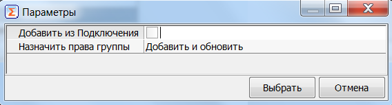

*Рисунок -- Диалоговое окно "Параметры"*

"Добавить из подключения" -- при установке флаг-галки в заголовочную часть интерфейса \"Пользователей\" добавятся все вновь добавленные пользователи из файла Подключения, заполнится детализация "Права пользователя" текущими правами по типам документов.

В список пользователей в шапке документа добавятся только те пользователи, у которых в файле подключения в графе \"Параметры\" не назначены права администратора и права \"Группа пользователей\".

"Назначить права группы" -- приведет права пользователя к правам группы.

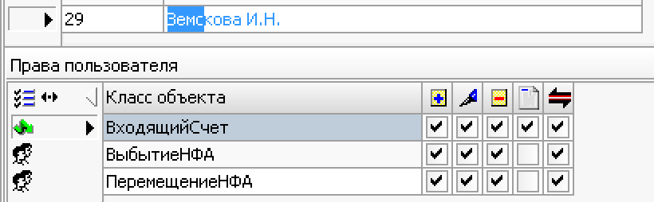

*Рисунок -- Детализация "Права пользователя"*

Иконка 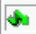 означает, что права взяты из интерфейса "Права пользователя".

Иконка 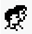 означает, что права взяты от прав группы, в которую входит пользователь, с документа "Группы пользователей".

При вхождении пользователя в несколько групп права суммируются.

## Интерфейс \"Настройка ЭП\" 

Электронный документ \"Настройка ЭП\" предназначен для привязки ЭП к определенным пользователям Системы.

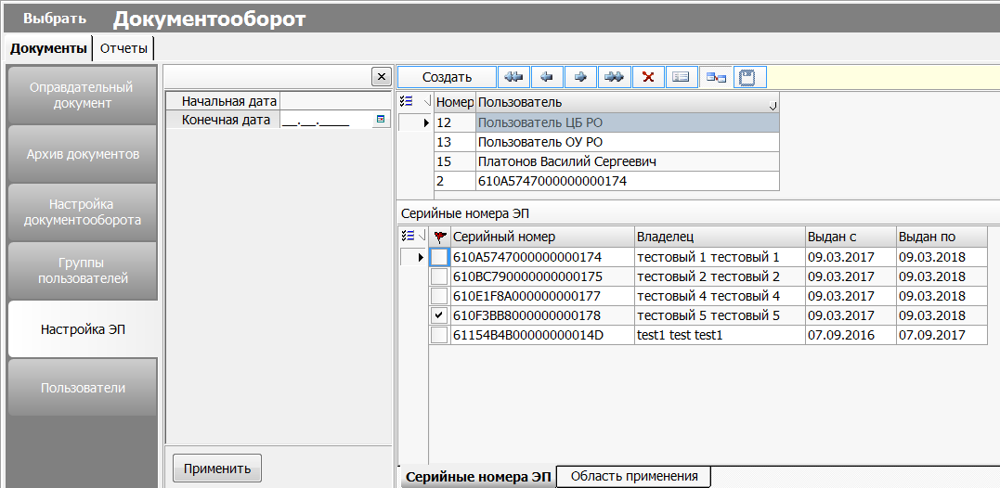

*Рисунок --Интерфейс "Настройка ЭП "*

Таблица -- Поля интерфейса ввода \"Настройка ЭП\"

+-------------------------+----------------------------------------------------------------------------------+-------------------------------------------------------------------------------------------------------------------------------------------------+
| Наименование поля       | Описание                                                                         | Способ ввода                                                                                                                                    |
+=========================+==================================================================================+=================================================================================================================================================+
| **Заголовок**                                                                                                                                                                                                                                                |
+-------------------------+----------------------------------------------------------------------------------+-------------------------------------------------------------------------------------------------------------------------------------------------+
| Номер                   | Номер по порядку.                                                                | Автоматическая генерация. Корректировка вручную.                                                                                                |
+-------------------------+----------------------------------------------------------------------------------+-------------------------------------------------------------------------------------------------------------------------------------------------+
| Пользователь            | ФИО пользователя.                                                                | Выбор из выпадающего списка.                                                                                                                    |
+-------------------------+----------------------------------------------------------------------------------+-------------------------------------------------------------------------------------------------------------------------------------------------+
| **Таблица-детализация \"Серийные номера ЭП\"**                                                                                                                                                                                                               |
+-------------------------+----------------------------------------------------------------------------------+-------------------------------------------------------------------------------------------------------------------------------------------------+
| Активна                 | Устанавливается пользователем, отвечающим за активацию ЭП пользователей Системы. | Поле с флаг-галкой, установка вручную.                                                                                                          |
|                         |                                                                                  |                                                                                                                                                 |
|                         |                                                                                  | Поле ОБЯЗАТЕЛЬНО для заполнения для корректной работы ЭП.                                                                                       |
|                         |                                                                                  |                                                                                                                                                 |
|                         |                                                                                  | При отсутствии галки в поле \"Активна\" ЭП работать не будет, даже если данные все прописаны.                                                   |
+-------------------------+----------------------------------------------------------------------------------+-------------------------------------------------------------------------------------------------------------------------------------------------+
| Серийный номер          | Серийный номер ключа ЭП.                                                         | Должны создаваться автоматически от данных ключа на электронном носителе при первой попытке пользователя подписать какой-либо документ Системы. |
+-------------------------+----------------------------------------------------------------------------------+                                                                                                                                                 |
| Владелец                | Владелец ключа ЭП.                                                               |                                                                                                                                                 |
+-------------------------+----------------------------------------------------------------------------------+                                                                                                                                                 |
| Выдан с                 | Дата, с которой выдан ключ ЭП.                                                   |                                                                                                                                                 |
+-------------------------+----------------------------------------------------------------------------------+                                                                                                                                                 |
| Выдан по                | Дата, по которую выдан ключ ЭП.                                                  |                                                                                                                                                 |
+-------------------------+----------------------------------------------------------------------------------+-------------------------------------------------------------------------------------------------------------------------------------------------+

## Интерфейс: Оправдательный документ

Интерфейс \"Оправдательный документ\" находится в подсистеме \"Документооборот\".

Документ используется:

- удаленными пользователями обслуживаемого учреждения (далее ОУ) для передачи в централизованную бухгалтерию (далее - ЦБ) через "тонкий клиент" Системы скан-копий первичных учетных документов (далее - оправдательные документы), подписанных электронной подписью (далее - ЭП);

- сотрудниками бухгалтерии ЦБ для постановки на учет первичных документов удаленных пользователей ОУ.

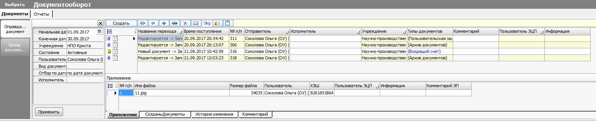

*Рисунок -- Интерфейс \"Оправдательный документ\"*

На панели инструментов интерфейса \"Оправдательный документ\" расположены дополнительные функциональные кнопки:

 (Создать на основании) - используется для создания бухгалтерских документов на основании \"Оправдательного документа\". Тип документов определяется в зависимости от значения, выбранного в одноименном поле документа.

 (Связать с первичными документами) - используется для создания двусторонней связи созданного электронного документа в Системе с оправдательным документом.

*Таблица. Поля интерфейса ввода \"Оправдательный документ\"*

+--------------------+------------------------+--------------------------------------------------------------------------------------------------------------------------------------+---------------------------------------------------------------------------------------------------------------------------------------------------------------------------------------------------------------------------------------------------------------------+
| **№ п/п**          | **Поле интерфейса**    | **Описание**                                                                                                                         | **Способ ввода значения**                                                                                                                                                                                                                                           |
+====================+========================+======================================================================================================================================+=====================================================================================================================================================================================================================================================================+
| **Заголовок**                                                                                                                                                                                                                                                                                                                                                                                                                                            |
+--------------------+------------------------+--------------------------------------------------------------------------------------------------------------------------------------+---------------------------------------------------------------------------------------------------------------------------------------------------------------------------------------------------------------------------------------------------------------------+
| 1                  | Название перехода      | Название перехода по статусам ЭД \"Оправдательный документ\".                                                                        | > Автоматическое заполнение при смене статуса ЭД \"Оправдательный документ\".                                                                                                                                                                                       |
|                    |                        |                                                                                                                                      | >                                                                                                                                                                                                                                                                   |
|                    |                        |                                                                                                                                      | > Формат вывода данных:                                                                                                                                                                                                                                             |
|                    |                        |                                                                                                                                      | >                                                                                                                                                                                                                                                                   |
|                    |                        |                                                                                                                                      | > \ -\> \                                                                                                                                                                                                                      |
+--------------------+------------------------+--------------------------------------------------------------------------------------------------------------------------------------+---------------------------------------------------------------------------------------------------------------------------------------------------------------------------------------------------------------------------------------------------------------------+
| 2                  | Время поступления      | Дата и время создания документа.                                                                                                     | > Автоматическая генерация. Корректировка вручную.                                                                                                                                                                                                                  |
|                    |                        |                                                                                                                                      | >                                                                                                                                                                                                                                                                   |
|                    |                        |                                                                                                                                      | > Формат вывода данных:                                                                                                                                                                                                                                             |
|                    |                        |                                                                                                                                      | >                                                                                                                                                                                                                                                                   |
|                    |                        |                                                                                                                                      | > ДД.ММ.ГГГГ ЧЧ:ММ:СС                                                                                                                                                                                                                                               |
+--------------------+------------------------+--------------------------------------------------------------------------------------------------------------------------------------+---------------------------------------------------------------------------------------------------------------------------------------------------------------------------------------------------------------------------------------------------------------------+
| 2                  | № п/п                  | Порядковый номер документа.                                                                                                          | > Автоматическая генерация. Корректировка вручную.                                                                                                                                                                                                                  |
+--------------------+------------------------+--------------------------------------------------------------------------------------------------------------------------------------+---------------------------------------------------------------------------------------------------------------------------------------------------------------------------------------------------------------------------------------------------------------------+
| 3                  | Отправитель            | Пользователь, создавший документ.                                                                                                    | > Автоматическое заполнение по имени пользователя, осуществившего вход в Систему, при изменении статуса ЭД \"Оправдательный документ\" на \"Заполнен\".                                                                                                             |
+--------------------+------------------------+--------------------------------------------------------------------------------------------------------------------------------------+---------------------------------------------------------------------------------------------------------------------------------------------------------------------------------------------------------------------------------------------------------------------+
| 4                  | Исполнитель            | Пользователь, которому назначен ЭД \"Оправдательный документ\" на обработку.                                                         | > Выбор из выпадающего списка пользователей ЦБ, которые имеют права на следующий переход, для обработки ЭД \"Оправдательный документ\".                                                                                                                             |
|                    |                        |                                                                                                                                      | >                                                                                                                                                                                                                                                                   |
|                    |                        |                                                                                                                                      | > Выбор доступен только пользователям ОУ (выбор пользователя ЦБ) и руководителям групп пользователей ЦБ (выбор пользователя ЦБ внутри своей группы).                                                                                                                |
+--------------------+------------------------+--------------------------------------------------------------------------------------------------------------------------------------+---------------------------------------------------------------------------------------------------------------------------------------------------------------------------------------------------------------------------------------------------------------------+
| 5                  | Учреждение             | Учреждение, которое размещает документ на обработку.                                                                                 | > Автоматическое заполнение из Установок системы при условии, что у пользователя права только на одно КСП.                                                                                                                                                          |
|                    |                        |                                                                                                                                      | >                                                                                                                                                                                                                                                                   |
|                    |                        |                                                                                                                                      | > Если права пользователю даны на несколько КСП - выбор из выпадающего списка либо из справочника \"Структурные подразделения\".                                                                                                                                    |
+--------------------+------------------------+--------------------------------------------------------------------------------------------------------------------------------------+---------------------------------------------------------------------------------------------------------------------------------------------------------------------------------------------------------------------------------------------------------------------+
| 6                  | Типы документов        | Тип документов Системы, который будет создан при обработке ЭД \"Оправдательный документ\".                                           | > Выбор из диалогового окна \"Параметры\" путем установки флаг-галки:                                                                                                                                                                                               |
|                    |                        |                                                                                                                                      |                                                                                                                                                                                                                                                                     |
|                    |                        |                                                                                                                                      | 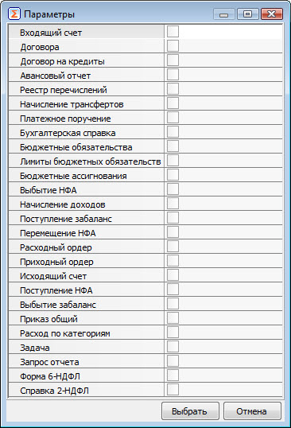                                                                                                                                       |
|                    |                        |                                                                                                                                      |                                                                                                                                                                                                                                                                     |
|                    |                        |                                                                                                                                      | Автоматическое заполнение при создании ЭД \"Оправдательный документ\" на основании электронных документов Системы (\"Платежное поручение\", \"Приходные ордера\", \"Расходные ордера\", \"авансовый отчет\", \"Входящий счет\", \"Договор\", \"Архив документов\"). |
+--------------------+------------------------+--------------------------------------------------------------------------------------------------------------------------------------+---------------------------------------------------------------------------------------------------------------------------------------------------------------------------------------------------------------------------------------------------------------------+
| 7                  | Комментарий            | Комментарий к документу.                                                                                                             | > Ввод вручную.                                                                                                                                                                                                                                                     |
+--------------------+------------------------+--------------------------------------------------------------------------------------------------------------------------------------+---------------------------------------------------------------------------------------------------------------------------------------------------------------------------------------------------------------------------------------------------------------------+
| 8                  | Пользователь ЭЦП       | Пользователь электронной цифровой подписи.                                                                                           | > Автоматическое заполнение при смене статуса документа на \"Заполнен\".                                                                                                                                                                                            |
+--------------------+------------------------+--------------------------------------------------------------------------------------------------------------------------------------+                                                                                                                                                                                                                                                                     |
| 9                  | Информация             | Полная информация по ЭП.                                                                                                             |                                                                                                                                                                                                                                                                     |
+--------------------+------------------------+--------------------------------------------------------------------------------------------------------------------------------------+---------------------------------------------------------------------------------------------------------------------------------------------------------------------------------------------------------------------------------------------------------------------+
| > **Таблица-детализация \"Приложение\"**                                                                                                                                                                                                                                                                                                                                                                                                                 |
+--------------------+------------------------+--------------------------------------------------------------------------------------------------------------------------------------+---------------------------------------------------------------------------------------------------------------------------------------------------------------------------------------------------------------------------------------------------------------------+
| 1                  | Номер п/п              | Порядковый номер записи.                                                                                                             | > Автоматическая генерация.                                                                                                                                                                                                                                         |
+--------------------+------------------------+--------------------------------------------------------------------------------------------------------------------------------------+---------------------------------------------------------------------------------------------------------------------------------------------------------------------------------------------------------------------------------------------------------------------+
| 2                  | Имя файла              | Ссылка на прикрепленный Файл.                                                                                                        | > Выбор файла из Проводника в диалоговом окне \"Открыть\".                                                                                                                                                                                                          |
|                    |                        |                                                                                                                                      | >                                                                                                                                                                                                                                                                   |
|                    |                        |                                                                                                                                      | > Получение изображения со сканера.                                                                                                                                                                                                                                 |
+--------------------+------------------------+--------------------------------------------------------------------------------------------------------------------------------------+---------------------------------------------------------------------------------------------------------------------------------------------------------------------------------------------------------------------------------------------------------------------+
| 3                  | Размер файла           | Объем файла.                                                                                                                         | > Автоматическое заполнение при прикреплении файла.                                                                                                                                                                                                                 |
+--------------------+------------------------+--------------------------------------------------------------------------------------------------------------------------------------+                                                                                                                                                                                                                                                                     |
| 4                  | Пользователь           | Пользователь, создавший запись.                                                                                                      |                                                                                                                                                                                                                                                                     |
+--------------------+------------------------+--------------------------------------------------------------------------------------------------------------------------------------+                                                                                                                                                                                                                                                                     |
| 5                  | ХЭШ                    |                                                                                                                                      |                                                                                                                                                                                                                                                                     |
+--------------------+------------------------+--------------------------------------------------------------------------------------------------------------------------------------+---------------------------------------------------------------------------------------------------------------------------------------------------------------------------------------------------------------------------------------------------------------------+
| 6                  | Пользователь ЭЦП       | Пользователь электронной цифровой подписи.                                                                                           | > Автоматическое заполнение при выборе ПКМ \"Подписать вложение\".                                                                                                                                                                                                  |
+--------------------+------------------------+--------------------------------------------------------------------------------------------------------------------------------------+                                                                                                                                                                                                                                                                     |
| 7                  | Информация             | Полная информация по ЭП.                                                                                                             |                                                                                                                                                                                                                                                                     |
+--------------------+------------------------+--------------------------------------------------------------------------------------------------------------------------------------+---------------------------------------------------------------------------------------------------------------------------------------------------------------------------------------------------------------------------------------------------------------------+
| 8                  | Комментарий ЭП         | Комментарий ЭП.                                                                                                                      | > Ввод вручную.                                                                                                                                                                                                                                                     |
+--------------------+------------------------+--------------------------------------------------------------------------------------------------------------------------------------+---------------------------------------------------------------------------------------------------------------------------------------------------------------------------------------------------------------------------------------------------------------------+
| > **Таблица-детализация \"Созданы документы\"**                                                                                                                                                                                                                                                                                                                                                                                                          |
+--------------------+------------------------+--------------------------------------------------------------------------------------------------------------------------------------+---------------------------------------------------------------------------------------------------------------------------------------------------------------------------------------------------------------------------------------------------------------------+
| 1                  | Вид документа          | Тип документа, который необходимо создать на основании \"Оправдательного документа\".                                                | > Автоматическое заполнение при смене статуса на \"Заполнен\" и подписании \"Оправдательного документа\" ЭЦП.                                                                                                                                                       |
+--------------------+------------------------+--------------------------------------------------------------------------------------------------------------------------------------+                                                                                                                                                                                                                                                                     |
| 2                  | Задача (+)             | Ссылка на пользовательскую задачу (данное поле отражается в случае установки флаг-галки в документе \"Настройка документооборота\"). |                                                                                                                                                                                                                                                                     |
+--------------------+------------------------+--------------------------------------------------------------------------------------------------------------------------------------+                                                                                                                                                                                                                                                                     |
| 2.1                | Статус                 | Статус пользовательской задачи.                                                                                                      |                                                                                                                                                                                                                                                                     |
+--------------------+------------------------+--------------------------------------------------------------------------------------------------------------------------------------+                                                                                                                                                                                                                                                                     |
| 2.2                | Название Задача        | Название пользовательской задачи.                                                                                                    |                                                                                                                                                                                                                                                                     |
+--------------------+------------------------+--------------------------------------------------------------------------------------------------------------------------------------+---------------------------------------------------------------------------------------------------------------------------------------------------------------------------------------------------------------------------------------------------------------------+
| 3                  | Первичный документ (+) | Ссылка на созданный электронный документ на основании оправдательного документа.                                                     | > Автоматическое заполнение при обработке задачи Пользователем ЦБ.                                                                                                                                                                                                  |
+--------------------+------------------------+--------------------------------------------------------------------------------------------------------------------------------------+                                                                                                                                                                                                                                                                     |
| 3.1                | Статус                 | Статус первичного документа.                                                                                                         |                                                                                                                                                                                                                                                                     |
+--------------------+------------------------+--------------------------------------------------------------------------------------------------------------------------------------+                                                                                                                                                                                                                                                                     |
| 3.2                | Название Документ      | Название, номер и дата первичного документа в Системе.                                                                               |                                                                                                                                                                                                                                                                     |
+--------------------+------------------------+--------------------------------------------------------------------------------------------------------------------------------------+---------------------------------------------------------------------------------------------------------------------------------------------------------------------------------------------------------------------------------------------------------------------+
| > **Таблица-детализация \"История изменения\"**                                                                                                                                                                                                                                                                                                                                                                                                          |
+--------------------+------------------------+--------------------------------------------------------------------------------------------------------------------------------------+---------------------------------------------------------------------------------------------------------------------------------------------------------------------------------------------------------------------------------------------------------------------+
| 1                  | Описание перехода      | Название перехода по статусам.                                                                                                       | > Автоматическое заполнение при смене статуса ЭД \"Оправдательный документ\".                                                                                                                                                                                       |
+--------------------+------------------------+--------------------------------------------------------------------------------------------------------------------------------------+                                                                                                                                                                                                                                                                     |
| 2                  | Пользователь           | Пользователь, изменивший статус ЭД \"Оправдательный документ\".                                                                      |                                                                                                                                                                                                                                                                     |
+--------------------+------------------------+--------------------------------------------------------------------------------------------------------------------------------------+                                                                                                                                                                                                                                                                     |
| 3                  | Дата изменения         | Дата и время изменения статуса ЭД \"Оправдательный документ\".                                                                       |                                                                                                                                                                                                                                                                     |
+--------------------+------------------------+--------------------------------------------------------------------------------------------------------------------------------------+---------------------------------------------------------------------------------------------------------------------------------------------------------------------------------------------------------------------------------------------------------------------+
| > **Таблица-детализация \"Комментарий\"**                                                                                                                                                                                                                                                                                                                                                                                                                |
+--------------------+------------------------+--------------------------------------------------------------------------------------------------------------------------------------+---------------------------------------------------------------------------------------------------------------------------------------------------------------------------------------------------------------------------------------------------------------------+
| 1                  | Комментарий            | Комментарий пользователя.                                                                                                            | > Ввод вручную.                                                                                                                                                                                                                                                     |
+--------------------+------------------------+--------------------------------------------------------------------------------------------------------------------------------------+---------------------------------------------------------------------------------------------------------------------------------------------------------------------------------------------------------------------------------------------------------------------+

Таблица-детализация \"Приложение\" в контекстном меню, вызываемом правой кнопкой мыши, содержит пункты:

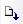 (Загрузить со сканера) - используется для загрузки скан-файла напрямую со сканера в таблицу-детализацию \"Приложение\";

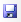 (Сохранить файлы) - используется для сохранения скан-файлов в Проводник.

 (Подписать вложение) - используется для подписания приложенного скан-файла.

 (Отклонить файл) - используется для отклонения приложенного скан-файла.

 (Предварительный просмотр) - используется для открытия скан-файла и параллельной дальнейшей работы в Системе.

На общем списке интерфейса \"Оправдательный документ\" слева от записи могут быть статусные картинки (иконки):

 - ЭД \"Оправдательный документ\" подписан ЭП n-уровня;

 - ЭД \"Оправдательный документ\" в таблице-детализации \"Приложение\" имеет прикрепленные файлы со скан-копиями;

 - ЭД \"Оправдательный документ\" имеет комментарий в таблице-детализации \"Комментарий\".

Документ \"Оправдательный документ\" может находиться в одном из следующих состояний (статусов):

*Новый документ* **-** устанавливается системой автоматически при создании нового документа;

*Редактируется* **-** документ сохранен в базе данных. Устанавливается удаленным пользователем;

*Заполнен* **-** устанавливается удаленным пользователем после заполнения ЭД \"Оправдательный документ\" и прикрепления скан-копии первичного учетного документа. Пользователю ЦБ с соответствующими правами автоматически формируется уведомление по обработке документа;

*Отклонен* **-** отклонение обработки ЭД \"Оправдательный документ\" пользователем ЦБ по какой-либо причине (причина может быть указана в таблице-детализации \"Комментарий\"). Удаленному пользователю в соответствии с его правами автоматически формируется уведомление по доработке документа ЭД \"Оправдательный документ\";

*Закрыт* **- ЭД** \"Оправдательный документ\" обработан пользователем ЦБ. Документ закрывается для редактирования;

*Подготовлен* - ЭД \"Оправдательный документ\" обработан пользователем ЦБ. Документ отправлен в обслуживаемое учреждение;

*Архив* - перевод обработанного ЭД \"Оправдательный документ\" в состояние \"Архивные\".

Диалоговое окно \"Уведомления\" используется для отображения задач к выполнению пользователем ЦБ:

- выполнение задач;

- отклонение задач.

Задачи формируются на основании прав доступа Исполнителя на учреждение и тип документа Системы, создаваемый на основании \"Оправдательного документа\".

Рисунок -- интерфейс \"Оправдательный документ\", окно \"Уведомления\"

**Примеры возможных схем документооборота**

Рисунок 1 -- Схема электронного документооборота скан-образ ПУД с ЭП

1\. Войти в Систему на секцию \"Документооборот\".

Пользователь: пользователь группы 1.

2\. Пользователю группы 1 перейти на интерфейс \"Оправдательный документ\". Нажать кнопку \"Создать\".

3\. Заполнить поле \"Тип документов\", поставив галку напротив необходимого типа документа.

4\. В детализации \"Приложение\" в поле \"Имя файла\" по кнопке \"три точки\" прикрепить через Проводник скан-файл первичного документа.

5\. По ПКМ \"Статус документа\" изменить статус ОД на \"Заполнен\".

6\. В открывшемся диалоговом окне \"Подпись\" нажать кнопку \"Подписать\".

7\. Войти в Систему на секцию \"Документооборот\", интерфейс \"Оправдательный документ\".

Пользователь: пользователь группы 2.

8\. Пользователю группы 2 перейти на интерфейс \"Оправдательный документ\".

9\. В появившемся окне \"Уведомления\" нажать на ссылку с ОД, открыть скан-файл в детализации \"Приложение\".

10\. При наличии некачественного или отсутствия скана указать причину отклонения на детализации \"Комментарий\", изменить статус ОД на \"Отклонен\".

11\. Пользователю группы 1 в появившемся окне \"Уведомления\" с отклоненным ОД нажать на ссылку с ОД.

12\. Изменить статус ОД на \"Редактируется\".

13\. Снять ЭП по кнопке \"Цифровая подпись\" на панели инструментов.

14\. Прикрепить новый скан-файл первичного документа в поле \"Имя файла\" на детализации \"Приложение\".

15\. Изменить статус ОД на \"Заполнен\".

16\. В открывшемся диалоговом окне нажать кнопку \"Подписать\".

17\. Пользователю группы 2 в появившемся окне \"Уведомления\" нажать на ссылку с ОД.

18\. В детализации \"Приложение\" открыть скан-файл первичного документа.

19\. По кнопке \"Создать на основании\" создать ЭД Системы, соответствующий указанному в поле \"Тип документов\" ОД.

20\. Заполнить необходимые поля ЭД.

21\. Изменить статус ЭД на \"Заполнен\" по ПКМ \"Статус документа\".

22\. Статус ОД изменится на \"Закрыт\" автоматически.

Рисунок 2 -- Схема электронного документооборота заявка на создание печатной формы/отчета

1\. Войти в Систему на секцию \"Документооборот\".

Пользователь: пользователь группы 1.

2\. Пользователю группы 1 перейти на интерфейс \"Оправдательный документ\". Нажать кнопку \"Создать\".

3\. В поле \"Тип документов\" нажать на ссылку \"Выбрать\", в открывшемся окне \"Параметры\" поставить галку в поле с необходимым типом документа.

4\. В детализации \"Приложение\" в поле \"Имя файла\" по кнопке \"три точки\" прикрепить через Проводник скан-файл заявки на создание отчета.

5\. По ПКМ \"Статус документа\" изменить статус ОД на \"Заполнен\".

6\. Войти в Систему на секцию \"Документооборот\", интерфейс \"Оправдательный документ\".

Пользователь: пользователь группы 2.

7\. Пользователю группы 2 перейти на интерфейс \"Оправдательный документ\".

8\. В появившемся окне \"Уведомления\" нажать на ссылку с ОД, открыть скан-файл в детализации \"Приложение\".

9\. При наличии некачественного или отсутствия скана указать причину отклонения на детализации \"Комментарий\", изменить статус ОД на \"Отклонен\".

10\. Пользователю группы 1 в появившемся окне \"Уведомления\" с отклоненным ОД нажать на ссылку с ОД.

11\. Изменить статус ОД на \"Редактируется\".

12\. Прикрепить новый скан-файл первичного документа в поле \"Имя файла\" детализации \"Приложение\".

13\. Изменить статус ОД на \"Заполнен\".

14\. Пользователю группы 2 в появившемся окне \"Уведомления\" нажать на ссылку с ОД.

15\. В детализации \"Приложение\" открыть скан-файл заявки на создание отчета.

16\. Перейти на секцию, по которой необходимо создать отчет, закладка \"Отчеты\".

17\. Сформировать отчет по кнопке \"Выполнить\" на панели инструментов.

18\. По ПКМ \"Добавить в оправдательный документ\" сохранить печатную форму отчета в ЭД \"Архив документов\".

19\. В открывшемся диалоговом окне \"Добавление в архив\" выбрать в поле \"Режим\" значение \"Создать новый архив\", в поле \"В оправдат. док.\" выбрать ЭД \"Оправдательный документ\", созданный пользователем группы 1. Нажать кнопку \"Выбрать\".

20\. Созданный ЭД \"Архив документов\" автоматически подпишется ЭП и прикрепится в открывшийся ОД в статусе \"Закрыт\".

21\. В открытом ЭД \"Оправдательный документ\" нажать на кнопку \"Цифровая подпись\" на панели инструментов. В открывшемся диалоговом окне нажать кнопку \"Подписать\".

22\. Изменить статус ЭД \"Оправдательный документ\" на \"Подготовлен\" по ПКМ.

23\. Пользователю группы 1 в появившемся окне \"Уведомления\" нажать на ссылку с ОД.

24\. Просмотреть печатную форму отчета по ссылке в поле \"Первичный документ\".

25\. При отсутствии печатной формы отчета указать причину отклонения на детализации \"Комментарий\".

26\. Изменить статус ЭД \"Оправдательный документ\" на \"Отклонен\".

27\. Пользователю группы 2 в появившемся окне \"Уведомления\" нажать на ссылку с ОД.

28\. Прочитать комментарий.

29\. Перейти на секцию, на которой формировали отчет, закладка \"Отчеты\".

30\. Сформировать новый отчет, нажав кнопку \"Выполнить\".

31\. По ПКМ \"Добавить в оправдательный документ\" сохранить печатную форму отчета в ЭД \"Архив документов\".

32\. В открывшемся диалоговом окне \"Добавление в архив\" выбрать в поле \"Режим\" значение \"Добавить в существующий\", в поле \"Архив форм\", в поле \"Способ добавления\" - Заменить основную форму, в поле \"В оправдат. док.\" выбрать ЭД \"Оправдательный документ\", созданный пользователем группы 1. Нажать кнопку \"Выбрать\".

33\. Созданный ЭД \"Архив документов\" автоматически подпишется ЭП и прикрепится в открывшийся ОД в статусе \"Закрыт\".

34\. В открытом ЭД \"Оправдательный документ\" нажать на кнопку \"Цифровая подпись\" на панели инструментов. В открывшемся диалоговом окне нажать кнопку \"Подписать\".

35\. Изменить статус ЭД \"Оправдательный документ\" на \"Подготовлен\" по ПКМ.

36\. Пользователю группы 1 в появившемся окне \"Уведомления\" нажать на ссылку с ОД.

37\. Просмотреть печатную форму отчета по ссылке в поле \"Первичный документ\".

38\. Изменить статус ЭД \"Оправдательный документ\" по ПКМ на \"Закрыт\".

Рисунок 3 -- Схема электронного документооборота заявка на ввод данных в ЕИСБУ

1\. Войти в Систему на секцию \"Документооборот\".

Пользователь: пользователь группы 1.

2\. Пользователю группы 1 перейти на интерфейс \"Оправдательный документ\". Нажать кнопку \"Создать\".

3\. В поле \"Тип документов\" нажать на ссылку \"Выбрать\", в открывшемся окне \"Параметры\" поставить галку напротив необходимого типа документов.

4\. В детализации \"Приложение\" в поле \"Имя файла\" по кнопке \"три точки\" прикрепить через Проводник скан-файл заявки на ввод данных в ЕИСБУf.

5\. По ПКМ \"Статус документа\" изменить статус ОД на \"Заполнен\".

6\. Войти в Систему на секцию \"Документооборот\", интерфейс \"Оправдательный документ\".

Пользователь: пользователь группы 2.

7\. Пользователю группы 2 перейти на интерфейс \"Оправдательный документ\".

8\. В появившемся окне \"Уведомления\" нажать на ссылку с ОД, открыть скан-файл в детализации \"Приложение\".

9\. При наличии некачественного или отсутствия скана указать причину отклонения на детализации \"Комментарий», изменить статус ОД на \"Отклонен\".

11\. Пользователю группы 1 в появившемся окне \"Уведомления\" с отклоненным ОД нажать на ссылку с ОД.

12\. Изменить статус ОД на \"Редактируется\".

13\. Прикрепить новый скан-файл заявки на ввод данных в ЕИСБУ в поле \"Имя файла\" в детализации \"Приложение\".

14\. Изменить статус ОД на \"Заполнен\".

15\. Пользователю группы 2 в появившемся окне \"Уведомления\" нажать на ссылку с ОД.

16\. В детализации \"Приложение\" открыть скан-файл заявки на ввод данных в ЕИСБУ.

17\. Ввести необходимые данные в электронный документ.

Изменить статус ЭД по ПКМ на \"Закрыт\".

18\. Нажать на кнопку \"Показать документ-основание\" на панели инструментов.

19\. В открывшемся диалоговом окне \"Параметры\" в поле \"Опр. документ\" по кнопке \"три точки\" выбрать ЭД \"Оправдательный документ\", созданный пользователем группы 1, в поле \"Перенесено\" указать вложение, которое необходимо прикрепить к ЭД. Нажать кнопку \"Выбрать\".

20\. В детализацию \"Приложение\" ЭД прикрепится скан-файл из ЭД \"Оправдательный документ\".

21\. Перейти на секцию \"Документооборот\", интерфейс \"Оправдательный документ\".

22\. Выбрать ЭД \"Оправдательный документ\", к которому привязали ЭД. По ПКМ \"Статус документа\" изменить статус на \"Закрыт\".

*Рисунок 4 -- Схема электронного документооборота создание ЭД ЕИСБУ*

1\. Войти в Систему на секцию \"Нефинансовые активы/Основные средства\".

Пользователь: пользователь группы 1.

2\. Пользователю группы 1 перейти на интерфейс \"Входящий счет\". Нажать кнопку \"Создать\".

3\. Заполнить поля ЭД \"Входящий счет\".

4\. На детализацию \"Приложения\" в поле \"Имя файла\" по кнопке \"три точки\" прикрепить скан-файл через Проводник.

5\. По кнопке \"Создать на основании\" на панели инструментов создать ЭД \"Оправдательный документ\".

6\. В открывшемся диалоговом окне \"Укажите перемещаемые вложения\" поставить галочку напротив вложения в поле \"Перенести\".

7\. Нажать кнопку \"Выбрать\".

8\. В открывшемся ЭД \"Оправдательный документ\" проверить заполнение поля \"Тип документов\" - \"Входящий счет\" в заголовочной части, на детализации \"Приложение\" проверить заполнение поля \"Имя файла\", на детализации \"Созданы документы\" поля \"Первичный документ\".

9\. Изменить статус ЭД \"Оправдательный документ\" на \"Заполнен\" по ПКМ.

10\. Войти в Систему на секцию \"Документооборот\".

Пользователь: пользователь группы 2.

11\. Пользователю группы 2 перейти на интерфейс \"Оправдательный документ\".

12\. В появившемся окне \"Уведомления\" нажать на ссылку с ОД, открыть скан-файл в детализации \"Приложение\".

13\. При наличии некачественного или отсутствия скана указать причину отклонения на детализации \"Комментарий\", изменить статус ОД на \"Отклонен\".

14\. Пользователю группы 1 в появившемся окне \"Уведомления\" с отклоненным ОД нажать на ссылку с ОД.

15\. Изменить статус ОД на \"Редактируется\".

16\. Прикрепить новый скан-файл первичного документа в поле \"Имя файла\" на детализации \"Приложение\".

17\. Изменить статус ОД на \"Заполнен\".

18\. Пользователю группы 2 в появившемся окне \"Уведомления\" нажать на ссылку с ОД.

19\. В детализации \"Приложение\" открыть скан-файл первичного документа.

20\. Нажать на ссылку на детализации \"Созданы документы\" ЭД \"Оправдательный документ\".

Проверить ЭД \"Входящий счет\".

21\. Изменить статус ЭД \"Входящий счет\" на \"Закрыт\".

22\. Статус ЭД \"Оправдательный документ\" изменяется на \"Закрыт\" автоматически.

## Интерфейс: Архив документов

Интерфейс \"Архив документов\" находится в подсистеме \"Документооборот\".

Интерфейс \"Архив документов\" позволяет организовать хранение электронных копий внутренних и внешних документов, заверенных электронной подписью:

- внутренние документы, получаемые средствами Системы по данным базы данных (отчетные формы - регистры бухгалтерского учета, бухгалтерская, бюджетная, прочая отчетность, печатные формы первичных учетных документов);

- внешние документы, сохраненные в форматах \*.doc, \*.xls, \*.pdf, \*.bmp, \*.jpg и в любом другом формате.

Рисунок -- Интерфейс «Архив документов»

Таблица. Поля интерфейса ввода «Архив документов»

+------------------------------+-----------------------------------------------------------+----------------------------------------------------------------------------------------------------------------------------------------------------------------------------------------------------------------------------------------------+
| Наименование поля            | Описание                                                  | Способ ввода                                                                                                                                                                                                                                 |
+:=============================+:==========================================================+:=============================================================================================================================================================================================================================================+
| Заголовок                                                                                                                                                                                                                                                                                                                               |
+------------------------------+-----------------------------------------------------------+----------------------------------------------------------------------------------------------------------------------------------------------------------------------------------------------------------------------------------------------+
| № п/п                        | Порядковый номер документа.                               | Автоматическая генерация. Корректировка вручную.                                                                                                                                                                                             |
+------------------------------+-----------------------------------------------------------+----------------------------------------------------------------------------------------------------------------------------------------------------------------------------------------------------------------------------------------------+
| Дата                         | Дата составления (создания).                              | По умолчанию заполняется текущей датой (датой создания документа). Корректировка вручную. Поле с календарем. Маска ввода ДД.ММ.ГГГГ.                                                                                                         |
+------------------------------+-----------------------------------------------------------+----------------------------------------------------------------------------------------------------------------------------------------------------------------------------------------------------------------------------------------------+
| Учреждение                   | Учреждение, документ которого размещен в архив.           | Выбор из справочника \"Структурные подразделения\". Должно поддерживаться автоматическое заполнение при сохранении внутреннего документа в архив.                                                                                            |
+------------------------------+-----------------------------------------------------------+----------------------------------------------------------------------------------------------------------------------------------------------------------------------------------------------------------------------------------------------+
| Дело                         | Номенклатура дел.                                         | Выбор значения из справочника «Делопроизводство»:                                                                                                                                                                                            |
|                              |                                                           |                                                                                                                                                                                                                                              |
|                              |                                                           | \- № (номер номенклатуры дел);                                                                                                                                                                                                               |
|                              |                                                           |                                                                                                                                                                                                                                              |
|                              |                                                           | \- Название (наименование дела);                                                                                                                                                                                                             |
|                              |                                                           |                                                                                                                                                                                                                                              |
|                              |                                                           | \- Срок хранения (выбор значения из диалогового окна «Период времени»);                                                                                                                                                                      |
|                              |                                                           |                                                                                                                                                                                                                                              |
|                              |                                                           | \- Периодичность (выбор значения из списка при нажатии кнопки . Доступны значения: Месяц, Квартал, Год.). |
+------------------------------+-----------------------------------------------------------+----------------------------------------------------------------------------------------------------------------------------------------------------------------------------------------------------------------------------------------------+
| Исполнитель                  | ФИО пользователя, создавшего запись.                      | Автоматическое заполнение.                                                                                                                                                                                                                   |
+------------------------------+-----------------------------------------------------------+----------------------------------------------------------------------------------------------------------------------------------------------------------------------------------------------------------------------------------------------+
| Кому (Пользователь)          | Пользователь, для которого предназначен архивный документ | Выбор из списка. Список с пользователями должен формироваться по полю \"Учреждение\".                                                                                                                                                        |
+------------------------------+-----------------------------------------------------------+----------------------------------------------------------------------------------------------------------------------------------------------------------------------------------------------------------------------------------------------+
| Кому (Отдел)                 | Отдел учреждения, к которому относится пользователь       | Заполняется автоматически по полю Кому (Пользователь).                                                                                                                                                                                       |
+------------------------------+-----------------------------------------------------------+----------------------------------------------------------------------------------------------------------------------------------------------------------------------------------------------------------------------------------------------+
| Год                          | Год формирования печатной формы.                          | Автоматическое заполнение при формировании документа.                                                                                                                                                                                        |
+------------------------------+-----------------------------------------------------------+----------------------------------------------------------------------------------------------------------------------------------------------------------------------------------------------------------------------------------------------+
| Период (+)                   | Период                                                    | Выбор из списка.                                                                                                                                                                                                                             |
+------------------------------+-----------------------------------------------------------+----------------------------------------------------------------------------------------------------------------------------------------------------------------------------------------------------------------------------------------------+
| \- Начало                    | Начальная дата формирования печатной формы.               | Ввод вручную. Поле с календарем. Маска ввода ДД.ММ.ГГГГ.                                                                                                                                                                                     |
+------------------------------+-----------------------------------------------------------+----------------------------------------------------------------------------------------------------------------------------------------------------------------------------------------------------------------------------------------------+
| \- Конец                     | Конечная дата формирования печатной формы.                | Ввод вручную. Поле с календарем. Маска ввода ДД.ММ.ГГГГ.                                                                                                                                                                                     |
+------------------------------+-----------------------------------------------------------+----------------------------------------------------------------------------------------------------------------------------------------------------------------------------------------------------------------------------------------------+
| Форма                        | Наименование печатной формы.                              | Автоматическое заполнение при формировании документа. Выбор значения из справочника «Учетные формы»                                                                                                                                          |
+------------------------------+-----------------------------------------------------------+----------------------------------------------------------------------------------------------------------------------------------------------------------------------------------------------------------------------------------------------+
| Название основного документа | Наименование печатной формы в системе.                    | Автоматическое заполнение при формировании документа.                                                                                                                                                                                        |
+------------------------------+-----------------------------------------------------------+----------------------------------------------------------------------------------------------------------------------------------------------------------------------------------------------------------------------------------------------+
| **Таблица -- детализация \"Документы\"**                                                                                                                                                                                                                                                                                                |
+------------------------------+-----------------------------------------------------------+----------------------------------------------------------------------------------------------------------------------------------------------------------------------------------------------------------------------------------------------+
| № п.п                        | Порядковый номер записи                                   | Автоматическая генерация. Корректировка вручную.                                                                                                                                                                                             |
+------------------------------+-----------------------------------------------------------+----------------------------------------------------------------------------------------------------------------------------------------------------------------------------------------------------------------------------------------------+
| Название документа (файла)   | Наименование печатной формы                               | Автоматическое заполнение при формировании документа. При нажатии на файл левой кнопкой мыши должна быть возможность просмотра печатного вида документа (файла).                                                                             |
+------------------------------+-----------------------------------------------------------+----------------------------------------------------------------------------------------------------------------------------------------------------------------------------------------------------------------------------------------------+
| Размер                       | Объем файла                                               | Автоматическое заполнение при формировании документа.                                                                                                                                                                                        |
+------------------------------+-----------------------------------------------------------+                                                                                                                                                                                                                                              |
| Пользователь                 | Пользователь                                              |                                                                                                                                                                                                                                              |
+------------------------------+-----------------------------------------------------------+----------------------------------------------------------------------------------------------------------------------------------------------------------------------------------------------------------------------------------------------+
| **Таблица -- детализация \"Комментарий\"**                                                                                                                                                                                                                                                                                              |
+------------------------------+-----------------------------------------------------------+----------------------------------------------------------------------------------------------------------------------------------------------------------------------------------------------------------------------------------------------+
| Комментарий                  | Комментарий пользователя                                  | > Ввод вручную.                                                                                                                                                                                                                              |
+------------------------------+-----------------------------------------------------------+----------------------------------------------------------------------------------------------------------------------------------------------------------------------------------------------------------------------------------------------+

При нажатии на кнопку 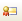 (Цифровая подпись) осуществляется наложение электронной подписи (либо нескольких электронных подписей) на печатную форму.

При нажатии на кнопку 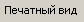 осуществляется просмотр печатного вида формы, указанной в заголовке документа с возможностью последующей печати.

Таблица-детализация \"Документы\" в контекстном меню, вызываемом правой кнопкой мыши, содержит пункт контекстного меню 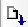 (Загрузить со сканера). При вызове осуществляется загрузка скан-копии документа напрямую со сканера.

На общем списке интерфейса \"Архив документов\" слева от записи могут быть статусные картинки (иконки):

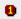 - документа архива подписан ЭП n-уровня;

 - документ архива в таблице-детализации \"Документы\" имеет прикрепленные файлы со скан-копиями;

 - документ архива имеет комментарий в таблице-детализации \"Комментарий\".

Сохранение внутренних документов, получаемых средствами Системы, в архив осуществляться путем нажатия кнопки контекстного меню \"Добавить в электронный архив\" (вызываемой щелчком правой кнопки мыши).

При выборе пункта контекстного меню возможно создание нового документа \"Архив документов\" с внутренним документом Системы. Для этого необходимо в открывшемся диалоговом окне в поле \"*Режим*\" выбрать \"*Создать новый архив*\".

Рисунок -- Диалоговое окно «Добавление в архив» для режима «Создать новый архив»

При выборе пункта контекстного меню возможно прикрепление сохраняемого внутреннего документа Системы к имеющейся печатной форме (записи) в интерфейсе \"Архив документов\". Для этого необходимо в открывшемся диалоговом окне в поле \"*Режим*\" выбрать \"*Добавить в существующий*\". В диалоговом окне появляются дополнительные параметры:

- *Архив форм* -- наименование архива форм. Автоматическое заполнение, выбор значения по кнопке .

- *Способ добавления* -- способ прикрепления сохраняемого документа. Выбор значения из списка по кнопке . Доступны значения: *Заменить основную форму*, *Добавить форму в таблицу*.

Рисунок -- Диалоговое окно «Добавление в архив» для режима «Добавить в существующий»

**Описание действий пользователя при сохранении печатных форм отчетов Системы в интерфейс \"Архив документов\"**

1.  Сформировать печатную форму в Системе на закладке Отчеты.

2.  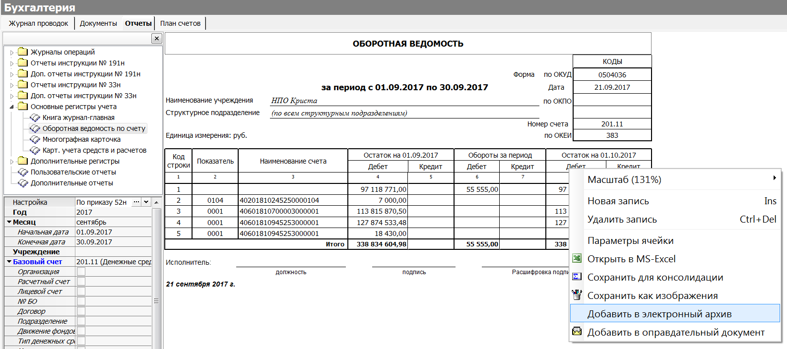С помощью пункта контекстного меню «Добавить в электронный архив» (вызываемого щелчком правой кнопки мыши в области сформированной печатной формы) сохранить печатную форму в интерфейс \"Архив документов\".

Рисунок -- Контекстное меню «Добавить в электронный архив»

3.  В появившемся диалоговом окне «Добавить в электронный архив» проверить автоматически заполненный параметр *«Режим»: Создать новый архив; Добавить в существующий.*

После выбора необходимых параметров документа нажать на кнопку , в результате чего на секции Документооборот будет сформирован новый, либо добавлена/заменена форма в старом документе «Архив документов».

Аналогично происходит сохранение в электронный архив печатных форм первичных учетных документов Системы, формируемых по кнопке «Печатный вид» на закладке «Документы».

**Описание действий пользователя при прикреплении внешних документов в интерфейс \"Архив документов\"**

В документе «Архив документов» существует возможность прикрепления и просмотра внешних по отношению к Системе документов, сохраненных в форматах \*.doc, \*.xls, \*.pdf, \*.bmp, \*.jpg и в любом другом формате. Прикрепление файлов происходит путем перетаскивания файла с помощью мыши (файл удерживается левой кнопкой мыши и перемещается в рабочую область документа «Архив документов»).

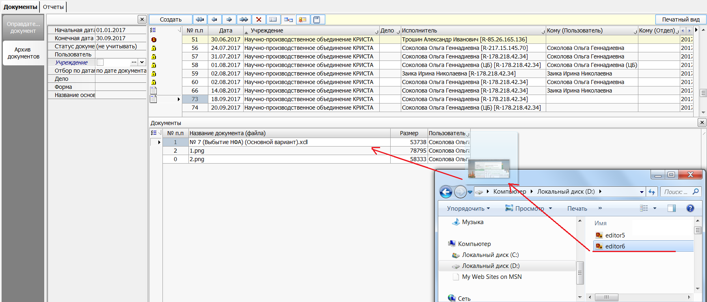Рисунок -- Документ «Архив документов»
