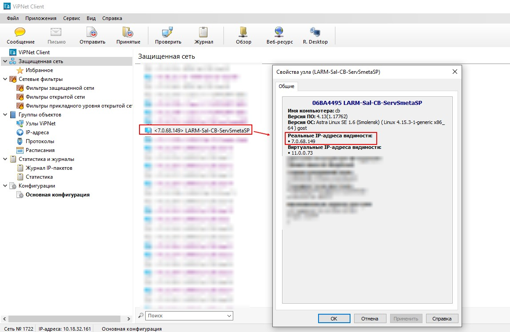

**Установка и настройка клиентского программного обеспечения ГИС «Смета ЯНАО» на автоматизированных рабочих местах с использванием VipNet Client**

1.  **Установить и настроить вспомогательное программное обеспечение.**

## VipNET клиент. Необходимо проверить доступность сетевого узла LARM-Sal-CB-ServSmetaSP

## КриптоПро CSP: <https://cryptopro.ru/products/csp/downloads>

2.  **Загрузить программное обеспечение ГИС «Смета ЯНАО»**

## Для операционной системы РЕД ОС: <https://files.yanao.ru/s/dfn7iAL85Jf5e7e>

## Для операционной системы Windows: <https://files.yanao.ru/s/PqieKP4SSB8RGqK>

3.  **Запустить программное обеспечение ГИС «Смета ЯНАО»**

## Для операционной системы РЕД ОС:

### Добавить права на выполнение исполняемого файла stimrun.

Рисунок 2 -- Схема ЭДО для ЭД «Заявка-обоснование»

Рисунок 3 -- Ещё рисунок

### Убедиться, что у текущего пользователя есть права доступа на запись в текущий каталог (при первом запуске клиент создаст файл инициализации в текущем каталоге).

### Запустить stimrun, в модальном окне перейте по гиперссылке «адрес сервера».

В дополнительном модальном окне в поле «Адрес сервера» добавить адрес сервера авторизации в формате IP:PORT. Узнать адрес сервера авторизации возможно следующими способами.

#### Для отечественных операционных систем: необходимо запустить приложение ViPNet Client, выбрать «Сетевые узлы», в поиске ввести наименование узла LARM-Sal-CB-ServSmetaSP, либо кратко как на изображении. В выборке посмотреть IP-адрес узла, использовать его вместе с портом 8080. В данном случае адрес сервера авторизации будет выглядеть 7.0.68.149:8080.

\*Запуск приложения ViPNet Client необходимо осуществлять от имени пользователя, под которым была произведена установка лицензии (dst).

#### Для операционных систем семейства Microsoft Windows: необходимо запустить приложение ViPNet Client, выбрать «Защищённая сеть», найти узел LARM-Sal-CB-ServSmetaSP, открыть свойства узла, посмотреть реальный IP-адрес узла, использовать его вместе с портом 8080. В данном случае адрес сервера авторизации будет выглядеть 7.0.68.149:8080

\* В случае использования прокси-сервера в Вашей локально-вычислительной сети необходимо указать параметры прокси-сервера, доступные при переходе по гиперссылке «Настройки»

Если Вы всё сделали правильно, то при выборе в выпадающем списке должен появится список баз данных различных учреждений. Выберите нужно учреждение из списка.

\* В случае если в выпадающем списке отсутствует перечень баз данных, значит доступ к серверу ГИС «Смета ЯНАО» ограничен. Причин может быть несколько:

\- отсутствие доступа к узлу защищённой сети VipNet - LARM-Sal-CB-ServSmetaSP;

\- проблемы на уровне сетевых технологий Вашей локально-вычислительной сети;

\- сервер ГИС «Смета ЯНАО» в плановом обслуживании (недоступность не более 40 минут в позднее вечернее время);

\- локальные проблемы с операционной системой автоматизированного рабочего места;

\- прочие.

В большинстве случаев львиная доля вероятных ошибок на стороне конечного пользователя. В этом случае Вам необходимо предпринимать соответствующие меры по устранению проблем.

### Тестовая апробация функционала ГИС «Смета ЯНАО» на примере базы данных департамент по общим вопросам

Для апробирования функционала для пользователей создана специальная база данных Департамент по общим вопросам ЯНАО_hidden.drx

Суффикс \_hidden означает скрытый контекст в списке подключений. Это сделано для того чтобы не смешивать тестовые базы данных и реальными. Поэтому на данном этапе Вам необходимо скопировать наименование Департамент по общим вопросам ЯНАО_hidden.drx и вставить в поле «Конфигурация».

\* В реальности пользователи работают в реальных базах данных, поэтому копирование наименований конфигурации не требуется: достаочно выбора значений из списка.

Далее, после того как наименование конфигурации установлено, и, если всё сделано правильно, то в списке пользователей должен отобразиться перечень пользователей выбранной базы данных. Для теста используйте имя пользователя student

\* В реальности имя пользователя = Фамилия Имя Отчество

Далее, введите пароль - 1

#### Результат авторизации пользователя (выбор конфигурации, имя пользователя, пароль, рабочее место) с максимальным уровнем доступа в рамках базы данных департамента по общим вопросам:

## Клиентское программное обеспечение для операционных систем Microsoft Windows (адрес сервера подключения может отличаться):

## Требуется установить сервер обновлений из стабильной ветки дистрибутива (указывается адрес подключения к серверу):

**Установка и настройка клиентского программного обеспечения ГИС «Смета ЯНАО» на автоматизированных рабочих местах с использованием технологии TLS**

**(альтернативный способ только в РМТКС ЯНАО).**

**Для Ред ОС.**

# **Обязательные системные требования:** 

# Установлено программное обеспечение КриптоПро CSP 4.0 и выше: <https://cryptopro.ru/products/csp/downloads>

1.  Открыть терминал (Ctrl+Alt+T)

2.  Команда для суперпользователя su.

3.  Вводим пароль суперпользователя.

4.  Команда openssl-switch-config gost

5.  Команда openssl engine

6.  В итоге должно получиться так:

7.  Команда exit.

8.  Удалить все файлы из директории stimate (находится в домашней папке пользователя).

9.  Переместить скачанные файлы stimrun и stimrun.ini в директорию stimate (находится в домашней папке пользователя).

Для операционной системы РЕД ОС: <https://files.yanao.ru/s/WfnAMN7MFNayJRR>

10. В свойствах файла stimrun выставить права как на картинке:

11. Запустить файл stimrun и дождаться установки.

12. При подключении ввести адрес сервера: [[https://smeta-app.yanao.ru:443]{.underline}](https://smeta-app.yanao.ru:443/)

13. После первого входа из меню \<Настройки\> открыть настройки клиента и во вкладке \<Программа\> выбрать сервер обновлений win-stim.krista.ru:8080. Также поставить галочку на \<Регистрация для запуска приложения из браузера\>

**Для MS Windows.**

1.  Удалить все файлы из директории stimate (находится в папке C:\\ Windows).

2.  Переместить скачанные файлы stimrun и stimrun.ini в директорию stimate/

Для операционной системы MS Windows: <https://files.yanao.ru/s/ZyG8ZHPzMSxt3BN>

3.  Запустить файл stimrun и дождаться установки.

4.  При подключении ввести адрес сервера: [[https://smeta-app.yanao.ru:443]{.underline}](https://smeta-app.yanao.ru:443/)

5.  После первого входа из меню \<Настройки\> открыть настройки клиента и во вкладке \<Программа\> выбрать сервер обновлений win-stim.krista.ru:8080. Также поставить галочку на \<Регистрация для запуска приложения из браузера\>

