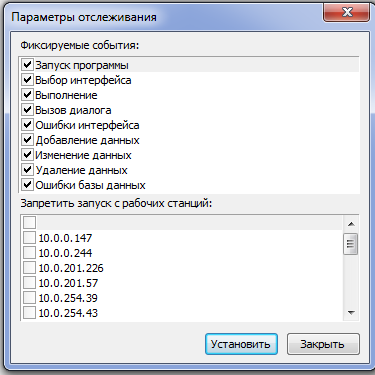

# Руководство администратора Личного кабинета сотрудника (2024)

## Содержание

* [Перечень рисунков](#перечень-рисунков)
* [Перечень таблиц](#перечень-таблиц)
* [Перечень терминов и сокращений](#перечень-терминов-и-сокращений)
* [1 Введение](#1-введение)
    * [1.1 Настройки для сводной базы данных](#11-настройки-для-сводной-базы-данных)
        * [1.1.1 Настройка файла подключения для сводной базы данных](#111-настройка-файла-подключения-для-сводной-базы-данных)
        * [1.1.2 Настройка списка учреждений для работы с ЛК сотрудника](#112-настройка-списка-учреждений-для-работы-с-лк-сотрудника)
    * [1.2 Настройка РМ «Личный кабинет сотрудника»](#12-настройка-рм-личный-кабинет-сотрудника)
        * [1.2.1 Настройка видимости секций в интерфейсе «Личный кабинет сотрудника»](#121-настройка-видимости-секций-в-интерфейсе-личный-кабинет-сотрудника)
    * [1.3 Настройка установочных параметров](#13-настройка-установочных-параметров)
        * [1.3.1 Настройка срока отображения ссылок на расчетные листы](#131-настройка-срока-отображения-ссылок-на-расчетные-листы)
        * [1.3.2 Настройка ограничений по объему вложений](#132-настройка-ограничений-по-объему-вложений)
* [2 Описание операций](#2-описание-операций)
    * [2.1 Порядок регистрации и администрирования пользователей](#21-порядок-регистрации-и-администрирования-пользователей)
        * [2.1.1 Описание входа в ЛК сотрудника](#211-описание-входа-в-лк-сотрудника)
        * [2.1.2 Описание авторизации и аутентификации пользователей через ЕСИА](#212-описание-авторизации-и-аутентификации-пользователей-через-есиа)
        * [2.1.3 Администрирование учетных записей пользователей](#213-администрирование-учетных-записей-пользователей)
        * [2.1.4 Аудит действий пользователей ЛК сотрудника](#214-аудит-действий-пользователей-лк-сотрудника)
    * [2.2 Настройка ЭДО для документа «Заявка обоснование»](#22-настройка-эдо-для-документа-заявка-обоснование)
    * [2.3 Настройка ЭДО для документа «Командирование (сведения)»](#23-настройка-эдо-для-документа-командирование-сведения)
    * [2.4 Настройка ЭДО для документа «Авансовый отчет»](#24-настройка-эдо-для-документа-авансовый-отчет)
    * [2.5 Настройка Бизнес-процессов (Карта маршрута)](#25-настройка-бизнес-процессов-карта-маршрута)
    * [2.6 Описание установки плагина и хост-приложения WorkspaceEX](#26-описание-установки-плагина-и-хост-приложения-workspaceex)
        * [2.6.1 Описание установки плагина](#261-описание-установки-плагина)
        * [2.6.2 Описание установки расширения в онлайн режиме](#262-описание-установки-расширения-в-онлайн-режиме)
        * [2.6.3 Описание установки расширения в оффлайн режиме](#263-описание-установки-расширения-в-оффлайн-режиме)
        * [2.6.4 Описание установки хост приложения](#264-описание-установки-хост-приложения)
    * [2.7 Описание настройки push-уведомлений](#27-описание-настройки-push-уведомлений)

## Перечень терминов и сокращений

В настоящем Руководстве администратора применяются термины и сокращения, приведенные в таблице 1.

**Таблица 1 -- Перечень терминов и сокращений**

| Сокращение (термин) | Определение                                           |
| :------------------ | :---------------------------------------------------- |
| БД                  | База данных                                           |
| ДО                  | Документооборот                                       |
| ИНН                 | Индивидуальный номер налогоплательщика                |
| КСП                 | Код структурного подразделения                        |
| КЭП                 | Квалифицированная электронная подпись                 |
| ЛК                  | Веб-приложение «Сервис подотчетного лица»             |
| ОГРН                | Основной государственный регистрационный номер        |
| НДО                 | Настройка документооборота                            |
| Подсистема, Система | Подсистема бюджетного (бухгалтерского) учета АС «Смета» |
| РМ                  | Рабочее место                                         |
| СНИЛС               | Страховой номер индивидуального лицевого счёта        |
| ЭД                  | Электронный документ                                  |
| ЭДО                 | Электронный документооборот                           |
| ЭП                  | Электронная подпись                                   |

---

## 1 Введение

Настоящий документ включает описание работы администраторов с функционалом «Личный кабинет сотрудника», который предназначен для доступа к сервисам самообслуживания сотрудника учреждения, основанный на использовании web-технологий.

### 1.1 Настройки для сводной базы данных

#### 1.1.1 Настройка файла подключения для сводной базы данных

Сводная БД -- это отдельная БД, используемая для выполнения настроек по сбору информации с других подключений сервера и для ведения учета по пользователям веб-приложения.

> **Внимание!** *Наименование может быть использовано другое по усмотрению Администратора.*

Пример настройки сводной БД показан на рисунке 1.

**Рисунок 1 -- Пример настройки сводной БД**

В файле подключения конечной и сводной БД должно быть указано общее подключение, как показано на рисунке 2.

**Рисунок 2 -- Пример настройки общего подключения**

#### 1.1.2 Настройка списка учреждений для работы с ЛК сотрудника

Список учреждений, сотрудники которых будут подключены к ЛК, настраивается на сводной БД в режиме «Установки системы»/закладка «Настройка учреждений», как показано на рисунке 3. Для каждого учреждения в поле «Настройка подключения» должно быть заполнено соответствующее наименование файла подключения на сервере.

**Рисунок 3 -- Вкладка «Настройки учреждения»**

> **Внимание!**
> 1.  *Каждое учреждение должно быть заведено как организация в интерфейсе «Справочник организации» с обязательным указанием ИНН данной организации.*
> 2.  **Сводная БД:** Для КСП Учреждения в поле «КСП сводной базы» необходимо прописать код КСП этого учреждения в конечной базе (Рисунок 4).
> 3.  **Конечная БД:** Для КСП учреждения в поле «КСП сводной базы» необходимо указать код КСП данного учреждения из сводной базы (Рисунок 5).

**Рисунок 4 -- Установка кода конечной базы в сводном подключении**

**Рисунок 5 -- Установка кода сводной базы в настройках учреждения**

### 1.2 Настройка РМ «Личный кабинет сотрудника»

Настройка РМ предварительно осуществляется разработчиком функционала ЛК на секции *«Настройки системы»/«Настройка рабочих мест»/«Настройка рабочих мест»*, как показано на рисунке 6.

**Рисунок 6 -- Интерфейс «Настройка рабочих мест»**

По умолчанию РМ включает все секции функционала ЛК. Настройка видимости может быть изменена Администратором для каждого учреждения отдельно.

#### 1.2.1 Настройка видимости секций в интерфейсе «Личный кабинет сотрудника»

Запрет видимости секций для сотрудников каждого учреждения устанавливается на сводной базе данных в режиме «Установки системы»/ закладка «Настройка учреждений» поле «Скрытые секции ЛК» (множественный выбор), как показано на рисунке 7.

**Рисунок 7 -- Поле «Скрытые секции ЛК»**

> На сводном подключении в порядке регистрации сотрудников будет вестись список учетных записей сотрудников (описание в 2.1).

### 1.3 Настройка установочных параметров

#### 1.3.1 Настройка срока отображения ссылок на расчетные листы

Количество месяцев, за которое выполняется отображение ссылок на расчетные листы на секции «Заработная плата» в интерфейсе «Личный кабинет сотрудника», устанавливается конфигурационном реестре на РМ «Конфигуратор» -- «Конфигурация/Программы/Личный кабинет/ Установки» параметр **«Срок РЛ (месяцы)»** (по умолчанию установлено 6 месяцев).

#### 1.3.2 Настройка ограничений по объему вложений

Максимальный размер файлов, прикрепляемых к документам, в интерфейсе «Личный кабинет сотрудника» устанавливается конфигурационном реестре на РМ «Конфигуратор» -- «Конфигурация/Программы/Личный кабинет/Установки» параметр **«Размер приложений (байт)»** (по умолчанию установлено 5242880 (5 Мб)).

---

## 2 Описание операций

### 2.1 Порядок регистрации и администрирования пользователей

#### 2.1.1 Описание входа в ЛК сотрудника

Работа в ЛК сотрудника осуществляется посредством web-браузера (браузерная версия) с использованием web-интерфейсов и в мобильном приложении.

*   **Браузерная версия:** Доступ осуществляется по адресу: [https://smeta.yanao.ru](https://smeta.yanao.ru)
*   **Мобильное приложение:** Ссылка для скачивания в RuStore: [https://apps.rustore.ru/app/com.krista.smeta_personal_account](https://apps.rustore.ru/app/com.krista.smeta_personal_account).

#### 2.1.2 Описание авторизации и аутентификации пользователей через ЕСИА

Авторизация и аутентификация пользователей web-приложения и мобильного приложения ЛК сотрудника выполняется посредством ЕСИА. При выполнении запроса со стороны ЕСИА в Систему поступают данные по параметрам scope:

**1. Данные о пользователе:**
    1.  `snils` -- СНИЛС сотрудника;
    2.  `fullname` -- полное фамилия имя отчество сотрудника;
    3.  `usr_org` -- идентификатор организации сотрудника.

**2. Данные об организации:**
    4.  `org_inn` -- ИНН организации;
    5.  `org_ogrn` -- ОГРН организации;
    6.  `org_kpp` -- КПП организации.

По параметрам `snils`, `fullname`, `org_inn` выполняется определение данного пользователя как сотрудника учреждения в Системе. При первичной загрузке параметра `snils` осуществляется **регистрация пользователя в ЭД «Учетные записи» на сводной базе Системы.**

> **Внимание!** *При определении пользователя как сотрудника выполняется проверка на наличие даты увольнения. Если по данным Системы сотрудник уволен на дату входа в ЛК, то доступ к Личному кабинету блокируется, выводится соответствующее сообщение: «Доступ к личному кабинету заблокирован в связи с увольнением».*

**Параметры подключения к ЕСИА** настраиваются в конфигурационном реестре РМ «Конфигуратор» -- «Конфигурация/Программы/Личный кабинет/ ЕСИА»:
*   `мнем. сист` -- указывается мнемоника системы: 350002;
*   `Адрес ЕСИА` -- указывается URL окна входа ЕСИА (для рабочего контура: `https://esia.gosuslugi.ru/`);
*   `Номер сертификата` -- номер сертификата, с которым зарегистрирована ЕЦИС на тех. портале ЕСИА;
*   `Пароль` -- пароль к закрытой части сертификата;
*   `Права` -- параметры scope, которые используются при авторизации из ЕСИА;
*   `Сервер инт.` -- URL окна входа в Личный кабинет сотрудника;
*   `Способ авт.` -- способ авторизации пользователя из ЕСИА: по СНИЛС и ИНН/КПП организации;
*   `Тип входа` -- тип входа: авторизация + регистрация.

#### 2.1.3 Администрирование учетных записей пользователей

На РМ «Конфигуратор» секция «ABL Help» в ЭД **«Учетные записи»**, представленной на рисунке 8, осуществляется хранение информации о пользователях ЛК сотрудника.

**Рисунок 8 -- ЭД «Учётные записи»**

**Таблица 2 -- Поля интерфейса ввода «Учётные записи»**

| Поле интерфейса | Описание                            | Способ ввода значения           |
| :-------------- | :---------------------------------- | :------------------------------ |
| № п/п           | Порядковый номер                    | Автоматическая генерация. Корректировка вручную |
| Дата            | Дата регистрации пользователя       | Автоматическое заполнение       |
| Фамилия         | Фамилия пользователя                |                                 |
| Имя             | Имя пользователя                    |                                 |
| Отчество        | Отчество                            |                                 |
| КСП             | Учреждение (КСП)                    |                                 |
| СНИЛС           | СНИЛС пользователя                  |                                 |
| Серийник        | Серийный номер ЭП пользователя      | Автоматическое заполнение при первичном подписании документов пользователем в ЛК |
| ВыданПо         | Конечная дата действия ЭП пользователя |                                 |
| Token           | Токен мобильного приложения         | Автоматическое заполнение при первичном входе в мобильное приложение. Используется для отправки push-уведомлений |

#### 2.1.4 Аудит действий пользователей ЛК сотрудника

Для мониторинга действий пользователей ЛК в плане изменения данных и выявления некорректных действий предназначена закладка **«Аудит пользователя»**.

Система аудита работы пользователей доступна на РМ *«Администратор»* на секции *«Администрирование»*, представлена на рисунке 9, и РМ *«Конфигуратор»* на секции *«Настройки системы» («Администратор»)*.

**Рисунок 9 -- Закладка «Аудит пользователя»**

Система фиксирует такие события, как запуск программы (вход/выход из Системы), выбор интерфейса (переход по рабочим местам и выбор типов документов), выполнение различных программ на меню и кнопках, вызовы диалогов, ошибки интерфейса, добавление данных, изменение данных, удаление данных, ошибки БД.

Определить фиксируемые события можно в диалоговом окне по кнопке **«Параметры отслеживания»** на верхней панели меню, как показано на рисунке 10.

> **Внимание!** *Только после выбора фиксируемых событий Система будет регистрировать данные для аудита.* Здесь же можно запретить запуск Системы с определенных рабочих станций.

**Рисунок 10 -- Параметры отслеживания**

Для выборки журнала аудита можно задать параметры, представленные в таблице 3.

**Таблица 3 -- Параметры выборки журнала аудита**

| Имя параметра | Значение параметра                  | Способ ввода значения           |
| :------------ | :---------------------------------- | :------------------------------ |
| Начало        | Начальная дата выборки данных аудита | Ввод с клавиатуры по маске даты, ввод из календаря |
| Конец         | Конечная дата выборки данных аудита |                                 |
| Событие       | Ограничение выборки данных аудита по совершенным событиям (список значений) | Выпадающий список значений      |
| Конфигурация  | Ограничение выборки данных аудита по конфигурации, на которой выполнялись события | Выпадающий список значений      |
| Организация   | Ограничение выборки данных аудита по организации, в которой выполнялись события |                                 |
| Пользователь  | Ограничение выборки данных аудита по пользователю, выполнившему события |                                 |
| IP-Адрес      | Ограничение выборки данных аудита по IP-адресу компьютера, с которого выполнялись события |                                 |
| Компьютер     | Ограничение выборки данных аудита по имени компьютера, с которого выполнялись события |                                 |
| Сервер        | Ограничение выборки данных аудита по имени сервера |                                 |

В табличной части журнала отображаются данные, представленные в таблице 4.

**Таблица 4 -- Поля табличной части Журнала аудита**

| Наименование поля | Значение поля                                                                 |
| :---------------- | :---------------------------------------------------------------------------- |
| Время             | Дата и время выполненного действия                                            |
| Конфигурация      | Конфигурация, на которой выполнялось действие                                 |
| Организация       | Организация, в которой выполнялось действие                                   |
| Пользователь      | Пользователь, выполнивший действие                                            |
| IP-Адрес          | IP-адрес компьютера, с которого выполнилось действие                          |
| Компьютер         | Имя компьютера, с которого выполнилось действие, либо DeviceId для мобильного приложения |
| Событие           | Тип действия, выполненного пользователем в Системе                            |
| Тип объекта       | Инициализация объекта, над которым выполнялось действие                       |
| Значение объекта  | Значение объекта, над которым выполнялось действие                            |
| Информация        | Информация по выполненному действию над объектом                              |
| Дополнительно     | Уточняющая информация                                                         |
| Количество        | Количество обработанных однотипных объектов, над которыми выполнялось действие |
| Версия клиента    | Версия клиентской части пользователя Системы, тип и версия ОС для мобильного приложения |
| Рабочий сервер    | Адрес внутреннего сервера Системы                                             |

### 2.2 Настройка ЭДО для документа «Заявка обоснование»

Настройка ЭДО для документа «Заявка-обоснование» выполняются администратором Системы в документе «Настройка документооборота» (РМ «Конфигуратор», РМ «Администратор», секция «Документооборот») путем загрузки настройки через сервис.

На всех статусах, кроме «Закрыт», предусмотрена возможность отклонить документ путем перевода его в статус «Отклонен» (при необходимости любое ответственное лицо может заполнить причину отклонения в поле «Причина отклонения» ЭД «Заявка обоснование»).

**Рисунок 11 -- Схема ЭДО для ЭД «Заявка-обоснование»**

### 2.3 Настройка ЭДО для документа «Командирование (сведения)»

Настройку ЭДО документа «Командирование (сведения)» можно импортировать с помощью сервиса **«Импортировать настройки ДО»**, как представлено на рисунке 12.

**Рисунок 12 -- Сервис импорта настроек ЭДО**

В диалоге параметров, представленном на рисунке 13, необходимо выбрать значение параметра «Тип документа» из выпадающего списка, установить флаг-галку у соответствующего документа в параметре «Настройки ДО» и нажать кнопку «Выбрать».

**Рисунок 13 -- Окно параметров сервиса «Импортировать настройки ДО»**

После работы сервиса автоматически создается ЭД «Настройка документооборота» с типом документа «Командирование (сведения)», представленный на рисунке 14.

**Рисунок 14 -- Настройка ЭДО для документа «Командирование (сведения)»**

> **Обязательным условием** работоспособности переходов документов ЛК является предоставление права на переход право группе «ОУ», представленным на рисунке 15.

**Рисунок 15 -- Добавление права на переход для пользователей ЛК**

### 2.4 Настройка ЭДО для документа «Авансовый отчет»

Права на переход (смена статусов) для документа «Авансовый отчет» настраиваются администратором Системы в документе «Настройка документооборота» (РМ «Конфигуратор», секция «Документооборот»), представленным на рисунке 16. Также есть автозагрузка настройки ЭДО из конфигурации.

> **Обязательным условием** для работы с документом из ЛК сотрудника является наличие прав на переход для группы **«ПЛК»**.

**Рисунок 16 -- Настройка ЭДО для документа «Авансовый отчет»**

### 2.5 Настройка Бизнес-процессов (Карта маршрута)

В узле реестра «Учетная политика/Настройки бизнес процессов» добавлены узлы для включения документов в общие бизнес-процессы, которые содержит перечень ЭД, как показано на рисунке 17.

**Рисунок 17 -- Настройка бизнес-процессов**

**Параметры:**
*   **Активный** = флаг-галка; Включение механизма;
*   **Карта процесса** = автоматическая генерация (При добавлении нового БП, выполняем программу «Построить карту маршрута»);
*   **Скрытый** = скрытие карты маршрута;
*   В параметрах указана очередность подписания документа и учетные формы настроек ДО.

> Если настройка ДО отсутствует у документа, то параметр «Учетные формы» не добавляем, как показано на рисунке 18.

**Рисунок 18 -- Включение перечня документов для настройки БП**

В настройках НДО в поле «Параметры» должно быть значение «Заполнить состояние», как показано на рисунке 19.

**Рисунок 19 -- Включение перечня документов для настройки БП**

Для отображения статусов Карты маршрута реализована возможность смены наименований переходов, как показано на рисунке 20.

**Рисунок 20 -- Наименование переходов в настройке НДО**

> Версия НДО должна быть не ниже 1.

Узел «Опции» содержит значения об уведомлении пользователя с ролью «Наблюдатель», как показано на рисунке 21.

**Рисунок 21 -- Включение уведомления пользователю с ролью «Наблюдатель»**

> **Настройки узлов и данные хранятся в конечном подключении.**

При отправке документа из Личного кабинета создается ЭД **«Событие учёта»**, как показано на рисунке 22.

**Рисунок 22 -- ЭД «Событие учёта»**

*   Вкладка «Наблюдатели» заполняется пользователем Личного кабинета автоматически;
*   Сведения о пользователе записывается в документ «Сведения о пользователях», как показано на рисунке 23.

**Рисунок 23 -- «Сведения о пользователях»**

**Бизнес-процесс «Командировка»** включает в себя такие документы, как:
*   Командирование (Сведения);
*   Финансовое обеспечение;
*   Решение о командировании.

Схема процесса изображена на рисунке 24.

**Рисунок 24 -- Бизнес-процесс «Командировка»**

> **Проверить работу** можно по нажатию кнопки  на документах, наследованных от ПоляНастройкиЭЦП, пример рабочей настройки представлен на рисунке 25.

**Рисунок 25 -- Проверка работоспособности настройки маршрута**

> Чтобы была возможность построения карты маршрута, необходимо включить этот параметр (должна быть выполнена корректно настройка с нумерацией прямых переходов и указанием ролей).

### 2.6 Описание установки плагина и хост-приложения WorkspaceEX

Для подписания документов КЭП, если нет активированного ключа, нужно в ЛК сотрудника указать номер через кнопку на вкладке «Основные реквизиты», как показано на рисунке 26.

**Рисунок 26 -- Кнопка «Добавить КЭП» на вкладке «Основные реквизиты».**

Также при отсутствии активированного ключа КЭП на ПК при попытке подписать документ будет выдавать ошибку, как показано на рисунке 27.

**Рисунок 27 -- Ошибка ключа сертификата пользователя на ПК.**

> При поиске доступных КЭП на ПК идет проверка на ФИО пользователя и срок действия сертификата. КЭП будет записан в учетную запись пользователя, как показано на рисунке 28.

**Рисунок 28 -- Учетная запись пользователя Личного кабинета.**

Для активации КЭП пользователя ЛК необходимо на РМ установить плагин и хост-приложение WorkspaceEX.

#### 2.6.1 Описание установки плагина

Для подписания в ЛК документов КЭП необходимо установить плагин, как показано на рисунке 29. При попытке отправить заявление с подписью КЭП выйдет окно предупреждения с ссылкой на скачивание и установку плагина.

**Рисунок 29 -- Окно предупреждения работы расширений для использования КЭП**

Далее при переходе по ссылке, следуя инструкции, устанавливается расширение, как показано на рисунке 30. Расширение можно установить как в онлайн, так и в оффлайн режимах.

**Рисунок 30 -- Управление расширениями браузера для работы КЭП**

#### 2.6.2 Описание установки расширения в онлайн режиме

В окне установки Крипто-плагина ниже после установки расширения будет ссылка на скачивание расширения из магазина приложений, его необходимо установить, следуя инструкции на рисунке 31.

**Рисунок 31 -- Ссылка на скачивание приложения через магазин расширения**

При переходе по ссылке нажимаем кнопку «Установить», как показано на рисунке 32.

  

**Рисунок 32 -- Установка приложения через магазин расширения**

#### 2.6.3 Описание установки расширения в оффлайн режиме

В окне установки Крипто-плагина ниже после установки расширения будет ссылка на скачивание расширения в оффлайн режиме, его необходимо установить, следуя инструкции на рисунке 33.

**Рисунок 33 -- Ссылка для скачивания расширения оффлайн**

Далее переходим по ссылке `chrome://extensions/`, включаем режим разработчика, и скачиваем только что скачанный файл в окно браузера. Подтверждаем установку, как показано на рисунке 34.

**Рисунок 34 -- Установка оффлайн расширения**

#### 2.6.4 Описание установки хост приложения

В окне установки Крипто-плагина ниже после установки расширения будет ссылка на скачивание хост-приложения, его необходимо установить, следуя инструкции на рисунке 35.

**Рисунок 35 -- Ссылка на скачивание хост-приложения**

Загружаем скачанный файл. В окне установки нажимаем кнопку «Установить», как показано на рисунке 36.

**Рисунок 36 -- Установка хост-приложения**

> После установки необходимо перезайти в браузер.

### 2.7 Описание настройки для работы страницы «Документы для подписания»

Секция «Документы для подписания» предназначена для работы с ЭД *«Лист голосования»*, созданными для реализации бизнес-процессов по Приказу 61н МФ РФ.

**Таблица 5 -- Описание полей документа «Лист голосования»**

| Поле интерфейса                   | Описание                                      | Способ ввода значения                             |
| :-------------------------------- | :-------------------------------------------- | :------------------------------------------------ |
| ***Основные реквизиты документа***                                                              |
| Дата                              | Порядковый номер                              | Дата ЭД, по которому сформированы листы голосования. Не редактируемое. |
| Учреждение                        | Учреждение (КСП)                              | Скрытое поле. Автоматическое значение.            |
| ***Таблица-детализация «Голосование»***                                                         |
| Блок информации по объекту голосования | Наименование объекта голосования и резолюция по объекту | Автоматическое значение. Не редактируемое.        |
| Голосую «ЗА»                      | Выбор значения при положительном решении      | Установка флаг-галки. Можно сразу по всем объектам установить «За» (кнопка «Подписать и отправить»). |
| Голосую «Против»                  | Выбор значения при отрицательном решении      | Установка флаг-галки. Можно сразу по всем объектам установить «Против» (кнопка «Отклонить»). *При голосе «Против» обязательно приложить файл особого мнения.* |
| Комментарий                       | Комментарий                                   | Ввод вручную                                      |
| ***Приложения.*** Загрузка файла особого мнения по кнопке  |                                               |                                                   |

#### Описание настройки работы со страницей «Документы для подписания»

> Для проведения процедуры голосования в АС «Смета» должна быть активна настройка документооборота согласно Приказу МФ РФ 61н в сводной и конечной базах.

1.  **Настройка подключения:** В файле подключения конечной и сводной базы должно быть указано общее подключение (аналогично Рисунку 2/37).
2.  **Настройка подписания через ЕОП (Единое окно подписания):** Для групп пользователей, которые будут подписывать документы через ЕОП, установить вид согласования, как показано на рисунке 38.
3.  **Связь КСП:** Должна быть настроена связь между КСП в сводной и конечной базах (аналогично Рисункам 39 и 40).
4.  **Настройка КЭП:** Для подписания документов КЭП необходимо активировать ключ, как описано в разделе 2.6.

**Рисунок 38 -- Настройка подписания через ЕОП**

#### Описание настройки отправки push-уведомлений

1.  **В настройках НДО:** На переходах должен быть указан способ уведомления = **«Push(Android)»**, как показано на рисунке 41.
2.  **Требования к пользователю:**
    *   Пользователь должен быть авторизован в RuStore.
    *   На устройстве пользователя должна быть установлена актуальная версия RuStore и мобильного приложения «Личный кабинет сотрудника».
3.  **Настройки на мобильном устройстве:**
    *   Разрешить приложению «Личный кабинет сотрудника» фоновую отправку уведомлений (Рисунок 42).
    *   Приложению RuStore должен быть разрешен доступ к работе в фоновом режиме. *Без этого разрешения push-уведомления будут приходить со значительной задержкой.*

**Рисунок 41 -- Установка способа отправки в настройке НДО**

 

**Рисунок 42 -- Настройка фоновой отправки уведомлений на мобильном устройстве**

