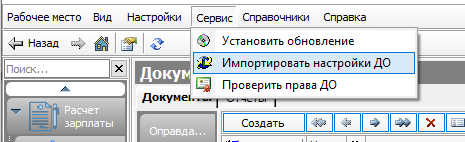

######### Перечень терминов и сокращений

В настоящем Руководстве администратора применяются термины и сокращения, приведенные в таблице [1](#т1).

| Сокращение (термин) | Определение |
| ----- | ----- |
| БД | База данных |
| ДО | Документооборот |
| ИНН | Индивидуальный номер налогоплательщика |
| КСП | Код структурного подразделения |
| КЭП | Квалифицированная электронная подпись |
| ЛК | Веб-приложение «Сервис подотчетного лмица» |
| ОГРН | Основной государственный регистрационный номер |
| НДО | Настройка документооборота |
| Подсистема, Система | Подсистема бюджетного (бухгалтерского) учета АС «Смета» |
| РМ | Рабочее место |
| СНИЛС | Страховой номер индивидуального лицевого счёта |
| ЭД | Электронный документ |
| ЭДО | Электронный документооборот |
| ЭП | Электронная подпись |

# Введение

Настоящий документ включает описание работы администраторов с функционалом «Личный кабинет сотрудника», который предназначен для доступа к сервисам самообслуживания сотрудника учреждения, основанный на использовании web-технологий.

> 

## Настройки для сводной базы данных

### Настройка файла подключения для сводной базы данных

Сводная БД -- это отдельная БД, используемая для выполнения настроек по сбору информации с других подключений сервера и для ведения учета по пользователям веб-приложения.

**Внимание!** *Наименование может быть использовано другое по усмотрению Администратора.*

Пример настройки сводной БД показан на рисунке [1](#рис3).

Рисунок []1 -- Пример настройки сводной БД

В файле подключения конечной и сводной БД должно быть указано общее подключение, как показано на рисунке [Рисунок 2](#_Ref168907407).

[]Рисунок -- Пример настройки общего подключения

### Настройка списка учреждений для работы с ЛК сотрудника

Список учреждений, сотрудники которых будут подключены к ЛК, настраивается на сводной БД в режиме «Установки системы»/закладка «Настройка учреждений», как показано на рисунке [Рисунок 3](#_Ref168907430). Для каждого учреждения в поле «Настройка подключения» должно быть заполнено соответствующее наименование файла подключения на сервере.

[]Рисунок 3 -- Вкладка «Настройки учреждения»

**Внимание!** *Каждое учреждение должно быть заведено как организация в интерфейсе «Справочник организации» с обязательным указанием ИНН данной организации.*

В сводной базе для КСП Учреждения необходимо в поле «КСП сводной базы» прописать код КСП этого учреждения в конечной базе, пример представлен на рисунке [Рисунок 4](#_Ref168907458).

[]Рисунок -- Установка кода конечной базы в сводном подключении

В конечной базе для КСП учреждения в поле «КСП сводной базы» необходимо указать код КСП данного учреждения из сводной базы, пример представлен рисунке [Рисунок 5](#_Ref168907357).

[]Рисунок -- Установка кода сводной базы в настройках учреждения

## Настройка РМ «Личный кабинет сотрудника»

Настройка РМ предварительно осуществляется разработчиком функционала ЛК на секции *«Настройки системы»/«Настройка рабочих мест»/«Настройка рабочих мест»*, как показано на рисунке [Рисунок 6](#_Ref168907485).

[]Рисунок 6 -- Интерфейс «Настройка рабочих мест»

По умолчанию РМ включает все секции функционала ЛК. Настройка видимости может быть изменена Администратором для каждого учреждения отдельно.

### Настройка видимости секций в интерфейсе «Личный кабинет сотрудника»

Запрет видимости секций для сотрудников каждого учреждения устанавливается на сводной базе данных в режиме «Установки системы»/ закладка «Настройка учреждений» поле «Скрытые секции ЛК» (множественный выбор), как показано на рисунке [7](#рис5).

Рисунок []7 -- Поле «Скрытые секции ЛК»

На сводном подключении в порядке регистрации сотрудников будет вестись список учетных записей сотрудников (описание в [2.1](#порядок-регистрации-и-администрирования-пользователей)).

## Настройка установочных параметров 

### Настройка срока отображения ссылок на расчетные листы

Количество месяцев, за которое выполняется отображение ссылок на расчетные листы на секции «Заработная плата» в интерфейсе «Личный кабинет сотрудника», устанавливается конфигурационном реестре на РМ «Конфигуратор» -- «Конфигурация/Программы/Личный кабинет/ Установки» параметр «Срок РЛ (месяцы)» (по умолчанию установлено 6 месяцев).

### Настройка ограничений по объему вложений

Максимальный размер файлов, прикрепляемых к документам, в интерфейсе «Личный кабинет сотрудника» устанавливается конфигурационном реестре на РМ «Конфигуратор» -- Конфигурация/Программы/Личный кабинет/Установки» параметр «Размер приложений (байт)» (по умолчанию установлено 5242880 (5 Мб)).

# Описание операций

## Порядок регистрации и администрирования пользователей 

### Описание входа в ЛК сотрудника

Работа в ЛК сотрудника осуществляется посредством web-браузера (браузерная версия) с использованием web-интерфейсов и в мобильном приложении.

Доступ в браузерную версию осуществляется по адресу: [https://smeta.yanao.ru],

Ссылка для скачивания приложения в RuStore: .

### Описание авторизации и аутентификации пользователей через ЕСИА

Авторизация и аутентификация пользователей web --приложения и мобильного приложения ЛК сотрудника выполняется посредством ЕСИА. При выполнении запроса со стороны ЕСИА в Систему поступают данные по параметрам scope:

1)  Данные о пользователе:

1)  snils -- СНИЛС сотрудника;

2)  fullname -- полное фамилия имя отчество сотрудника;

3)  usr_org -- идентификатор организации сотрудника;

2)  Данные об организации:

4)  *org_inn* -- ИНН организации;

5)  *org_ogrn* -- ОГРН организации;

6)  *org_kpp* -- КПП организации.

По параметрам snils, fullname, *org_inn* выполняется определение данного пользователя как сотрудника учреждения в Системе. При первичной загрузке параметра snils осуществляется регистрация *пользователя в ЭД «Учетные записи» на сводной базе Системы.*

**Внимание!** *При определении пользователя как сотрудника выполняется проверка на наличие даты увольнения. Если по данным Системы сотрудник уволен на дату входа в ЛК, то доступ к Личному кабинету блокируется, выводится соответствующее сообщение: «Доступ к личному кабинету заблокирован в связи с увольнением».*

Параметры подключения к ЕСИА настраиваются в конфигурационном реестре РМ «Конфигуратор» -- «Конфигурация/Программы/Личный кабинет/ ЕСИА::

- *«мнем. сист»* -- указывается мнемоника системы: 350002;

- *«Адрес ЕСИА»* -- указывается URL окна входа ЕСИА (для подключения к рабочему контуру используется );

- «Номер сертификата» -- указывается номер сертификата, с которым зарегистрирована ЕЦИС на тех. портале ЕСИА;

- «*Пароль*» -- пароль к закрытой части сертификата;

- «*Права*» -- параметры scope, которые используются при авторизации из ЕСИА;

- «*Сервер инт.*» -- указывается URL окна входа в Личный кабинет сотрудника;

- «*Способ авт.*» -- указывается способ авторизации пользователя из ЕСИА: по СНИЛС и ИНН/КПП организации

- «*Тип входа*» -- указывается тип входа: авторизация + регистрация;

### Администрирование учетных записей пользователей

На РМ «Конфигуратор» секция «ABL Help» в ЭД «Учетные записи», описанной в таблице 2 и представленной на рисунке[Рисунок 8](#_Ref168907803), осуществляется хранение информации о пользователях ЛК сотрудника.

[]Рисунок 8 -- ЭД «Учётные записи»

| Имя параметра | Значение параметра | Способ ввода значения |
| ----- | ----- | ----- |
| Начало | Начальная дата выборки данных аудита | Ввод с клавиатуры по маске даты, ввод из календаря |
| Конец | Конечная дата выборки данных аудита |  |
| Событие | Ограничение выборки данных аудита по совершенным событиям, возможные значения: «Запуск программы»; «Выбор интерфейса»; «Выполнение»; «Вызов диалога»; «Ошибки интерфейса»; «Добавление данных»; «Изменение данных»; «Удаление данных»; «Ошибки базы данных» | Выпадающий список значений |
| Конфигурация | Ограничение выборки данных аудита по конфигурации, на которой выполнялись события | Выпадающий список значений   |
| Организация | Ограничение выборки данных аудита по организации, в которой выполнялись события |  |
| Пользователь | Ограничение выборки данных аудита по пользователю, выполнившему события |  |
| IP-Адрес | Ограничение выборки данных аудита по IP-адресу компьютера, с которого выполнялись события |  |
| Компьютер | Ограничение выборки данных аудита по имени компьютера, с которого выполнялись события |  |
| Сервер | Ограничение выборки данных аудита по имени сервера |  |

| Наименование поля | Значение поля |
| ----- | ----- |
| Время | Дата и время выполненного действия |
| Конфигурация | Конфигурация, на которой выполнялось действие |
| Организация | Организация, в которой выполнялось действие |
| Пользователь | Пользователь, выполнивший действие |
| IP-Адрес | IP-адрес компьютера, с которого выполнилось действие |
| Компьютер | Имя компьютера, с которого выполнилось действие, либо DeviceId для мобильного приложения |
| Событие | Тип действия, выполненного пользователем в Системе |
| Тип объекта | Инициализация объекта, над которым выполнялось действие |
| Значение объекта | Значение объекта, над которым выполнялось действие |
| Информация | Информация по выполненному действию над объектом |
| Дополнительно | Уточняющая информация |
| Количество | Количество обработанных однотипных объектов, над которыми выполнялось действие |
| Версия клиента | Версия клиентской части пользователя Системы, тип и версия операционной системы для мобильного приложения |
| Рабочий сервер | Адрес внутреннего сервера Системы |

### Аудит действий пользователей ЛК сотрудника

Для мониторинга действий пользователей ЛК в плане изменения данных и выявления некорректных действий предназначена закладка *«Аудит пользователя»*.

Система аудита работы пользователей доступна на РМ *«Администратор»* на секции *«Администрирование»*, представлена на рисунке[Рисунок 9](#_Ref168907824), и РМ *«Конфигуратор»* на секции *«Настройки системы» («Администратор»)*.

[]Рисунок 9 -- Закладка «Аудит пользователя»

Система фиксирует такие события, как запуск программы (вход/выход из Системы), выбор интерфейса (переход по рабочим местам и выбор типов документов), выполнение различных программ на меню и кнопках, вызовы диалогов, ошибки интерфейса, добавление данных, изменение данных, удаление данных, ошибки БД.

Определить фиксируемые события можно в диалоговом окне по кнопке *«Параметры отслеживания»* на верхней панели меню, как показано на рисунке [10](#рис10).

Рисунок []10 -- Параметры отслеживания

**Внимание!** *Только после выбора фиксируемых событий Система будет регистрировать данные для аудита.*

Здесь же можно запретить запуск Системы с определенных рабочих станций.

Для выборки журнала аудита можно задать параметры, представленные в таблице [3](#т4), а в табличной части журнала отображаются данные, представленные в таблице [4](#т5).

Таблица []3 -- Параметры выборки журнала аудита

+---------------+-------------------------------------------------------------------------------------------+----------------------------------------------------+
| Имя параметра | Значение параметра                                                                        | Способ ввода значения                              |
+===============+===========================================================================================+====================================================+
| Начало        | Начальная дата выборки данных аудита                                                      | Ввод с клавиатуры по маске даты, ввод из календаря |
+---------------+-------------------------------------------------------------------------------------------+                                                    |
| Конец         | Конечная дата выборки данных аудита                                                       |                                                    |
+---------------+-------------------------------------------------------------------------------------------+----------------------------------------------------+
| Событие       | Ограничение выборки данных аудита по совершенным событиям, возможные значения:            | Выпадающий список значений                         |
|               |                                                                                           |                                                    |
|               | - «Запуск программы»;                                                                     |                                                    |
|               |                                                                                           |                                                    |
|               | - «Выбор интерфейса»;                                                                     |                                                    |
|               |                                                                                           |                                                    |
|               | - «Выполнение»;                                                                           |                                                    |
|               |                                                                                           |                                                    |
|               | - «Вызов диалога»;                                                                        |                                                    |
|               |                                                                                           |                                                    |
|               | - «Ошибки интерфейса»;                                                                    |                                                    |
|               |                                                                                           |                                                    |
|               | - «Добавление данных»;                                                                    |                                                    |
|               |                                                                                           |                                                    |
|               | - «Изменение данных»;                                                                     |                                                    |
|               |                                                                                           |                                                    |
|               | - «Удаление данных»;                                                                      |                                                    |
|               |                                                                                           |                                                    |
|               | - «Ошибки базы данных»                                                                    |                                                    |
+---------------+-------------------------------------------------------------------------------------------+----------------------------------------------------+
| Конфигурация  | Ограничение выборки данных аудита по конфигурации, на которой выполнялись события         | Выпадающий список значений                         |
+---------------+-------------------------------------------------------------------------------------------+                                                    |
| Организация   | Ограничение выборки данных аудита по организации, в которой выполнялись события           |                                                    |
+---------------+-------------------------------------------------------------------------------------------+                                                    |
| Пользователь  | Ограничение выборки данных аудита по пользователю, выполнившему события                   |                                                    |
+---------------+-------------------------------------------------------------------------------------------+                                                    |
| IP-Адрес      | Ограничение выборки данных аудита по IP-адресу компьютера, с которого выполнялись события |                                                    |
+---------------+-------------------------------------------------------------------------------------------+                                                    |
| Компьютер     | Ограничение выборки данных аудита по имени компьютера, с которого выполнялись события     |                                                    |
+---------------+-------------------------------------------------------------------------------------------+                                                    |
| Сервер        | Ограничение выборки данных аудита по имени сервера                                        |                                                    |
+---------------+-------------------------------------------------------------------------------------------+----------------------------------------------------+

Таблица []4 -- Поля табличной части Журнала аудита

  -------------------------------------------------------------------------------------------------------------------------------
  Наименование поля   Значение поля
  ------------------- -----------------------------------------------------------------------------------------------------------
  Время               Дата и время выполненного действия

  Конфигурация        Конфигурация, на которой выполнялось действие

  Организация         Организация, в которой выполнялось действие

  Пользователь        Пользователь, выполнивший действие

  IP-Адрес            IP-адрес компьютера, с которого выполнилось действие

  Компьютер           Имя компьютера, с которого выполнилось действие, либо DeviceId для мобильного приложения

  Событие             Тип действия, выполненного пользователем в Системе

  Тип объекта         Инициализация объекта, над которым выполнялось действие

  Значение объекта    Значение объекта, над которым выполнялось действие

  Информация          Информация по выполненному действию над объектом

  Дополнительно       Уточняющая информация

  Количество          Количество обработанных однотипных объектов, над которыми выполнялось действие

  Версия клиента      Версия клиентской части пользователя Системы, тип и версия операционной системы для мобильного приложения

  Рабочий сервер      Адрес внутреннего сервера Системы
  -------------------------------------------------------------------------------------------------------------------------------

## Настройка ЭДО для документа «Заявка обоснование»

Настройка ЭДО для документа «Заявка-обоснование» выполняются администратором Системы в документе «Настройка документооборота» (РМ «Конфигуратор», РМ «Администратор», секция «Документооборот») путем загрузки настройки через сервис-

На всех статусах, кроме «Закрыт», предусмотрена возможность отклонить документ путем перевода его в статус «Отклонен» (при необходимости любое ответственное лицо может заполнить причину отклонения в поле «Причина отклонения» ЭД «Заявка обоснование»).

Рисунок 11 -- Схема ЭДО для ЭД «Заявка-обоснование»

## Настройка ЭДО для документа «Командирование (сведения)»

Настройку ЭДО документа «Командирование (сведения)» можно импортировать с помощью сервиса «Импортировать настройки ДО», как представлено на рисунке [12](#рис12).

Рисунок []12 -- Сервис импорта настроек ЭДО

В диалоге параметров, представленном на рисунке 13, необходимо выбрать значение параметра «Тип документа» из выпадающего списка, установить флаг-галку у соответствующего документа в параметре «Настройки ДО» и нажать кнопку «Выбрать», как показано на рисунке [13](#рис13).

Рисунок []13 -- Окно параметров сервиса «Импортировать настройки ДО»

После работы сервиса автоматически создается ЭД «Настройка документооборота» с типом документа «Командирование (сведения)», представленный на рисунке [14](#рис14).

Рисунок []14 -- Настройка ЭДО для документа «Командирование (сведения)»

Обязательным условием работоспособности переходов документов ЛК, является предоставление права на переход право группе «ОУ», представленным на рисунке [15](#рис15).

Рисунок []15 -- Добавление права на переход для пользователей ЛК

## Настройка ЭДО для документа «Авансовый отчет»

Права на переход (смена статусов) для документа «Авансовый отчет» настраиваются администратором Системы в документе «Настройка документооборота» (РМ «Конфигуратор», секция «Документооборот»), представленным на рисунке [16](#рис16). Так же есть автозагрузка настройки ЭДО из конфигурации. Обязательным условием для работы с документом из ЛК сотрудника является наличие прав на переход для группы «ПЛК».

Рисунок []16 -- Настройка ЭДО для документа «Авансовый отчет»

## Настройка Бизнес-процессов (Карта маршрута)

В узле реестра «Учетная политика/Настройки бизнес процессов добавлены узлы для включения документов в общие бизнес-процессы «которые содержит перечень ЭД, как показано на рисунке [17](#рисунок16)

Рисунок []17 -- Настройка бизнес-процессов

Параметры

Активный = флаг галка; Включение механизма;

Карта процесса=автоматическая генерация (При добавлении нового БП, выполняем программу «Построить карту маршрута»);

Скрытый=скрытие карты маршрута;

В параметрах указана очередность подписания документа и учетные формы настроек ДО.

Если настройка ДО отсутствует у документа то параметр «Учетные формы» не добавляем, как показано на рисунке [18](#рисунок17)

Рисунок []18 -- Включение перечня документов для настройки БП

В настройках НДО в поле «Параметры» должно быть значение «Заполнить состояние», как показано на рисунке [19](#рисунок18)

Рисунок []19 -- Включение перечня документов для настройки БП

Для отображения статусов Карты маршрута реализована возможность смены наименований переходов, как показано на рисунке [20](#рисунок191)

Рисунок []20 -- Наименование переходов в настройке НДО

Версия НДО должна быть не ниже=1;

Узел «Опции» содержит значения об уведомлении пользователя с ролью «Наблюдатель», как показано на рисунке [21](#рисунок19)

Рисунок []21 -- Включение уведомления пользователю с ролью «Наблюдатель»

> Настройки узлов и данные хранятся в конечном подключении

При отправке документа из Личного кабинета создается ЭД «Событие учёта», как показано на рисунке [22](#рисунок20)

Рисунок []22 -- ЭД «Событие учёта»

Вкладка «Наблюдатели» заполняется пользователем Личного кабинета автоматически;

Сведения о пользователе записывается в документ «Сведения о пользователях», как показано на рисунке [23](#рисунок21)

Рисунок []23 -- «Сведения о пользователях»

Бизнес-процесс «Командировка» включает в себя такие документы, как:

- Командирование (Сведения);

- Финансовое обеспечение;

- Решение о командировании;

Схема процесса изображена на рисунке [24](#рисунок22)

Рисунок[] -- Бизнес-процесс «Командировка»

ПОЛ отправил в систему ЭД «Командирование (Сведения)», далее в системе будут создаваться уже ЭД «Решение о командировании» и «Финансовое обеспечение» и на основании «ЭД «Командирование (Сведения)» после подписания ЭД «Решение о командировании» и «Приказ о командировке». ЭД «Настройка бизнес-процессов» позволит мониторить прохождение данных документов по маршруту подписания и отображать полную карту прохождения. От Начала (Подписание ПОЛом ЭД «Командирование сведения») до Конечной точки (Утверждение ЭД «Приказа о командировке» руководителем).

Проверить работу можно по нажатию кнопки  на документах наследованных от ПоляНастройкиЭЦП , пример рабочей настройки представлен на рисунке [25](#рисунок23)

Рисунок []25 -- Проверка работоспособности настройки маршрута

Чтобы была возможность построения карты маршрута необходимо включить этот параметр (должна быть выполнена корректно настройка с нумерацией прямых переходов и указанием ролей).

## Описание установки плагина и хост-приложения WorkspaceEX

Для подписания документов КЭП, если нет активированного ключа, нужно в ЛК сотрудника указать номер через кнопку на вкладке «Основные реквизиты», как показано на рисунке [Рисунок 26](#_Ref168908393).

[]Рисунок -- Кнопка «Добавить КЭП» на вкладке «Основные реквизиты».

Так же при отсутствии активированного ключа КЭП на ПК при попытке подписать документ будет выдавать ошибку, как показано на рисунке[Рисунок 27](#_Ref168908416).

[]Рисунок 27 -- Ошибка ключа сертификата пользователя на ПК.

При поиске доступных КЭП на ПК идет проверка на ФИО пользователя и срок действия сертификата.

КЭП будет записан в учетную запись пользователя, как показано на рисунке[Рисунок 28](#_Ref168908430).

[]Рисунок -- Учетная запись пользователя Личного кабинета.

Для активации КЭП пользователя ЛК необходимо на РМ установить плагин и хост-приложения WorkspaceEX.

### Описание установки плагина

Для подписания в ЛК документов КЭП необходимо установить плагин, как показано на рисунке [29](#рис17). При попытке отправить заявление с подписью КЭП выйдет окно предупреждения с ссылкой на скачивание и установку плагина.

Рисунок []29 -- Окно предупреждения работы расширений для использования КЭП

Далее при переходе по ссылке следуя инструкции устанавливается расширение, как показано на рисунке [30](#рис20). Расширение можно установить как в онлайн так и в оффлайн режимах

Рисунок []30 -- Управление расширениями браузера для работы КЭП

### Описание установки расширения в онлайн режиме

В окне установки Крипто-плагина ниже после установки расширения, будет ссылка на скачивание расширения из магазина приложений, его необходимо установить, следуя инструкции на рисунке [31](#рис21)

Рисунок []31 -- Ссылка на скачивание приложения через магазин расширения

При переходе по ссылке нажимаем кнопку «Установить» как показано на рисунке [32](#рис22)

Рисунок []32 -- Установка приложения через магазин расширения

### Описание установки расширения в оффлайн режиме

В окне установки Крипто-плагина ниже после установки расширения, будет ссылка на скачивание расширения в оффлайн режиме, его необходимо установить, следуя инструкции на рисунке [33](#рис23)

Рисунок []33 -- Ссылка для скачивания расширения оффлайн

Далее переходим по ссылке chrome://extensions/ включаем режим разработчика, и скачиваем только что скачанный файл в окно браузера. Подтверждаем установку, как показано на рисунке

Рисунок -- Установка оффлайн расширения

### Описание установки хост приложения

В окне установки Крипто-плагина ниже после установки расширения, будет ссылка на скачивание хост приложения, его необходимо установить, следуя инструкции на рисунке [35](#рис25)

Рисунок []35 -- Ссылка на скачивание хост-приложения

Загружаем скаченный файл. В окне установки, нажимаем кнопку «Установить», как показано на рисунке [36](#рис26)

Рисунок []36 -- Установка хост-приложения

После установки необходимо перезайти в браузер.

## Описание настройки для работы страницы «Документы для подписания»

Секция «Документы для подписания» предназначена для работы с ЭД *«Лист голосования»,* созданными для реализации бизнес-процессов по Приказу 61н МФ РФ.

Описание полей ввода документа «Документы для подписания» с типом «Голосование» представлено в таблице [5](#табл8).

Таблица []5 -- Описание полей документа «Лист голосования»

| Имя параметра | Значение параметра | Способ ввода значения |
| ----- | ----- | ----- |
| Начало | Начальная дата выборки данных аудита | Ввод с клавиатуры по маске даты, ввод из календаря |
| Конец | Конечная дата выборки данных аудита |  |
| Событие | Ограничение выборки данных аудита по совершенным событиям, возможные значения: «Запуск программы»; «Выбор интерфейса»; «Выполнение»; «Вызов диалога»; «Ошибки интерфейса»; «Добавление данных»; «Изменение данных»; «Удаление данных»; «Ошибки базы данных» | Выпадающий список значений |
| Конфигурация | Ограничение выборки данных аудита по конфигурации, на которой выполнялись события | Выпадающий список значений   |
| Организация | Ограничение выборки данных аудита по организации, в которой выполнялись события |  |
| Пользователь | Ограничение выборки данных аудита по пользователю, выполнившему события |  |
| IP-Адрес | Ограничение выборки данных аудита по IP-адресу компьютера, с которого выполнялись события |  |
| Компьютер | Ограничение выборки данных аудита по имени компьютера, с которого выполнялись события |  |
| Сервер | Ограничение выборки данных аудита по имени сервера |  |

| Наименование поля | Значение поля |
| ----- | ----- |
| Время | Дата и время выполненного действия |
| Конфигурация | Конфигурация, на которой выполнялось действие |
| Организация | Организация, в которой выполнялось действие |
| Пользователь | Пользователь, выполнивший действие |
| IP-Адрес | IP-адрес компьютера, с которого выполнилось действие |
| Компьютер | Имя компьютера, с которого выполнилось действие, либо DeviceId для мобильного приложения |
| Событие | Тип действия, выполненного пользователем в Системе |
| Тип объекта | Инициализация объекта, над которым выполнялось действие |
| Значение объекта | Значение объекта, над которым выполнялось действие |
| Информация | Информация по выполненному действию над объектом |
| Дополнительно | Уточняющая информация |
| Количество | Количество обработанных однотипных объектов, над которыми выполнялось действие |
| Версия клиента | Версия клиентской части пользователя Системы, тип и версия операционной системы для мобильного приложения |
| Рабочий сервер | Адрес внутреннего сервера Системы |

### Описание настройки работы со страницей «Документы для подписания»

В файле подключения конечной и сводной базы должно быть указано общее подключение, как показано на рисунке [37](#рисунок37)

Рисунок []37 -- Настройка подключения для хранения листов голосования

Для проведения процедуры голосования в АС «Смета» должна быть активна настройка документооборота, согласно Приказу МФ РФ 61н. В сводной и конечной базах. Для тех групп пользователей, которые будут подписывать документы через единое окно подписания, установить вид согласования, как показано на рисунке [38](#рисунок38)

Рисунок []38 -- Настройка подписания через ЕОП

В сводной базе для КСП Учреждения необходимо в поле \"КСП сводной базы\" прописать код КСП этого учреждения в конечной базе, пример представлен на рисунке [39](#рисунок39)

Рисунок []39 -- Настройка КСП в сводном подключении

В конечной базе для КСП учреждения в поле \"КСП сводной базы\" необходимо указать код КСП данного учреждения из сводной базы, пример представлен на рисунке [40](#рисунок40)

Рисунок []40 -- Настройка КСП в конечном подключении

Для подписания документов КЭП, если нет активированного ключа нужно в Личном кабинете сотрудника указать номер через кнопку на вкладке «Основные реквизиты», как описано в разделе 2.6

## Описание настройки отправки push-уведомлений

В настройках НДО на переходах, должен быть указан способ уведомления =«Push(Android)», как показано на рисунке [41](#рисунок41)

Рисунок []41 -- Установка способа отправки в настройке НДО

Пользователь должен быть авторизирован в RuStore;

На устройстве пользователя должна быть установлена актуальная версия RuStore.

На мобильном устройстве пользователя необходимо разрешить приложению «Личный кабинет сотрудника» фоновую отправку уведомлений, как показано на рисунке [42](#рисунок42)

Рисунок []42 -- Настройка фоновой отправки уведомлений на мобильном устройстве

Приложению RuStore разрешен доступ к работе в фоновом режиме. Без этого разрешения push-уведомления будут приходить, но со значительной задержкой.

