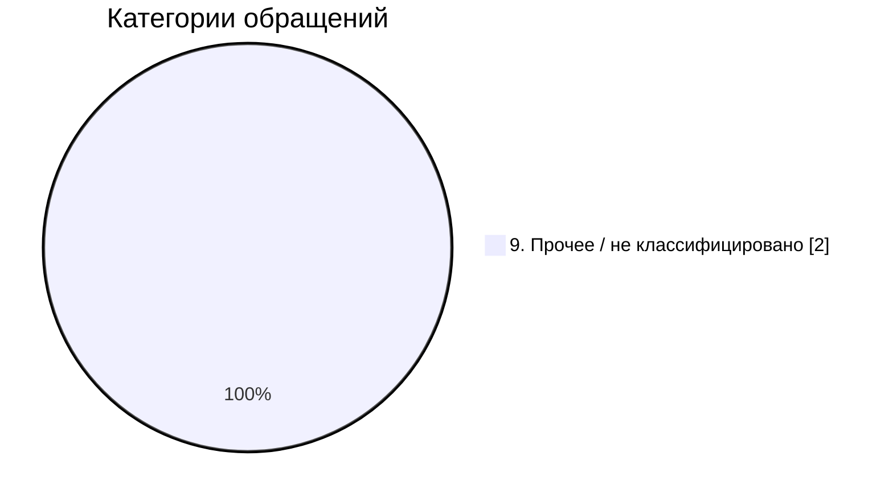
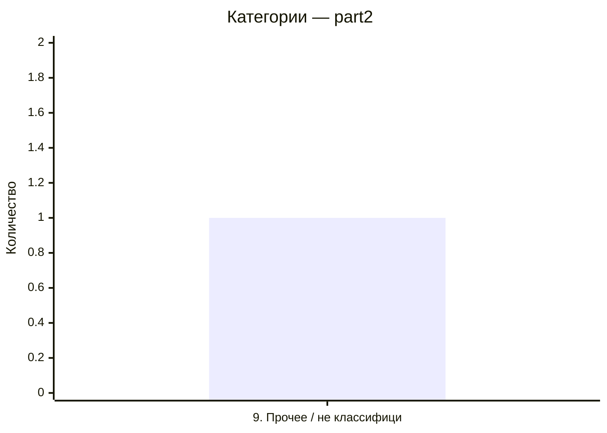

# Анализ обращений ЦБ ЯНАО

Автоматическая классификация обращений по 8 категориям.

**Источники:** part1.xlsx, part2.xlsx

## Общая сводка (2 обращений)

### Распределение по категориям

| Категория | Количество |
|---|---:|
| 9. Прочее / не классифицировано | 2 |

## Файл `part1` (1 обращений)

### Категории

| Категория | Количество |
|---|---:|
| 9. Прочее / не классифицировано | 1 |

### Пересечения категорий

| Пара категорий | Количество |
|---|---:|

### Топ услуг

| Услуга | Количество |
|---|---:|
| 9 | 1 |

### Статусы

| Статус | Количество |
|---|---:|
| 4 | 1 |

### Топ исполнителей

| Исполнитель | Количество |
|---|---:|
| 7 | 1 |

## Файл `part2` (1 обращений)

### Категории

| Категория | Количество |
|---|---:|
| 9. Прочее / не классифицировано | 1 |

### Пересечения категорий

| Пара категорий | Количество |
|---|---:|

### Топ услуг

| Услуга | Количество |
|---|---:|
| 9 | 1 |

### Статусы

| Статус | Количество |
|---|---:|
| 4 | 1 |

### Топ исполнителей

| Исполнитель | Количество |
|---|---:|
| 7 | 1 |
