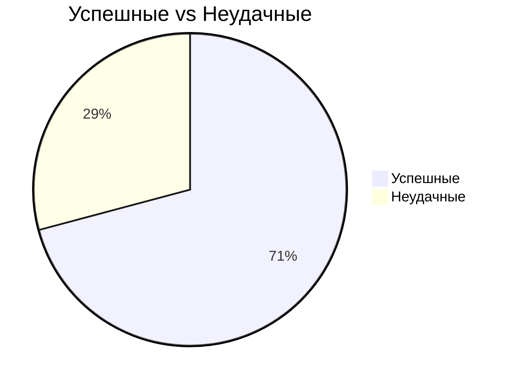

# Анализ CDR-звонков по ФИО

Период: 21.01.2025 – 20.02.2025

## 📊 Общая статистика

- **Всего звонков**: 22,274
- **Успешные**: 15,779 (70.8%)
- **Неудачные**: 6,495 (29.2%)

## 📈 Диаграммы

### Топ-10 инициаторов звонков

```mermaid
xychart-beta
    title Кол-во звонков (Топ-10)
    x-axis "Инициатор"
    y-axis "Количество"
    line [6585, 652, 638, 494, 476, 461, 455, 392, 387, 386]
    labels ["Uplink", "Бабихина Ольга ", "Тимофеева Алиса", "Родина Наталья ", "Алыкова Татьяна", "Якута Светлана ", "Ксения Викторов", "Лейпожих Алёна ", "Лаба Вера Алекс", "Мунарева Виктор"]
```

### Распределение по статусам



## 👥 Топ-10 инициаторов

| # | ФИО | Звонки | Неудачные |
|---|-----|--------|-----------|
| 1 | Uplink | 6585 | 2114 |
| 2 | Бабихина Ольга Анатольевна | 652 | 134 |
| 3 | Тимофеева Алиса Николаевна | 638 | 145 |
| 4 | Родина Наталья Васильевна | 494 | 136 |
| 5 | Алыкова Татьяна Валерьевна | 476 | 151 |
| 6 | Якута Светлана Михайловна | 461 | 145 |
| 7 | Ксения Викторовна Шевелева | 455 | 131 |
| 8 | Лейпожих Алёна Алексеевна | 392 | 108 |
| 9 | Лаба Вера Алексеевна | 387 | 87 |
| 10 | Мунарева Виктория Игоревна | 386 | 130 |

## 📞 Топ-15 адресатов

| # | ФИО | Количество |
|---|-----|------------|
| 1 | Uplink | 6819 |
| 2 | Бабихина Ольга Анатольевна | 766 |
| 3 | Чечеткин Михаил Игоревич | 659 |
| 4 | Останин Иван Георгиевич | 609 |
| 5 | Тимофеева Алиса Николаевна | 580 |
| 6 | Родина Наталья Васильевна | 566 |
| 7 | Роганова Анна Анатольевна | 535 |
| 8 | Ксения Викторовна Шевелева | 448 |
| 9 | Лейпожих Алёна Алексеевна | 404 |
| 10 | Андрей Чернов | 380 |
| 11 | Жданова Галина Игоревна | 320 |
| 12 | Алыкова Татьяна Валерьевна | 312 |
| 13 | Лаба Вера Алексеевна | 306 |
| 14 | Галямов Азат Ахтамович | 303 |
| 15 | Стрельникова Ольга Сергеевна | 285 |