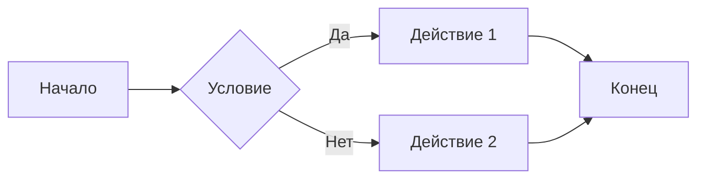

# Документация ГИС «Смета ЯНАО»

Этот портал содержит:
- Все реализованные и запланированные доработки с 2019 года,
- Технические задания (ТЗ),
- BPMN-диаграммы процессов,
- Ссылки на контракты и YouGile.

Используйте **поиск** в правом верхнем углу для быстрого нахождения функционала.

# Портал знаний ГИС «Смета ЯНАО»

[Контракты](contracts/) • 
[Проекты 2026](projects/) • 
[Быстрые решения](quick-guides/)

## Быстрый доступ
- [Полные инструкции (внешний сайт)](https://smeta-app.yanao.ru/docs)
- [Техническая поддержка](mailto:support@yanao.ru)
- [Чат в Teams](msteams://...)

## Flowchart111
