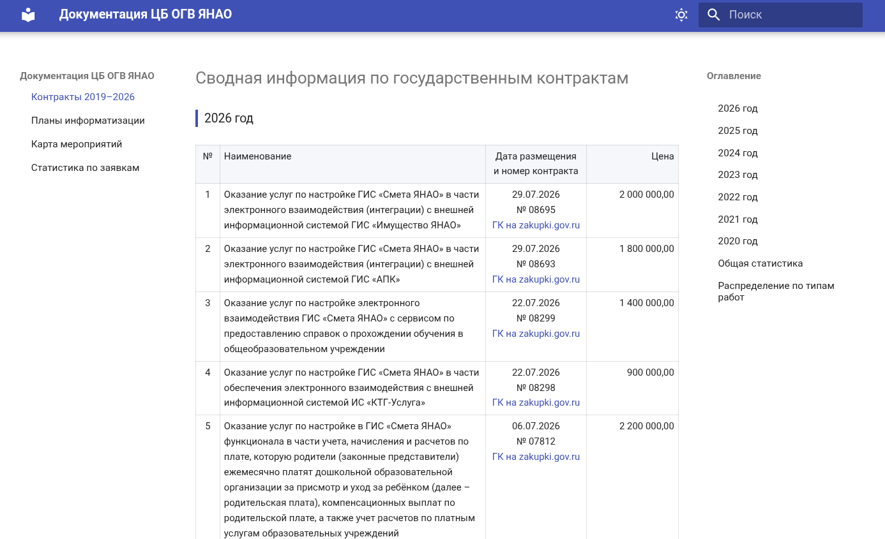

Портал предназначен для быстрого доступа к информации по заключенным контрактам, мероприятиям планов информатизации, отслеживания состояния работы по проектам и тому подобного.

Посмотрите интерактивные подсказки ниже чтобы было легче ориентироваться на портале

  

  <!-- № 1: Поиск — синий -->
  

    
1

    

      <b>Быстрый поиск</b> по всей документации. Введите ключевое слово — система найдёт все упоминания
    

  

  <!-- № 2: Левое меню — зелёный -->
  

    
2

    

      <b>Навигация по разделам портала</b>
    

  

  <!-- № 3: Заголовок раздела — оранжевый -->
  

    
3

    

      <b>Текущий раздел.</b> Показывает, где вы находитесь
    

  

  <!-- № 4: Оглавление справа — фиолетовый -->
  

    
4

    

      <b>Навигация по текущему разделу</b>
    

  

  <!-- № 5: Таблица контрактов — бирюзовый -->
  

    
5

    

      <b>Информация раздела</b>
    

  

