# Установка и настройка клиентского ПО ГИС «Смета ЯНАО»

В данном разделе описан порядок установки и настройки автоматизированного рабочего места (АРМ) для работы с ГИС «Смета ЯНАО». Существует два способа подключения: через **VipNet Client** (основной) и через **TLS** (альтернативный).

---

## :material-shield-check: Способ 1: Подключение через VipNet Client

### 1. Предварительная подготовка

!!! warning "Проверьте перед началом"
    1.  **КриптоПро CSP.** При отсутствии загрузите и установите: [cryptopro.ru](https://cryptopro.ru/products/csp/downloads)
    2.  **VipNet Client.** Убедитесь, что клиент установлен и запущен.
    3.  **Сетевой узел.** Проверьте доступность узла `LARM-Sal-CB-ServSmetaSP`.  
    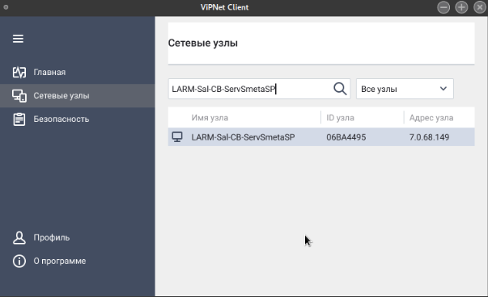

### 2. Загрузка программного обеспечения

<span class="twemoji icon-download">:material-download:</span> **Выберите версию для вашей ОС и загрузите ПО ГИС «Смета ЯНАО»**

[:material-download: Скачать для РЕД ОС](https://files.yanao.ru/s/dfn7iAL85Jf5e7e){ .md-button }
[:material-download: Скачать для Windows](https://files.yanao.ru/s/PqieKP4SSB8RGqK){ .md-button }

### 3. Настройка и запуск

=== "РЕД ОС"
    1.  **Права доступа:** Добавьте права на выполнение исполняемого файла `stimrun`.
        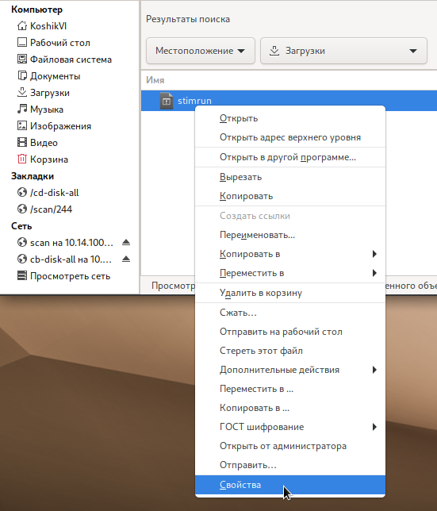
    2.  **Каталог:** Убедитесь, что у текущего пользователя есть права на запись в текущий каталог (при первом запуске создается файл инициализации).
        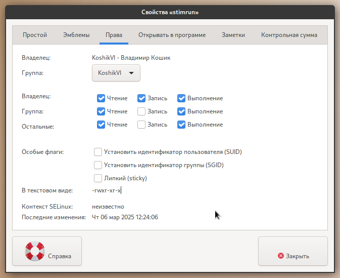
    3.  **Запуск:** Запустите `stimrun`. В модальном окне нажмите на гиперссылку **«адрес сервера»**.
        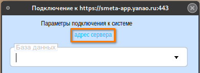
    4.  **Настройка адреса:**
        *   Запустите **ViPNet Client**.
        *   Перейдите в раздел **«Сетевые узлы»**.
        *   В поиске введите: `LARM-Sal-CB-ServSmetaSP`.
        *   Узнайте IP-адрес узла (например, `7.0.68.149`) и используйте порт `8080`.
        *   Итоговый адрес: `7.0.68.149:8080`.
        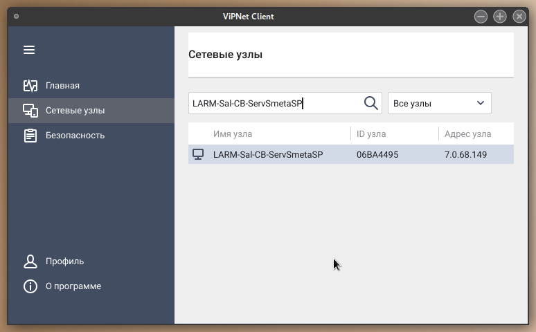

    !!! danger "Важно"
        Запуск приложения ViPNet Client необходимо осуществлять от имени пользователя, под которым была произведена установка лицензии (dst).

=== "Windows"
    1.  **Поиск узла:**
        *   Запустите **ViPNet Client**.
        *   Выберите **«Защищённая сеть»**.
        *   Найдите узел `LARM-Sal-CB-ServSmetaSP`, откройте свойства и посмотрите реальный IP-адрес.
        *   Используйте порт `8080`. Итоговый адрес: `7.0.68.149:8080`.
        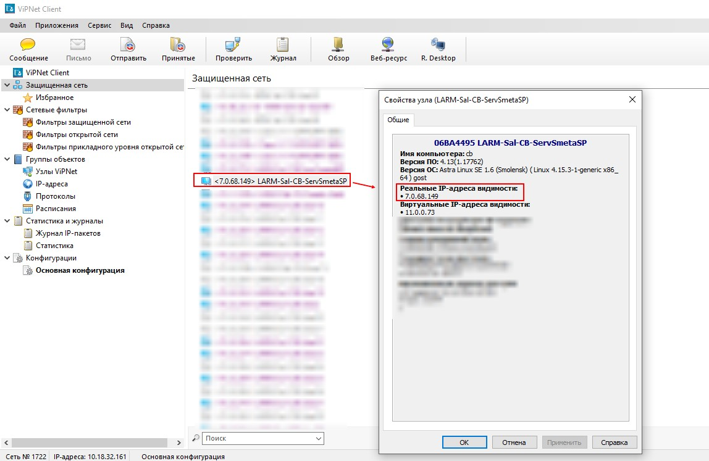
    2.  **Настройка подключения:** Установите адрес сервера подключения в клиенте ГИС.
        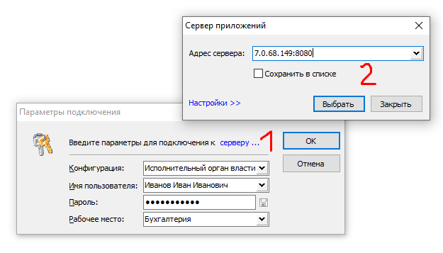
    3.  **Обновления:** Установите сервер обновлений из стабильной ветки дистрибутива.
        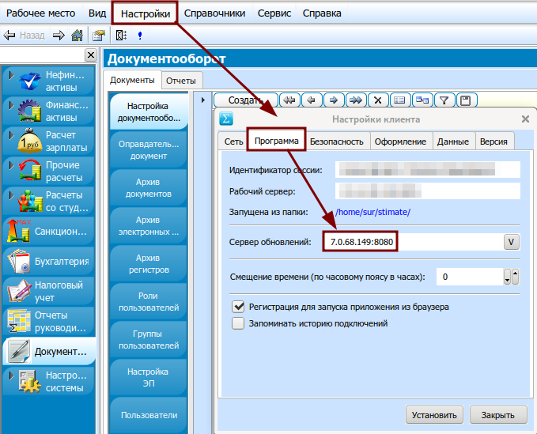

#### Настройка прокси

!!! note "Если используется прокси-сервер"
    В случае использования прокси-сервера в локальной сети необходимо указать его параметры. Перейдите по гиперссылке **«Настройки»** в клиенте.
    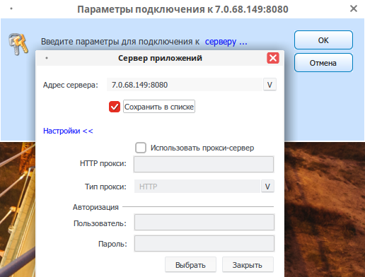{ .image-full }

### 4. Проверка подключения

Если всё сделано правильно, в выпадающем списке появится перечень баз данных учреждений. Выберите нужное учреждение.
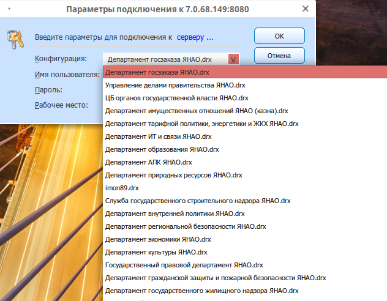{ .image-full }

!!! failure "Если список пуст"
    Если список баз данных отсутствует, доступ к серверу ограничен. Возможные причины:
    *   Отсутствие доступа к узлу VipNet `LARM-Sal-CB-ServSmetaSP`.
    *   Проблемы сетевых технологий ЛВС.
    *   Плановое обслуживание сервера (недоступность до 40 мин вечером).
    *   Локальные проблемы ОС АРМ.

---

## :material-flask-outline: Тестовая апробация функционала

Для проверки функционала создана специальная тестовая база данных.

!!! tip "Данные для входа"
    *   **Конфигурация:** `Департамент по общим вопросам ЯНАО_hidden.drx`
    *   **Пользователь:** `student`
    *   **Пароль:** `1`

    > **К сведению:** Суффикс `_hidden` означает скрытый контекст. Чтобы подключиться, скопируйте полное имя базы и вставьте его в поле **«Конфигурация»** вручную.

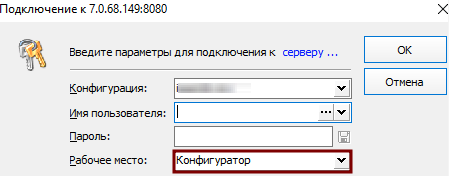

Результат успешной авторизации:
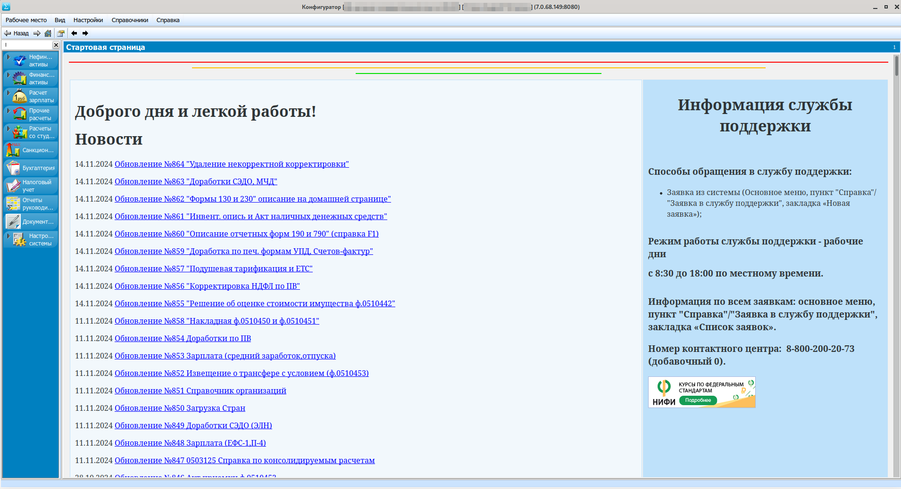

---

## :material-lock-outline: Способ 2: Подключение через TLS (Альтернативный)

!!! warning "Ограничение доступа"
    :material-information-outline: Этот способ работает **только в сети РМТКС ЯНАО**.

### 1. Подготовка КриптоПро (РЕД ОС)

1.  Убедитесь, что установлен **КриптоПро CSP 4.0+**.
2.  Откройте терминал (`Ctrl+Alt+T`).
3.  Выполните команды от имени суперпользователя:

    ```bash
    su
    # Введите пароль суперпользователя
    openssl-switch-config gost
    openssl engine
    exit
    ```

    *Результат выполнения `openssl engine`:*
    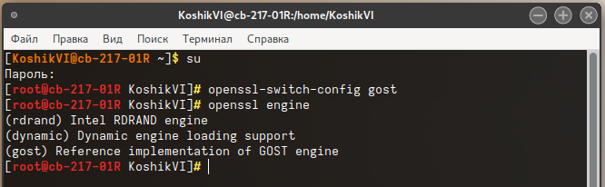

### 2. Установка клиентской части

=== "РЕД ОС"
    1.  Удалите все файлы из директории `stimate` (в домашней папке пользователя).
        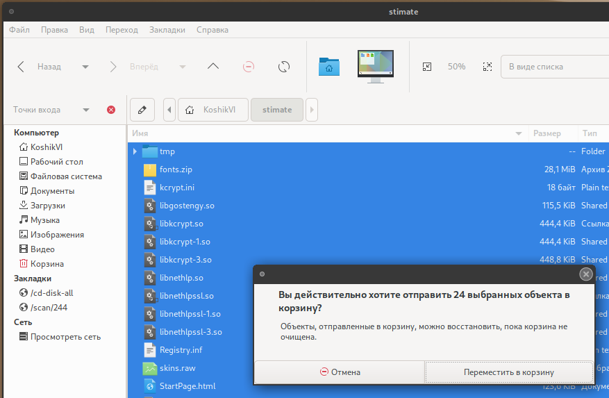
    2.  Скачайте файлы `stimrun` и `stimrun.ini`:
        [:material-download: Скачать для РЕД ОС (TLS)](https://files.yanao.ru/s/WfnAMN7MFNayJRR)
    3.  Переместите файлы в директорию `stimate`.
    4.  Выставьте права на файл `stimrun`:
        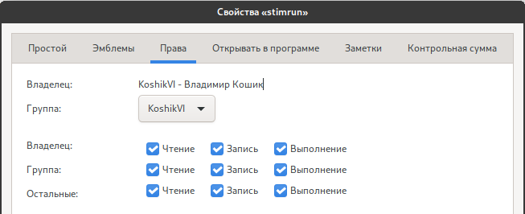
    5.  Запустите `stimrun` и дождитесь установки.
    6.  Адрес сервера: `https://smeta-app.yanao.ru:443`
    7.  После первого входа в меню <Настройки> → <Программа>:
        *   Введите адрес сервера обновлений: `win-stim.krista.ru:8080`
        *   Установите галочку: <Регистрация для запуска приложения из браузера>
        

=== "Windows"
    1.  Удалите все файлы из директории `stimate` (папка `C:\Windows`).
    2.  Скачайте файлы `stimrun` и `stimrun.ini`:
        [:material-download: Скачать для Windows (TLS)](https://files.yanao.ru/s/ZyG8ZHPzMSxt3BN)
    3.  Переместите файлы в директорию `stimate`.
    4.  Запустите `stimrun` и дождитесь установки.
    5.  Введите адрес сервера: `https://smeta-app.yanao.ru:443`
    6.  После первого входа в меню <Настройки> → <Программа>:
        *   Введите сервер обновлений: `win-stim.krista.ru:8080`
        *   Установите галочку: <Регистрация для запуска приложения из браузера>
        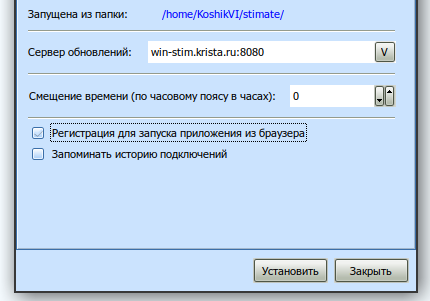