# Описание установки плагина и хост-приложения WorkspaceEX

!!! warning "Для подписания документов КЭП"
    :material-alert-outline: Если нет активированного ключа, нужно в ЛК сотрудника указать номер через кнопку на вкладке **«Основные реквизиты»**, как показано на рисунке 1.

**Рисунок 1 – Кнопка «Добавить КЭП» на вкладке «Основные реквизиты»**

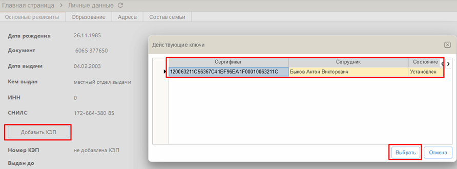

Также при отсутствии активированного ключа КЭП на ПК при попытке подписать документ будет выдавать ошибку, как показано на рисунке 2.

**Рисунок 2 – Ошибка ключа сертификата пользователя на ПК**

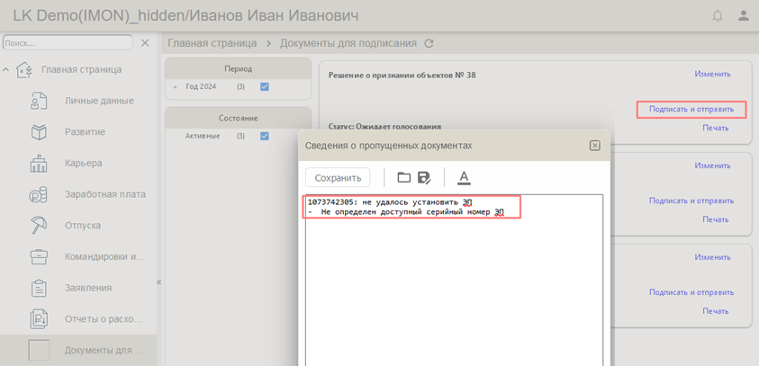

При поиске доступных КЭП на ПК идет проверка на:
- ФИО пользователя
- Срок действия сертификата

КЭП будет записан в учетную запись пользователя, как показано на рисунке 3.

**Рисунок 3 – Учетная запись пользователя Личного кабинета**

!!! info "Важно"
    Для активации КЭП пользователя ЛК необходимо на РМ установить **плагин** и **хост-приложение WorkspaceEX**.

### Описание установки плагина

Для подписания в ЛК документов КЭП необходимо установить плагин, как показано на рисунке 4. 

При попытке отправить заявление с подписью КЭП выйдет окно предупреждения с ссылкой на скачивание и установку плагина.

**Рисунок 4 – Окно предупреждения работы расширений для использования КЭП**

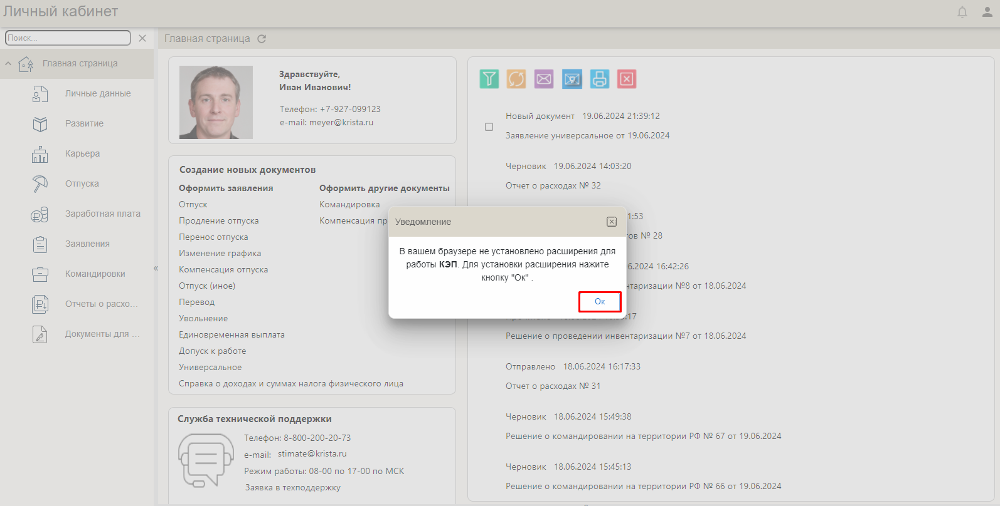

Далее при переходе по ссылке следуя инструкции устанавливается расширение, как показано на рисунке 5. 

Расширение можно установить как в **онлайн**, так и в **оффлайн** режимах.

**Рисунок 5 – Управление расширениями браузера для работы КЭП**

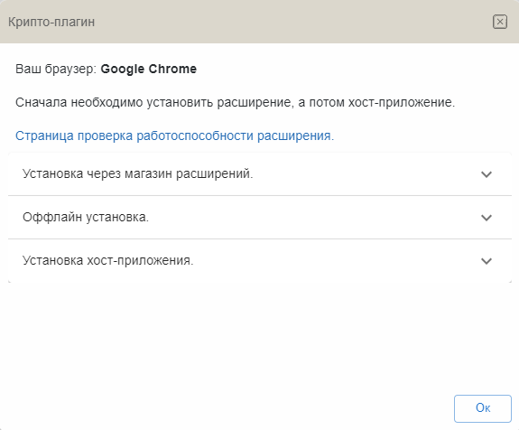

---

## Описание установки расширения в онлайн режиме {#описание-установки-расширения-в-онлайн-режиме}

В окне установки Крипто-плагина после установки расширения будет ссылка на скачивание расширения из магазина приложений. Его необходимо установить, следуя инструкции на рисунке 6.

**Рисунок 6 – Ссылка на скачивание приложения через магазин расширения**

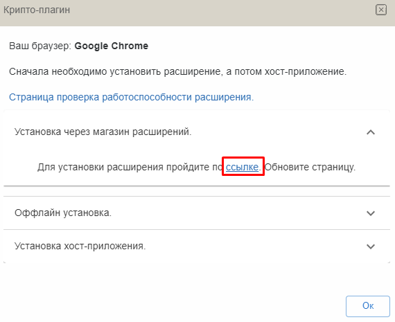

При переходе по ссылке нажмите кнопку **«Установить»**, как показано на рисунке 7.

**Рисунок 7 – Установка приложения через магазин расширения**

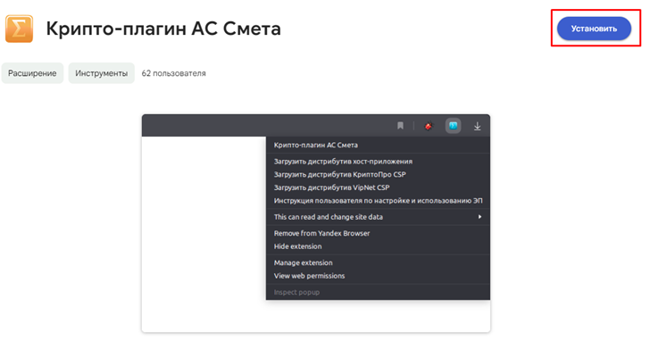
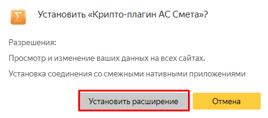
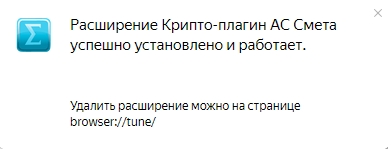

---

## Описание установки расширения в оффлайн режиме {#описание-установки-расширения-в-оффлайн-режиме}

В окне установки Крипто-плагина после установки расширения будет ссылка на скачивание расширения в оффлайн режиме. Его необходимо установить, следуя инструкции на рисунке 8.

**Рисунок 8 – Ссылка для скачивания расширения оффлайн**

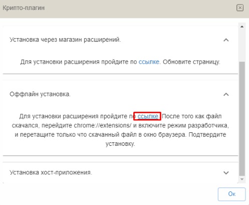

**Порядок действий:**

1. Перейдите по ссылке `chrome://extensions/`
2. Включите **режим разработчика**
3. Перетащите скачанный файл в окно браузера
4. Подтвердите установку, как показано на рисунке 9

**Рисунок 9 – Установка оффлайн расширения**

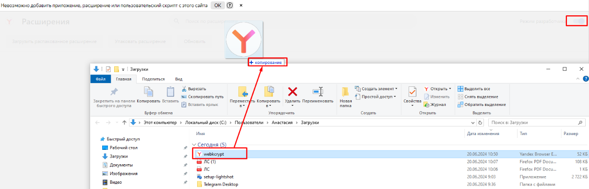

---

## Описание установки хост-приложения {#описание-установки-хост-приложения}

В окне установки Крипто-плагина после установки расширения будет ссылка на скачивание хост-приложения. Его необходимо установить, следуя инструкции на рисунке 10.

**Рисунок 10 – Ссылка на скачивание хост-приложения**

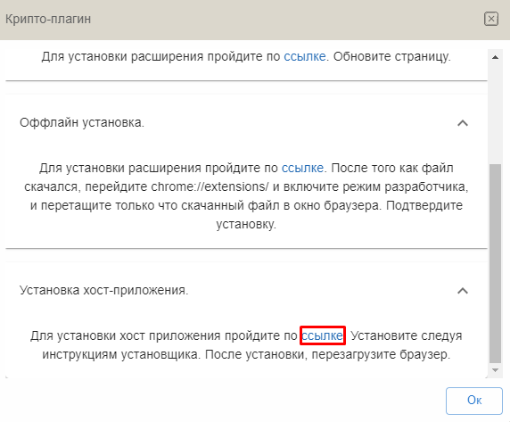

**Порядок действий:**

1. Загрузите скачанный файл
2. В окне установки нажмите кнопку **«Установить»**, как показано на рисунке 11

**Рисунок 11 – Установка хост-приложения**

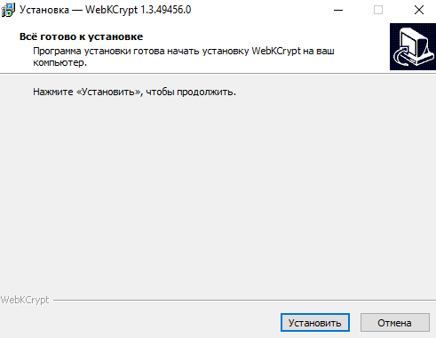

!!! success "Завершение установки"
    После установки необходимо **перезайти в браузер** для применения изменений.