# Руководство пользователя
Студия извлечения данных Extraction Services ООО «КРИСТА» 2025

## Основные понятия

!!! tip "Для кого"
    Настоящее руководство пользователя предназначено для операторов и аналитиков данных, работающих с платформой Extraction Services. Документ описывает порядок работы в веб-интерфейсе “Студия” (Studio), включая настройку конфигураций, создание структур данных, управление категориями документов и тестирование качества извлечения.

Студия извлечения данных (Extraction Studio) — это визуальный интерфейс для управления платформой Extraction Services. Она позволяет без написания кода настраивать правила обработки документов, тестировать их на реальных данных и анализировать результаты.

!!! info "Основные возможности"

    - Создание и редактирование схем извлечения данных (JSON Schema)
    - Настройка классификации документов
    - Управление версиями конфигураций
    - Пакетное тестирование на датасетах
    - Отладка промптов для LLM

## Термины и определения

| Термин | Определение |
|--------|-------------|
| **Задача (Task)** | Единичный запрос на обработку документа. Каждая задача имеет свой уникальный статус (например, “В очереди”, “Обработка”, “Готово”) и результат выполнения |
| **Структура данных (Data Structure)** | Схема (JSON Schema), которая определяет, какие именно поля и в каком формате система должна извлечь из документа |
| **Категория документа (Document Category)** | Классификация типа документа (например, “Паспорт”, “Счет”, “Билет”). Категория связывает тип документа с определенной структурой данных и правилами обработки |
| **Конфигурация (Configuration)** | Полный набор настроек, включающий все категории и структуры данных. Конфигурации группируются по доменам и имеют версии |
| **Домен (Domain)** | Область применения конфигурации (например, “Бухгалтерия”, “Кадры”). Позволяет изолировать настройки для разных отделов или бизнес-процессов |
| **Версия (Version)** | Конкретный вариант конфигурации. Система поддерживает версионирование, что позволяет безопасно вносить изменения и возвращаться к предыдущим настройкам |

## Схема процесса
??? "Алгоритм работы"
    ```mermaid

    graph TD
        Start([Начало работы]) --> CreateConfig{Создание конфигурации}
        
        CreateConfig -->|Пустая| ConfigEmpty[Новая конфигурация<br/>с нуля]
        CreateConfig -->|Клонирование| ConfigClone[Копирование<br/>существующей]
        CreateConfig -->|Импорт| ConfigImport[Загрузка из ZIP]
        
        ConfigEmpty --> CreateSchema
        ConfigClone --> CreateSchema
        ConfigImport --> CreateSchema
        
        CreateSchema[Создание структуры данных<br/>Response Schema] --> DefineFields[Определение полей:<br/>- name, type<br/>- description<br/>- format]
        
        DefineFields --> CreateCategory[Создание категории документа]
        
        CreateCategory --> CategoryStep1[Шаг 1:<br/>- Название категории<br/>- Выбор структуры данных]
        CategoryStep1 --> CategoryStep2[Шаг 2:<br/>- Область использования<br/>- Выбор сервиса<br/>- Детализация полей<br/>- Настройка промптов]
        
        CategoryStep2 --> CreateDataset{Есть тестовые<br/>данные?}
        
        CreateDataset -->|Нет| CreateNewDataset[Создание набора данных<br/>- Загрузка документов<br/>- Создание схемы<br/>возвращаемых значений<br/>- Заполнение эталонов]
        CreateDataset -->|Да| RunTest
        
        CreateNewDataset --> RunTest[Запуск тестирования]
        
        RunTest --> ConfigSelect[Выбор конфигурации<br/>и наборов данных]
        ConfigSelect --> TestParams[Настройка параметров:<br/>- Вне очереди<br/>- Отложенный старт<br/>- Детализация отчета]
        TestParams --> ExecuteTest[Выполнение теста]
        
        ExecuteTest --> AnalyzeResults{Анализ<br/>результатов}
        
        AnalyzeResults -->|Точность<br/>низкая| ViewReport[Просмотр отчета:<br/>- Средняя точность<br/>- Детали по наборам<br/>- Детали по полям]
        ViewReport --> EditCategory[Редактирование:<br/>- Уточнение описаний<br/>полей<br/>- Корректировка<br/>промптов]
        EditCategory --> RunTest
        
        AnalyzeResults -->|Точность<br/>приемлемая| CheckProduction{Готова для<br/>продакшена?}
        
        CheckProduction -->|Нет| EditCategory
        CheckProduction -->|Да| MarkProduction[Пометка версии<br/>как ПРОДУКТОВОЙ]
        
        MarkProduction --> Freeze[Заморозка<br/>конфигурации]
        
        Freeze --> NewChanges{Есть новые<br/>изменения?}
        
        NewChanges -->|Да| CloneForChanges[Клонирование<br/>конфигурации<br/>новая версия]
        CloneForChanges --> CreateSchema
        
        NewChanges -->|Нет| End([Рабочий<br/>процесс])
        
        style Start fill:#90EE90
        style End fill:#FFB6C1
        style CreateConfig fill:#87CEEB
        style CreateSchema fill:#87CEEB
        style CreateCategory fill:#87CEEB
        style RunTest fill:#DDA0DD
        style AnalyzeResults fill:#FFD700
        style MarkProduction fill:#90EE90
        style Freeze fill:#FFB6C1
    ```

## Интерфейс Студии

### Главная страница

После входа в систему открывается главная страница, предоставляющая быстрый доступ к основным разделам.

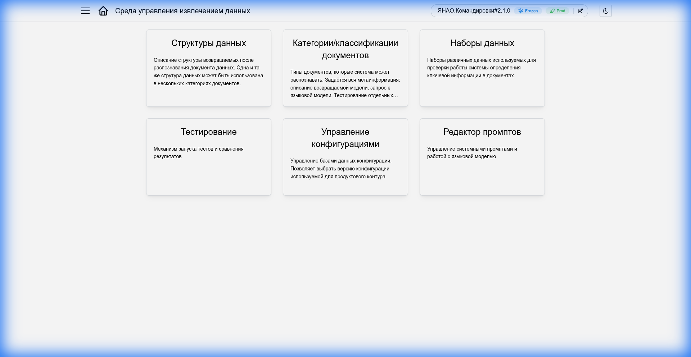

<figcaption>Главная страница Студии</figcaption>

Основные разделы меню:

- **Конфигурации**: Управление доменами и версиями настроек
- **Структуры данных**: Определение полей для извлечения
- **Категории документов**: Настройка правил классификации и привязка схем
- **Датасеты**: Загрузка тестовых данных
- **Тестирование**: Запуск проверок и просмотр отчетов

## Управление конфигурациями

!!! note "Что такое конфигурация?"
    Конфигурация — это сердце вашей работы в Студии. Она объединяет все настройки системы извлечения данных: категории документов, структуры данных и промпты. Каждая конфигурация принадлежит определённому **домену** (например, “Командировки” или “Закупки”) и имеет **версию**, что позволяет безопасно экспериментировать с настройками, не ломая работающую систему.

### Список конфигураций

Раздел **Конфигурации** в боковом меню открывает полный список всех доменов и их версий.

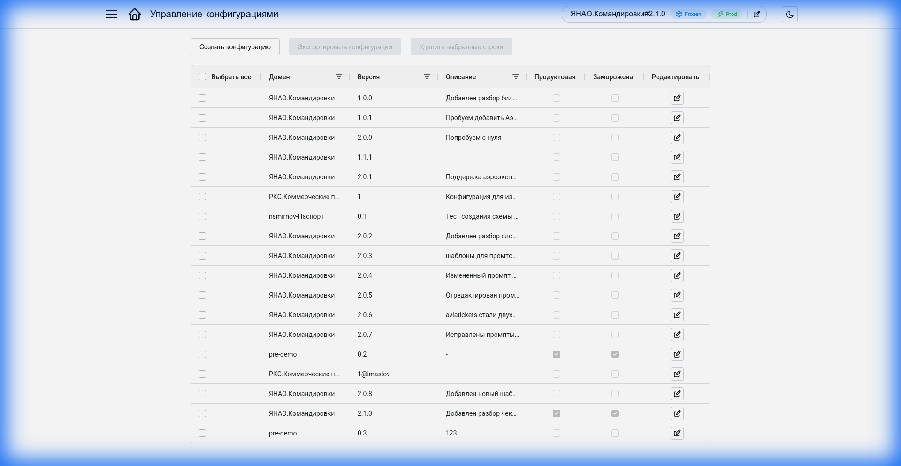

<figcaption>Список конфигураций</figcaption>

| Действие | Описание |
|----------|----------|
| **Создать** | Открывает форму создания новой конфигурации |
| **Редактировать** | Кнопка в строке конфигурации — открывает форму редактирования параметров |
| **Экспорт** | Сохраняет конфигурацию в ZIP-архив для резервного копирования или переноса на другой сервер |
| **Удалить** | Удаляет выбранную конфигурацию. Недоступно для продакшн-версий |

### Создание новой конфигурации

Чтобы создать новую конфигурацию, нажмите кнопку **“Создать”**. Система предложит выбрать один из трёх режимов:

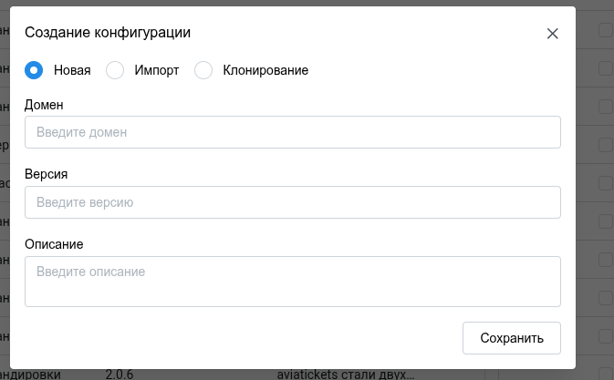

<figcaption>Создание конфигурации</figcaption>

=== "Пустая конфигурация"
    Создаёт конфигурацию “с чистого листа”. Подходит, когда вы начинаете работу над совершенно новым доменом, для которого ещё нет готовых наработок.
    
    **Что нужно указать:**
    
    - **Домен** — название области применения (например, “Закупки” или “HR”)
    - **Версия** — номер версии (рекомендуется начинать с 1.0.0)
    
    После создания вам нужно будет вручную добавить структуры данных и категории документов.

=== "Клонирование существующей"
    Копирует все настройки из выбранной конфигурации — категории, структуры данных, промпты. Это самый безопасный способ внести изменения в работающую систему: вы создаёте копию, экспериментируете с ней, и только после успешного тестирования переключаетесь на новую версию.
    
    **Что нужно указать:**
    
    - **Домен** — можно оставить тот же или указать новый
    - **Версия** — новый номер версии (например, если клонируете 1.0.0, укажите 1.1.0 или 2.0.0)
    - **Базовая конфигурация** — выберите конфигурацию, которую хотите скопировать
    
    !!! tip "Типичный сценарий"
        Нужно добавить новую категорию документов или изменить схему извлечения? Склонируйте текущую продакшн-версию, внесите изменения, протестируйте — и только потом отправляйте в продакшн.

=== "Импорт из архива"
    Загружает конфигурацию из ZIP-архива. Архив можно получить от коллег, скачать из другой среды (тестовой или продакшн) или восстановить из резервной копии.
    
    **Что нужно указать:**
    
    - **Архив** — ZIP-файл с конфигурацией (формат экспорта системы)
    
    Домен и версия будут взяты из архива автоматически. Если такая конфигурация уже существует — импорт будет отклонён.
    
    !!! warning "Когда использовать"
        Перенос настроек между серверами, восстановление из бэкапа, получение готовых конфигураций от команды разработки.

### Редактирование конфигурации

Для редактирования существующей конфигурации выберите её в списке и нажмите на иконку редактирования. Откроется форма с параметрами:

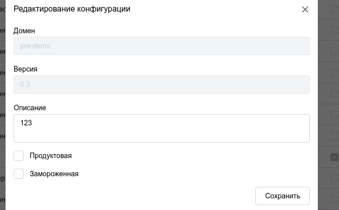

<figcaption>Редактирование конфигурации</figcaption>

- **Описание**: Текстовое описание конфигурации — для чего она предназначена, какие изменения внесены по сравнению с предыдущей версией и т.д.
- **Продуктовая**: Отмечает версию как используемую по умолчанию. Когда внешняя система отправляет документ на обработку без указания конкретной версии — используется именно продуктовая версия.
- **Заморозка**: Блокирует любые изменения в конфигурации — редактирование категорий и схем становится недоступным. Используйте для защиты стабильных версий от случайных правок.

!!! warning "Важно"
    Перед тем как пометить версию как продуктовую, убедитесь, что она прошла тестирование на датасетах и показывает приемлемое качество извлечения.

### Текущая конфигурация

Переключатель **Текущая конфигурация** в заголовке страницы — это глобальный контекст вашей работы в Студии. Всё, что вы видите и редактируете — категории документов, структуры данных, результаты тестов — относится именно к выбранной здесь конфигурации.

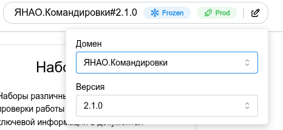

<figcaption>Текущая конфигурация</figcaption>

**Как переключить:** Кликните на переключатель — откроется список всех доступных конфигураций. Выберите нужный домен и версию.

**Метки статуса:** Рядом с названием конфигурации могут отображаться цветные метки, помогающие быстро понять её состояние:

- :material-check-circle:{ .product } **Продуктовая** — версия используется по умолчанию при обработке документов через API
- :material-lock:{ .frozen } **Заморожена** — версия защищена от редактирования

Если меток нет — это обычная рабочая версия (черновик), которую можно свободно редактировать.

## Структуры данных

Структура данных (Response Schema) — это шаблон, определяющий какие именно поля система должна извлечь из документа. По сути, это “контракт”: вы описываете, что хотите получить, а система возвращает результат строго по этой схеме.

Каждая структура данных привязывается к одной или нескольким категориям документов. Например, структура “Билет” может использоваться для категорий “Авиабилет”, “ЖД-билет”, “Автобусный билет” — если все они извлекают одинаковый набор полей.

### Список структур

Раздел **Структуры данных** в боковом меню показывает все схемы текущей конфигурации.

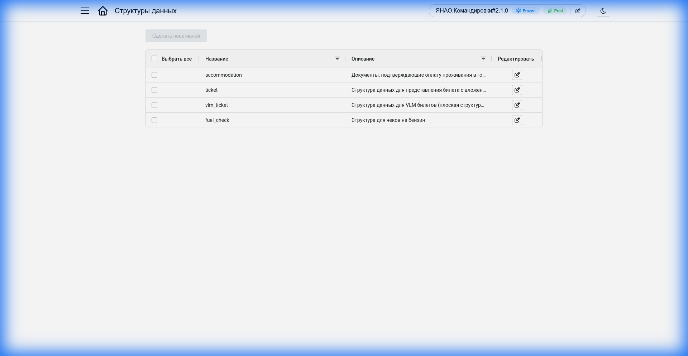

<figcaption>Список структур данных</figcaption>

| Действие | Описание |
|----------|----------|
| **Создать** | Создаёт новую пустую структуру данных |
| **Редактировать** | Кнопка в строке — открывает редактор схемы. В замороженных конфигурациях кнопка доступна, но изменения сохранить нельзя |
| **Удалить** | Удаляет схему. Недоступно для замороженных конфигураций и схем, используемых в категориях |

### Создание и редактирование структуры

При создании (или редактировании) структуры откроется единая форма, где нужно указать:

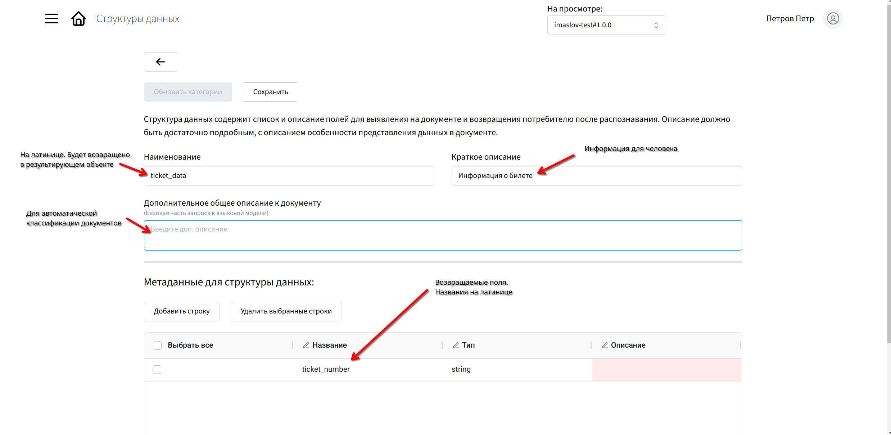

<figcaption>Создание структуры данных</figcaption>

- **Название** — уникальный идентификатор схемы (например, train_ticket, invoice)
- **Описание** — для чего предназначена схема, какие документы она покрывает
- **Поля** — какие данные нужно извлечь из документа

Для настройки полей можно использовать визуальный редактор или вставить пример ожидаемого JSON — система автоматически сгенерирует схему на его основе.

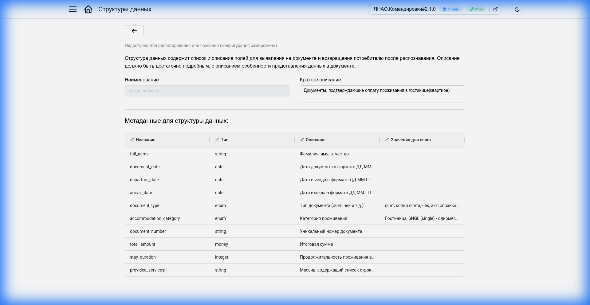

<figcaption>Редактор структуры данных</figcaption>

Каждое поле имеет тип. Доступные типы:

| Тип | Описание | Пример |
|-----|----------|--------|
| `string` | Текстовая строка | ФИО, номер документа, название |
| `number` | Число (целое или дробное) | Сумма, количество |
| `integer` | Целое число | Порядковый номер, год |
| `boolean` | Логическое значение | Флаг наличия/отсутствия |
| `date` | Дата | Дата отправления, срок действия |
| `array` | Массив значений | Список пассажиров, перечень товаров |
| `object` | Вложенный объект | Адрес (улица, дом, город) |

!!! note
    Описания полей можно оставить общими — детализация (например, где именно искать информацию в документе) настраивается позже, при создании категорий документов.

## Категории документов

Категория документа — это “рецепт” обработки конкретного типа документа. Она связывает структуру данных (что извлекать) с правилами распознавания и промптами (как извлекать). Например, категория “Билет РЖД” знает, что нужно искать дату отправления, номер поезда и ФИО пассажира, и как именно это делать.

!!! tip
    Категории — это последний шаг настройки перед тем, как система сможет обрабатывать реальные документы.

### Список категорий

Раздел **Категории документов** показывает все категории текущей конфигурации.

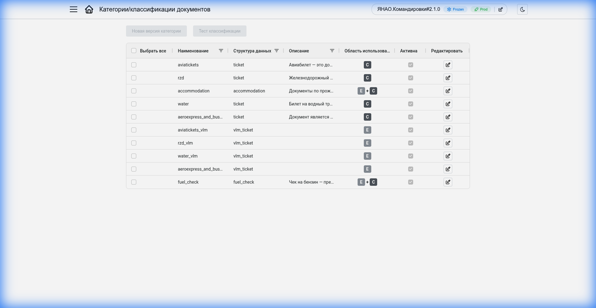

<figcaption>Список категорий документов</figcaption>

В таблице отображаются:

- **Название** — имя категории
- **Структура данных** — схема, используемая для извлечения данных
- **Сервис** — движок обработки (vlm-parser или ticket-parser)
- **Область использования** — режим работы категории:
    - **E+C** (Extraction + Classification) — полный цикл: классификация типа документа и извлечение данных
    - **C** (Classification) — только классификация без извлечения данных
    - **E** (Extraction) — только извлечение данных (если тип документа уже известен)
- **Активна** — признак, указывающий будет ли категория использоваться системой при обработке документов. Неактивные категории игнорируются.

| Действие | Описание |
|----------|----------|
| **Создать** | Создаёт новую категорию документов |
| **Редактировать** | Кнопка в строке — открывает редактор категории. В замороженных конфигурациях можно открыть, но сохранить нельзя |
| **Удалить** | Удаляет категорию. Недоступно для замороженных конфигураций |

### Создание и редактирование категории

При создании категории процесс состоит из двух этапов:

#### Шаг 1: Начальная настройка

Сначала нужно указать базовую информацию:

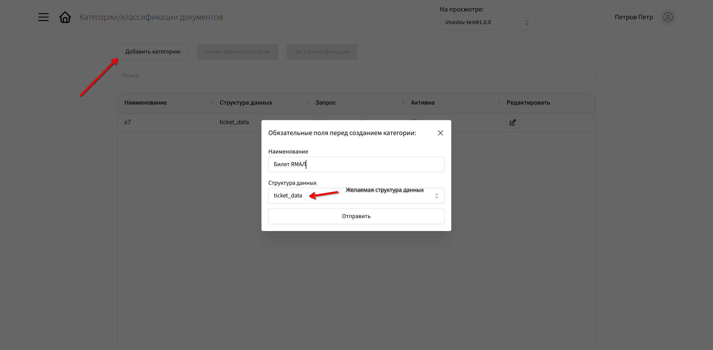

<figcaption>Создание категории — шаг 1</figcaption>

- **Название** — понятное имя категории (например, “Билет РЖД”, “Паспорт РФ”)
- **Структура данных** — выберите схему, которая будет заполняться данными из документов этой категории (после создания изменить нельзя)

#### Шаг 2: Детальная настройка

После создания (или при редактировании существующей категории) откроется полная форма:

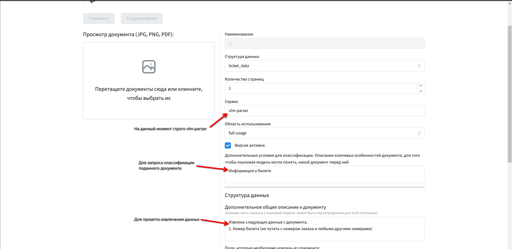

<figcaption>Создание категории — шаг 2</figcaption>

**Основные параметры:**

- **Версия активна** — включает/выключает использование категории при обработке документов
- **Наименование** — имя категории
- **Структура данных** — выбранная схема (только для просмотра)
- **Количество страниц** — ожидаемое количество страниц в документах этой категории
- **Область использования** — режим работы категории:
    - **Классификация + извлечение** — полный цикл обработки
    - **Только классификация** — определение типа без извлечения (извлечение будет выполнено другим способом)
    - **Только извлечение** — явный вызов VLM для извлечения данных из документа известного типа
- **Сервис** — движок обработки (vlm-parser или ticket-parser). Для режимов “Классификация + извлечение” и “Только извлечение” автоматически устанавливается vlm-parser.
- **Дополнительные условия для классификации** — описание ключевых особенностей документа, помогающее языковой модели понять, какой документ перед ней (показывается не для всех режимов)

**Настройка полей структуры данных:**

Таблица с полями из выбранной схемы. Для каждого поля можно указать:

- **Описание** — детализация того, что именно нужно извлечь и где это искать в документе
- **Значение по умолчанию** — значение, которое будет использовано, если поле не найдено в документе

**Промпт для извлечения:**

Запрос к языковой модели для извлечения информации. Генерируется автоматически на основе таблицы полей, но может быть вручную отредактирован для уточнения инструкций.

!!! example "Пример детализации"
    Если в структуре данных вы указали просто “дата”, то в описании поля категории можно уточнить: “Дата отправления поезда в формате ДД.ММ.ГГГГ, расположена в верхней части билета справа от логотипа РЖД”.
    
    Чем точнее описания и промпты — тем качественнее и стабильнее работает извлечение данных.

## Наборы данных

Для контроля качества работы системы предусмотрен функционал работы с тестовыми данными. Раздел **Наборы данных** состоит из двух вкладок.

### Список наборов данных

Набор данных — это коллекция тестовых документов с эталонными результатами извлечения. Используется для проверки качества работы конфигураций.

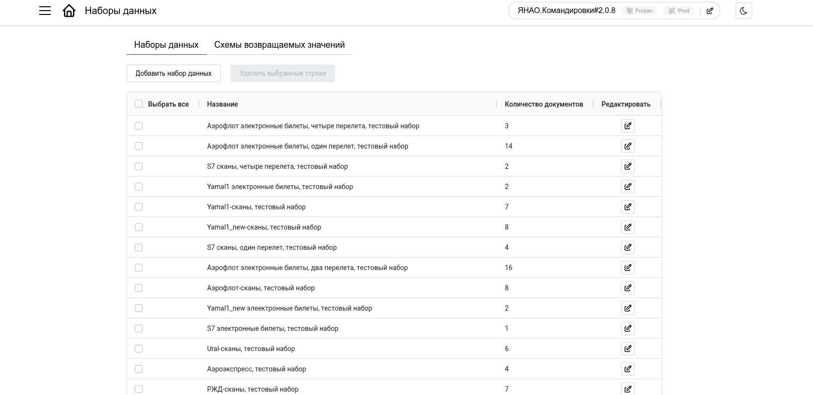

<figcaption>Список наборов данных</figcaption>

В таблице отображаются:

- **Название** — имя набора данных
- **Описание** — назначение набора (опционально)
- **Количество документов** — число документов в наборе

| Действие | Описание |
|----------|----------|
| **Создать** | Создать новый набор данных |
| **Редактировать** | Открыть набор для управления документами |
| **Удалить** | Удалить набор данных |

#### Создание набора данных

При создании нужно указать:

- **Название набора данных** — уникальное имя
- **Описание набора данных** — для чего предназначен набор (опционально)

#### Работа с документами в наборе

После создания (или при редактировании) открывается страница управления документами набора:

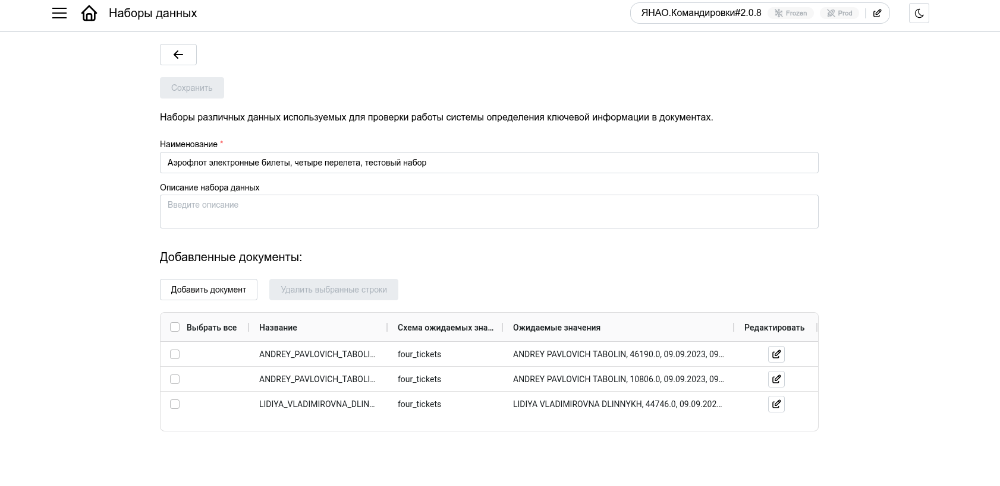

<figcaption>Документы в наборе</figcaption>

Здесь отображается список документов с их характеристиками:

- **Название** — имя файла документа
- **Схема ожидаемых значений** — какая схема используется для хранения эталонных данных
- **Ожидаемые значения** — эталонные данные для сравнения

**Действия с документами:**

- **Добавить документ** — загрузить новый тестовый документ
- **Редактировать** — изменить эталонные данные или категории документа
- **Удалить** — удалить документ из набора

#### Добавление документа в набор

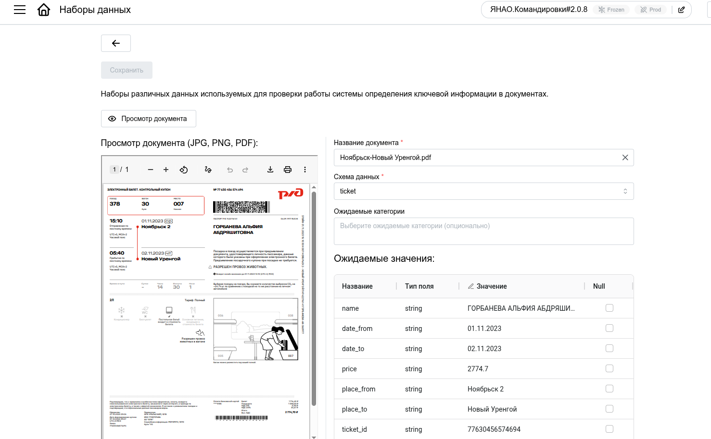

<figcaption>Добавление документа</figcaption>

При добавлении документа нужно:

1. **Прикрепить файл** — загрузить изображение или PDF
2. **Указать название** — имя документа в наборе
3. **Выбрать схему ожидаемых значений** — схему для хранения эталонных данных
4. **Заполнить ожидаемые значения** — эталонные данные, с которыми будет сравниваться результат обработки
5. **Выбрать ожидаемые категории** (опционально) — указать, какие категории должны быть обнаружены на каждой странице документа. Используется для тестирования режима без автоматической классификации, когда категории передаются явно.

### Схемы возвращаемых значений

Схема возвращаемых значений (Field Schema) — это шаблон для хранения эталонных данных в тестовых документах. В отличие от структур данных (Response Schema), которые используются в продакшене, схемы возвращаемых значений создаются специально для тестирования.

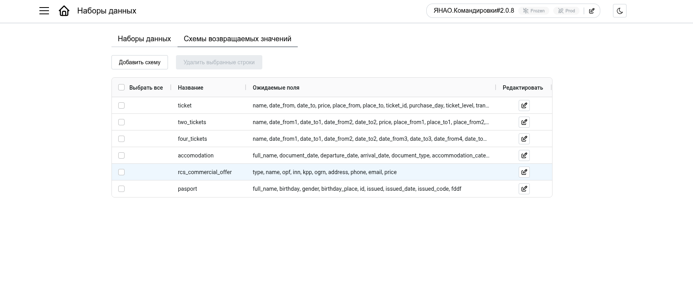

<figcaption>Список схем возвращаемых значений</figcaption>

В таблице отображаются:

- **Название** — имя схемы
- **Ожидаемые поля** — список полей в схеме

| Действие | Описание |
|----------|----------|
| **Создать** | Создать новую схему |
| **Редактировать** | Изменить поля схемы |
| **Удалить** | Удалить схему (если она не используется в документах) |

#### Создание схемы возвращаемых значений

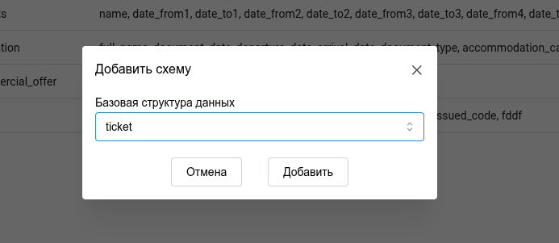

<figcaption>Создание схемы — шаг 1</figcaption>

При создании можно:

- **Создать пустую схему** — указать название и вручную добавить поля
- **Создать из существующей структуры данных** — импортировать поля из Response Schema, созданной ранее в разделе “Структуры данных”

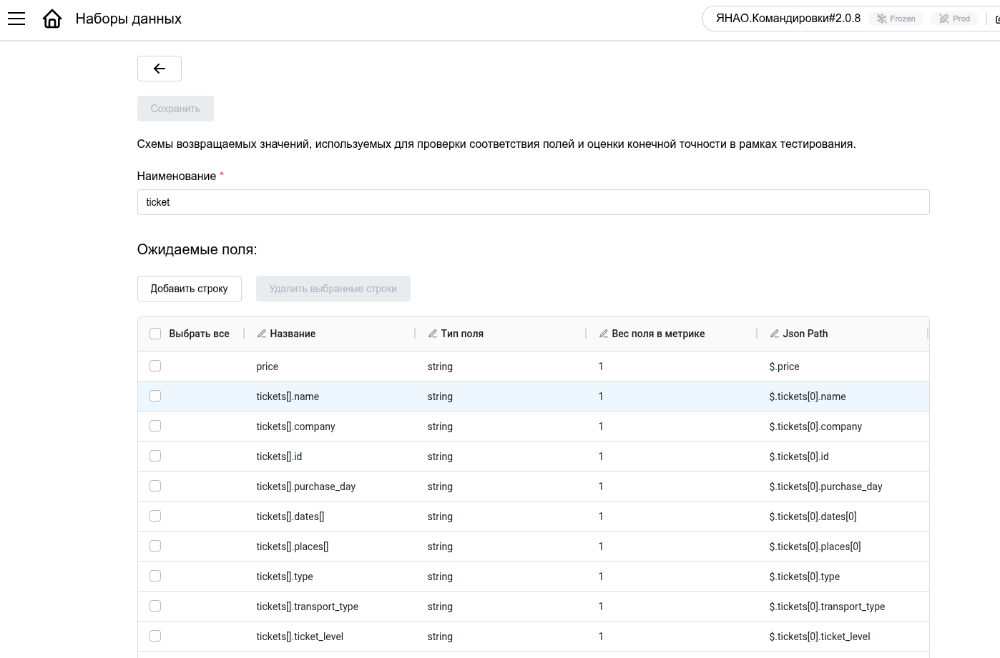

<figcaption>Создание схемы — шаг 2</figcaption>

После выбора способа создания откроется редактор полей, где для каждого поля указывается:

- **Название** — имя поля
- **Тип поля** — string, number, date, array, object и т.д.
- **Вес поля в метрике** — число от 0 до 1, определяющее важность поля при расчете точности тестирования. Поля с большим весом сильнее влияют на итоговую оценку качества.
- **Json Path** — путь к полю в JSON-ответе (например, `$.name` для простого поля или `$.passenger.firstName` для вложенного). Используется для корректного извлечения значений из результатов обработки.

## Тестирование

Раздел тестирования позволяет проверить качество работы конфигурации на наборах данных с эталонными результатами. Система запускает обработку документов, сравнивает полученные результаты с ожидаемыми и формирует подробный отчет.

### Список задач тестирования

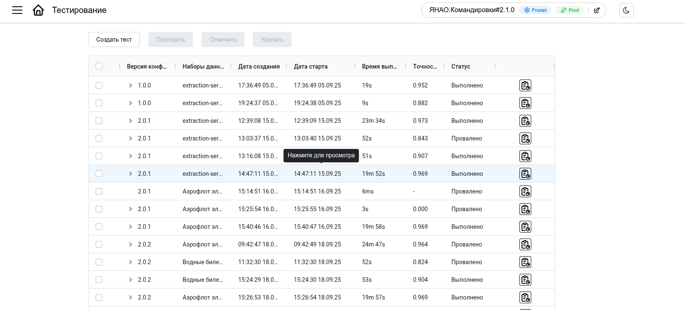

<figcaption>Панель тестирования</figcaption>

Главная страница показывает все задачи тестирования (выполненные, запущенные, запланированные).

В таблице отображаются:

- **Версия конфигурации** — какая конфигурация тестируется (кликабельно, открывает детальный отчет)
- **Наборы данных** — список наборов, на которых проводится тестирование
- **Дата создания** — когда задача была создана
- **Точность** — средняя взвешенная точность (показывается только для завершенных задач)
- **Статус** — текущее состояние задачи:
    - **Запланировано** — задача в очереди, ожидает выполнения
    - **В работе** — задача выполняется
    - **Успешно** — тестирование завершено успешно
    - **Провалено** — тестирование завершено с ошибками
    - **Отменено** — задача была отменена
- **Иконка статуса** — визуальный индикатор результата (✓ успешно, ✗ провалено)

| Действие | Описание |
|----------|----------|
| **Запустить тестирование** | Создать новую задачу |
| **Повторить** | Создать копию выбранных задач и запустить заново |
| **Отменить** | Остановить выполнение запущенных задач |
| **Возобновить** | Запустить отмененные или проваленные задачи повторно |
| **Удалить** | Удалить выбранные задачи |

### Создание задачи тестирования

При нажатии “Запустить тестирование” откроется форма:

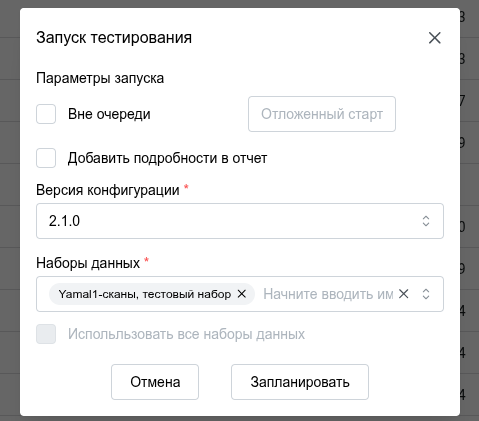

<figcaption>Создание задачи тестирования</figcaption>

**Параметры запуска:**

- **Вне очереди** — запустить задачу с наивысшим приоритетом, минуя очередь (не совместимо с отложенным стартом)
- **Отложенный старт** — указать дату и время, когда задача должна начаться (не совместимо с режимом “вне очереди”)
- **Добавить подробности в отчет** — включить в отчет успешные совпадения полей (по умолчанию показываются только ошибки)

**Версия конфигурации:**

- Выбрать конфигурацию для тестирования (по умолчанию — текущая активная)

**Наборы данных:**

- Выбрать наборы данных для тестирования
- **Использовать все наборы данных** — запустить тестирование на всех доступных наборах

После заполнения нажмите **“Запланировать”** — задача будет создана и запущена согласно параметрам.

### Просмотр результатов

Для просмотра подробного отчета кликните на **Версию конфигурации** в таблице задач.

#### Вкладка “Результаты”

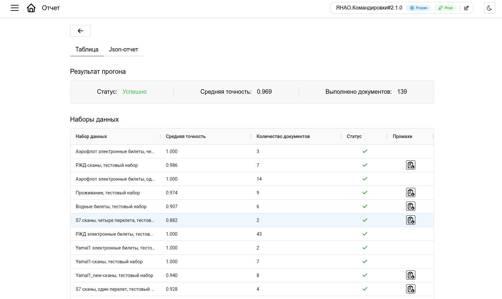

<figcaption>Отчет о результатах тестирования</figcaption>

Отчет содержит три секции:

**1. Результат прогона:**

- **Статус** — успешно (зелёный) или провалено (красный)
- **Средняя точность** — взвешенная точность по всем наборам данных
- **Выполнено экспериментов** — общее количество обработанных документов

**2. Наборы данных:**

Таблица с результатами по каждому набору:

- **Набор данных** — название набора
- **Средняя точность** — точность по данному набору
- **Количество экспериментов** — число документов в наборе
- **Иконка статуса** — результат (✓/✗)
- **Детали** — кнопка для просмотра детальной информации по документам набора

#### Детали по набору данных

При клике на иконку деталей откроется модальное окно со списком документов:

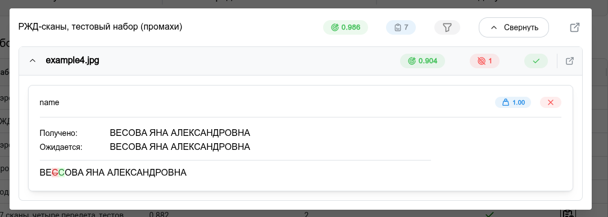

<figcaption>Детали по набору</figcaption>

Для каждого документа показывается:

- **Название документа** — имя файла (кликабельно, открывает детали по полям)
- **Взвешенная точность** — точность извлечения по данному документу
- **Количество промахов** — сколько полей было извлечено неверно
- **Ошибка выполнения** — если документ не был обработан (технические ошибки)
- **Иконка статуса** — результат обработки документа

!!! note
    **При клике на название документа** откроется детальное сравнение полей:
    
    - **Название поля** — имя извлекаемого поля
    - **Ожидаемое значение** — эталонное значение из набора данных
    - **Полученное значение** — что извлекла система
    - **Вес** — вес поля в метрике точности
    - **Иконка статуса** — совпадение (✓) или несовпадение (✗)

#### Вкладка “JSON”

Показывает полный отчет в формате JSON для технического анализа или интеграции с внешними системами.

!!! warning "Важно"
    Точность рассчитывается на основе взвешенной метрики — поля с большим весом (указанным в схеме возвращаемых значений) влияют сильнее на итоговую оценку качества.

## Редактор промптов

Инструмент для тонкой настройки системных промптов, отправляемых в LLM. Позволяет экспериментировать с формулировками инструкций для улучшения качества извлечения в сложных случаях.

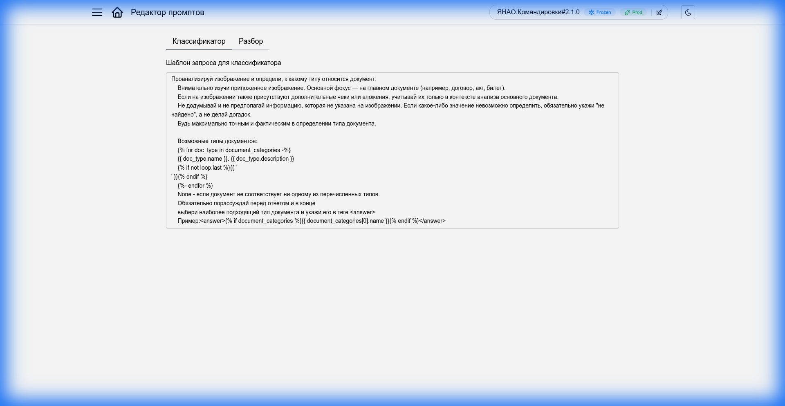

<figcaption>Редактор промптов</figcaption>

## Дополнительные инструменты

В интерфейсе также доступны ссылки на технические инструменты (обычно используются администраторами или разработчиками):

- **Swagger UI**: Документация API
- **Mongo Express**: Прямой доступ к базе данных

!!! tip
    Эти инструменты помогают в глубокой диагностике и интеграции с внешними системами.