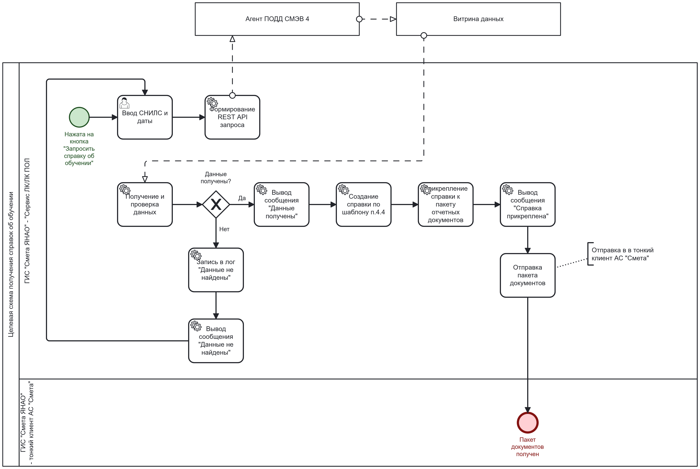
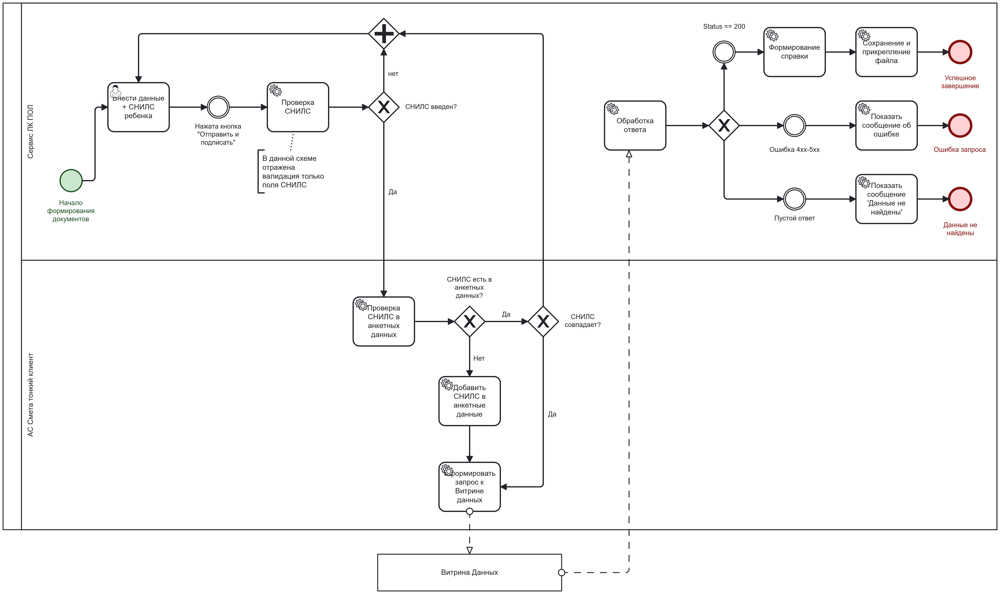
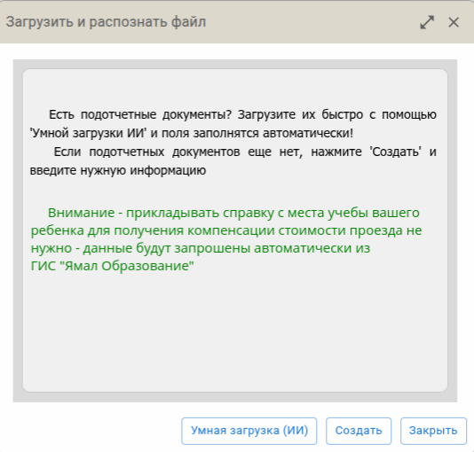
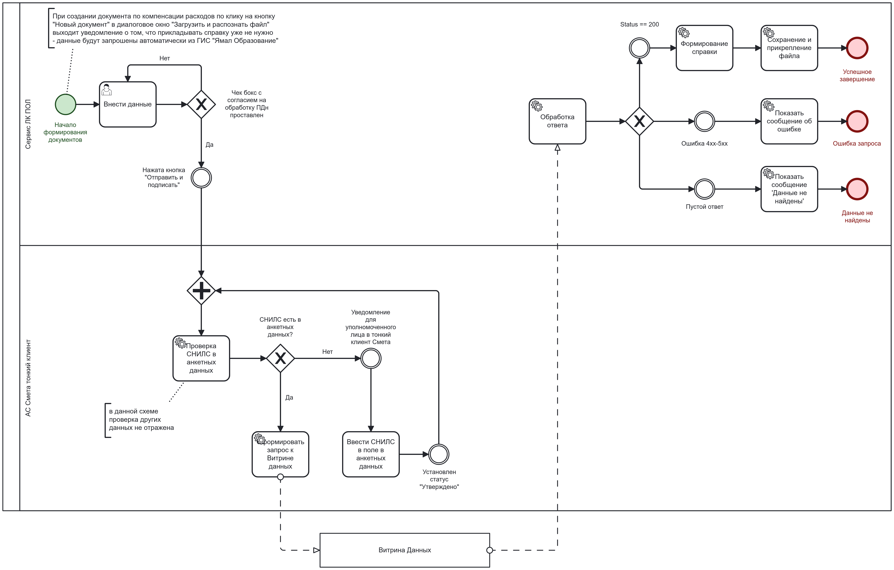

# Справки Образование

## Этап 1. Согласование постановки задачи

### Общие требования
### Согласование задачи
#### 1-я итерация 30.01.26

 
_______________
#### 2-я итерация 04.02.26

1. Подотчетное лицо формирует документы по компенсации расходов в ЛК ПОЛ, указывая СНИЛС ребенка. (Нужно добавить в интерфейс «Члены семьи» поле СНИЛС как на рисунке 1).

2. При нажатии на кнопку «Отправить и подписать» Сервис ЛК ПОЛ сверяет введенный СНИЛС с информацией в анкетных данных Сметы: 

    > 1) если ПОЛ ничего не ввел – сообщение «Вы не ввели СНИЛС»  
    
    > 2) если введенный СНИЛС не совпадает со СНИЛС в анкетных данных – выводит сообщение о несовпадении  (далее решение проблемы с ТП) 
    
    > 3) если в анкетных данных Сметы не был заведен СНИЛС – туда добавляется СНИЛС введенный ПОЛ и формируется запрос к Витрине данных ГИС ЯНАО «Образование Ямала». 
    
    > 4) если введенный СНИЛС совпадает со СНИЛС в анкетных данных - формирует запрос к Витрине данных ГИС ЯНАО «Образование Ямала».

*тем самым получается для подотчетного лица чтобы получить справку для компенсации нужно только указать СНИЛС.

 
_______________
#### 3-я итерация 06.02.26

1. При создании документа по компенсации расходов по клику на кнопку "Новый документ" в диалоговое окно "Загрузить и распознать файл" под сообщением 
> Есть подотчетные документы? Загрузите их быстро с помощью 'Умной загрузки ИИ' и поля заполнятся автоматически!
   Если подотчетных документов еще нет, нажмите 'Создать' и введите нужную информациюв окне 
   добавить сообщение чтобы ПОЛ не прикладывал справку об обучении: 
> Внимание - прикладывать справку с места учебы вашего ребенка для получения компенсации стоимости проезда не нужно - данные будут запрошены автоматически из ГИС "Ямал Образование".

   
2. Перед кнопкой "Подписать и отправить" (возможно) нужно предусмотреть сообщение о согласии на обработку Персональных данных с чек боксом, пока галка не поставлена (Согласен с обработкой ПДн) кнопка "Подписать и отправить" не активна. 

3. В тонком клиенте Смета проверяется СНИЛС в анкетных данных Сметы (Если СНИЛС отсутствует уполномоченному лицу (кадровик) в тонкий клиент Смета приходит уведомление о необходимости его внести. Уполномоченное лицо уточняет и вносит СНИЛС и меняет статус в тонком клиенте Смета на "Утверждено" (в последующие разы это действие не требуется совершать так как СНИЛС уже будет внесен)).

4. Формируется запрос в витрину данных и далее ответы по схеме 3.

 

## Этап 2. Согласование ТЗ {#etap-2-soglasovanie-tz}
## Этап 3. Запустились на торги

## Комментарии и обсуждение

  <h3>Обсуждение раздела</h3>
  
Есть вопросы или предложения по этому разделу? Присоединяйтесь к обсуждению!

  
  

    <a href="../spravki-obrazovanie-comments/"
       style="background: #1976d2; color: white; padding: 12px 24px; 
              border-radius: 6px; text-decoration: none; display: inline-block;">
      Перейти к комментариям
    </a>
    
    <a href="https://github.com/mihailsapogov1978-arch/my-docs/issues/new?labels=Spravky_obr&title=[Вопрос]%20по%20разделу%20'Справки%20Образование'"
       target="_blank"
       style="background: white; color: #1976d2; padding: 12px 24px; 
              border-radius: 6px; text-decoration: none; display: inline-block; border: 1px solid #1976d2;">
      🚀 Задать вопрос на GitHub
    </a>
  

  
  <!-- Последние 3 комментария -->
  

    
<small>Загрузка последних комментариев...</small>

  

